# Examples

intrastate gives large prompts a deterministic way to resolve decisions
and state transitions. The prompt orchestrates the work; intrastate
evaluates declared rules and returns a result the prompt can act on.

This is a main motivation for the project, described in
[Determinism Injection](https://chris.wensel.net/post/determinism-injection/):
externalize lookups, decisions, and writes so the prompt can focus on
the reasoning its task requires.

The examples below introduce the capabilities through five
[bundled models](../models/examples/), then show how five models support
the [rdr](https://github.com/cwensel/rdr) workflow. For the TOML grammar,
see [Model authoring](model-authoring.md).

## Layering intrastate into a prompt

A large prompt may need to choose a review stage, check completion
conditions, enforce a retry limit, and update a status field. Each of
these decisions can have explicit inputs and a finite set of answers.
Moving one into a model gives it a coverage check and a callable interface.

The integration has four steps:

1. **Collect facts.** Supply observed values with `--tag`, or bind
   artifacts that the model reads through accessors.
2. **Resolve a decision.** Call `flow resolve` with the model and outcome.
   It returns a selected rule, emitted values, and any planned writes.
3. **Act on the result.** The prompt runs the selected task, resolves
   another outcome, or reports a stop. A script can handle this dispatch.
4. **Apply planned state changes.** Pass the plan to `flow set-state`
   when the workflow calls for a write.

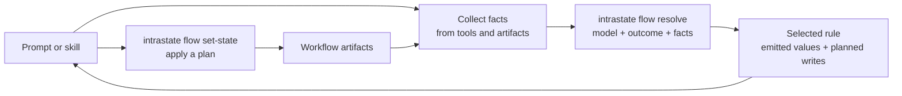

intrastate has no backing datastore. State remains in the artifacts the
workflow already uses. A prompt can adopt a single decision table and
add further models as needed.

### Capabilities used by prompts

| Capability | Use in a prompt |
| --- | --- |
| [Coverage and overlap checks](#model-types-and-diagrams) | Validate routing branches before running the workflow |
| [Decision tables with declared outputs](#minimal-decision-table) | Select a stage, operation, or stop reason from current facts |
| [Output dispositions](#grouping-outputs-with-dispositions) | Dispatch on categories such as `route`, `chain`, or `stop` |
| [State readers and writers](#reading-and-writing-a-markdown-document) | Read and update fields in existing workflow artifacts |
| [Separate resolution and application](#minimal-state-machine) | Inspect a transition plan before applying its writes |
| [Gates](#state-machine-with-gates-and-compound-guards) and [read-back](#applying-record-changes-rdr-writetoml) | Check a selected transition and verify an applied write |
| [Structured refusals](#results-and-refusals) | Identify missing facts, ambiguous matches, or denied transitions |

For example, a stage prompt can delegate its routing with an instruction
of this form:

```text
At each phase boundary, collect the current facts and resolve the next
action with the workflow model. Dispatch on the returned disposition.
For a stop, report the returned reason. If resolution refuses, use its
code and details to identify the input or model problem before continuing.
```

The model defines the decision policy. The surrounding prompt still
performs the selected work and handles situations that require judgment.

## Model types and diagrams

| Model class | Purpose | Row output |
| --- | --- | --- |
| `state-machine` | Read owned state and determine a transition or decision | Planned writes and/or emitted values |
| `decision-table` | Map supplied facts to a decision without owning state | Emitted values |

Both classes use the same coverage analysis. For finite, declared domains,
`intrastate lint` checks that each outcome covers every combination of
guarded values without overlap. An escape row can provide a fallback for
uncovered combinations; lint reports this separately from proved coverage.

The bundled models are checked by `make graph-lint`. Row and cell counts
in this document were computed from `intrastate graph --emit json`; a
**cell** is one combination of values across a group's guarded dimensions.

Two conventions apply to the diagrams below:

- **Decision-table rows are unordered.** Tree diagrams group conditions
  for readability; branch order does not determine which row wins.
- **DOT exports show an approximation of reachability.** The export is
  labelled `declared-over-approximation` and may combine states or include
  paths that cannot occur at runtime. The diagrams below illustrate
  individual rules. The [JSON-to-Mermaid example](#deriving-a-diagram-from-the-export)
  provides a way to derive diagrams from exported rows, guards, and writes.

## Minimal state machine

[`review-state-machine.toml`](../models/examples/review-state-machine.toml)
owns one tag, `status`, over a four-value domain, and advances it through
three recognized outcomes.

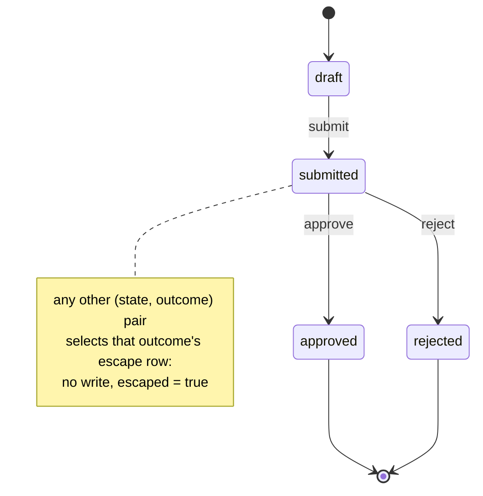

The three transition rows are:

| rule | outcome | guard | write |
| --- | --- | --- | --- |
| `submit` | `submit` | `status = draft` | `status = submitted` |
| `approve` | `approve` | `status = submitted` | `status = approved` |
| `reject` | `reject` | `status = submitted` | `status = rejected` |

Each outcome also has an escape row: `submit-otherwise`,
`approve-otherwise`, and `reject-otherwise`. These rows declare
`escape = ["no_match"]` with no guard or write.

Coverage is checked per outcome. For example, `submit` handles only one
of the four `status` values. Without its escape row, the other three
produce `graph-coverage-gap`. With the escape rows, lint exits 0 and
reports one coverage advisory per outcome:

```console
$ intrastate lint --model models/examples/review-state-machine.toml
  graph-coverage-closed-by-escape: the coverage of group review/approve is closed by the bare escape row "approve-otherwise" rather than proved over its declared domains (rule="approve-otherwise" element="review/approve")
  graph-coverage-closed-by-escape: the coverage of group review/reject is closed by the bare escape row "reject-otherwise" rather than proved over its declared domains (rule="reject-otherwise" element="review/reject")
  graph-coverage-closed-by-escape: the coverage of group review/submit is closed by the bare escape row "submit-otherwise" rather than proved over its declared domains (rule="submit-otherwise" element="review/submit")
```

To initialize an empty store, bind a path to the `review` artifact role
used by `[read.review-state]` and `[write.review-state]`:

```console
$ intrastate flow init-state --model review-state-machine.toml --artifact review=state.json
absent: (none)
artifacts.review: state.json
seeded[0]: status

$ cat state.json
{"status":"draft"}

$ intrastate flow next --model review-state-machine.toml --artifact review=state.json
candidates[0].next.status: submitted
candidates[0].outcome: submit
candidates[0].rule: submit
outcomes[0]: submit
outcomes[1]: approve
outcomes[2]: reject
owned.status: draft
readers[0]: review-state
```

From `draft`, `next` reports `submit` as the only candidate. Resolving
`approve` selects its escape row:

```console
$ intrastate flow resolve --model review-state-machine.toml --artifact review=state.json --outcome approve
escape_class: no_match
escaped: true
next: (none)
rule: approve-otherwise
writes: (none)
```

Resolving `submit` returns a plan. Pass it to `set-state` to apply the
write and verify the result by reading it back:

```console
$ intrastate flow resolve --model review-state-machine.toml --artifact review=state.json --outcome submit --as json \
    | intrastate flow set-state --model review-state-machine.toml --artifact review=state.json --plan -
owned.status: submitted
writers[0]: review-state
writes.status: submitted

$ intrastate flow next --model review-state-machine.toml --artifact review=state.json
candidates[0].outcome: approve
candidates[0].rule: approve
candidates[1].outcome: reject
candidates[1].rule: reject
owned.status: submitted
```

The DOT export combines `submitted`, `approved`, and `rejected` into one
node. With the escape rows, every outcome has an edge from every node:

```console
$ intrastate graph --model models/examples/review-state-machine.toml --emit dot
// declared-over-approximation
digraph "review" {
  label="review (declared-over-approximation)";
  "status=approved,rejected,submitted,;";
  "status=draft,;" [shape=doublecircle, xlabel="initial"];
  "status=approved,rejected,submitted,;" -> "status=approved,rejected,submitted,;" [label="approve"];
  "status=approved,rejected,submitted,;" -> "status=approved,rejected,submitted,;" [label="reject"];
  "status=approved,rejected,submitted,;" -> "status=approved,rejected,submitted,;" [label="submit"];
  "status=draft,;" -> "status=approved,rejected,submitted,;" [label="approve"];
  "status=draft,;" -> "status=approved,rejected,submitted,;" [label="reject"];
  "status=draft,;" -> "status=approved,rejected,submitted,;" [label="submit"];
}
```

This approximation supports claims such as "no path reaches this state,"
but a path in the export may not be possible at runtime.

The JSON export includes each row's guards, writes, and outcome, plus tag
domains. The jq program in [Reproducing the diagrams](#reproducing-the-diagrams)
uses these fields to render the individual state transitions:

```console
$ intrastate graph --model models/examples/review-state-machine.toml --emit json \
    | jq -r -f graph-to-mermaid.jq
stateDiagram-v2
    [*] --> draft
    submitted --> approved : approve
    submitted --> rejected : reject
    draft --> submitted : submit
    approved --> [*]
    rejected --> [*]
```

This reproduces the first diagram's transitions. Escape rows contribute
no edges because they do not change state.

## Reading and writing a Markdown document

[`markdown-review.toml`](../models/examples/markdown-review.toml) reads and
updates the `Status:` line in an existing document. It demonstrates a
command reader, an in-process line-edit writer, and read-back verification.
The model covers both `draft` and `approved` without an escape row.

The reader uses `sed` to return the status as a single raw value. The
writer replaces exactly one matching line:

```toml
[read.document]
role = "document"
command = ["sed", "-n", "s/^Status: //p", "{artifact}"]
output = "raw"
keys = ["status"]
timeout = "5s"

[write.document]
role = "document"
keys = ["status"]
timeout = "5s"
read_back = true

[write.document.edit.status]
anchor = '^Status: .+$'
replace = 'Status: {status}'
```

`{artifact}` is the path bound to the `document` role; `{status}` is the
planned value. The reader expects exactly one line beginning `Status: `.
This example targets that document format, rather than general Markdown
parsing.

Run the following from a checkout with `sed` on `PATH`. Copy the
[sample document](../models/examples/markdown-review.md) to a temporary
directory before editing it:

```sh
make build
markdown_dir=$(mktemp -d)
cp models/examples/markdown-review.md "$markdown_dir/review.md"
./bin/intrastate lint --model models/examples/markdown-review.toml

./bin/intrastate flow resolve \
    --model models/examples/markdown-review.toml \
    --artifact "document=$markdown_dir/review.md" \
    --outcome approve --allow-commands --as=json > "$markdown_dir/plan.json"
```

Resolution reads `status = draft` and selects `approve-draft`, planning
`status = approved`. The document is still unchanged. Apply the plan:

```sh
./bin/intrastate flow set-state \
    --model models/examples/markdown-review.toml \
    --artifact "document=$markdown_dir/review.md" \
    --plan "$markdown_dir/plan.json" --allow-commands

diff -u models/examples/markdown-review.md "$markdown_dir/review.md"
```

The response confirms `owned.status: approved` and `writes.status: approved`.
The diff shows only `Status: draft` changing to `Status: approved`; `diff`
exits 1 because it found the expected change. All other document bytes are
preserved.

Both commands need `--allow-commands`: resolution invokes the `sed`
reader, and application invokes it again to verify the write. The edit
writer itself runs in-process. Start with an existing document containing
the status line; `init-state` does not create an edit-backed artifact.

Resolving `approve` again selects `already-approved`, emits that result,
and plans no writes. If the status line disappears or becomes duplicated
between resolution and application, the writer refuses before mutation
with `edit_anchor_unmatched` or `edit_anchor_ambiguous` in the refusal
details.

## Minimal decision table

[`pricing-decision-table.toml`](../models/examples/pricing-decision-table.toml)
maps `tier × region` to emitted values without owning state. Each
dimension has two values, giving four cells covered by four rows. The
model lints with an empty findings list and needs no escape rows.

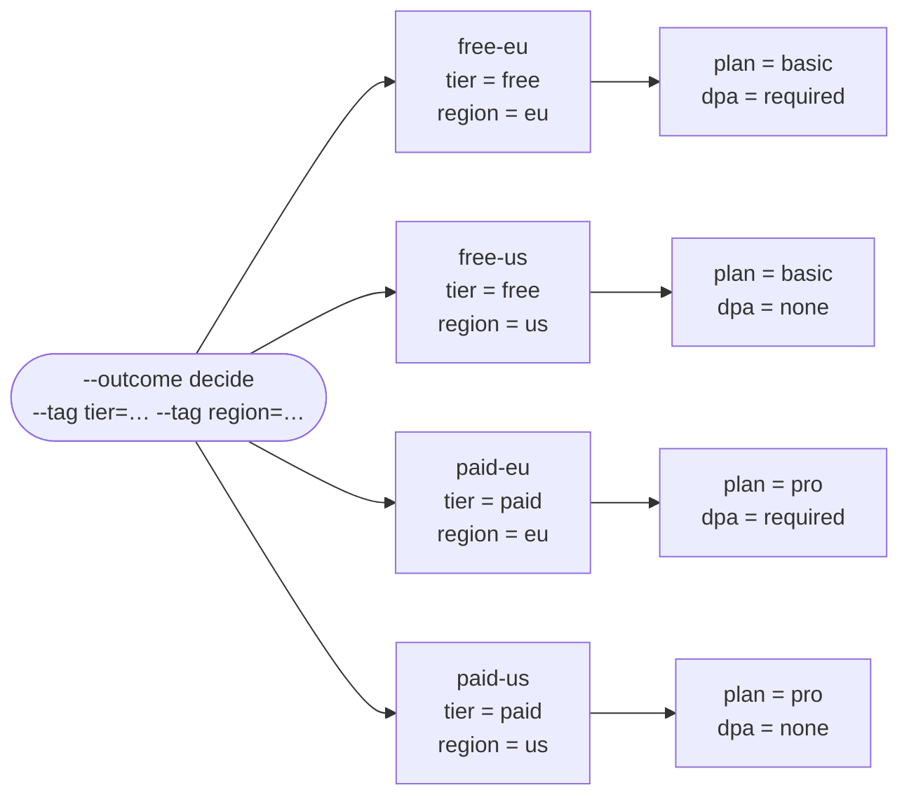

Each column below represents one rule, with inputs above and outputs
below:

| | free-eu | free-us | paid-eu | paid-us |
| --- | --- | --- | --- | --- |
| tier | free | free | paid | paid |
| region | eu | us | eu | us |
| **plan** | basic | basic | pro | pro |
| **dpa** | required | none | required | none |

Supply the inputs with `--tag`. No artifact is needed:

```console
$ intrastate flow resolve --model pricing-decision-table.toml --outcome decide --tag tier=paid --tag region=eu
emit.dpa: required
emit.plan: pro
escaped: false
next: (none)
observed.region: eu
observed.tier: paid
rule: paid-eu
writes: (none)
```

If an input is missing, the resolver reports the affected guard atoms
and rows:

```console
$ intrastate flow resolve --model pricing-decision-table.toml --outcome decide --tag tier=paid
error: flow-guard-unevaluable: a guard predicate could not be decided over the assembled state
  flow-guard-unevaluable: rule `paid-eu`: the atom on `region` could not be decided (absent) (locator="pricing:paid-eu" rule="paid-eu" key="region" operator="eq" literal="eu" block="all")
  flow-guard-unevaluable: rule `paid-us`: the atom on `region` could not be decided (absent) (locator="pricing:paid-us" rule="paid-us" key="region" operator="eq" literal="us" block="all")
```

The model declares output domains: `plan` is `basic | pro`, and `dpa` is
`required | none`. Undeclared emit keys or values outside these domains
cause a load failure.

### Grouping outputs with dispositions

[`routing-decision-table.toml`](../models/examples/routing-decision-table.toml)
also has four cells. Its `next` output domain is divided into two named
dispositions, `route` and `stop`. The resolver returns both the emitted
value and its disposition:

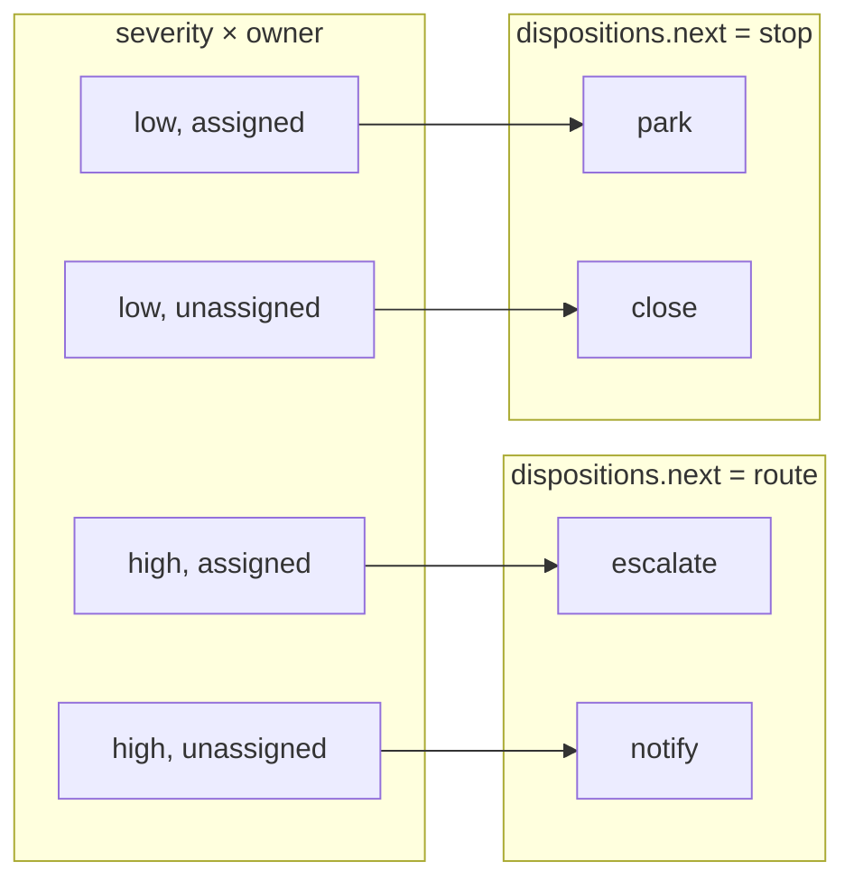

```console
$ intrastate flow resolve --model routing-decision-table.toml --outcome triage --tag severity=high --tag owner=unassigned
dispositions.next: route
emit.next: notify
rule: high-unassigned
```

Disposition names are defined by the model. Each domain member belongs
to exactly one disposition, which the resolver returns verbatim. Callers
can branch on `dispositions.next`; the RDR examples below use this to
chain decision groups.

## State machine with gates and compound guards

[`release-grammar.toml`](../models/examples/release-grammar.toml) is the
source for the authoring guide's grammar examples. It models
`idle → building → shipped | held` and demonstrates all five tag kinds,
guard operators, `guard.unless`, rule-level `clear`, a gate accessor,
and contexts shared through `use` and `inherits`.

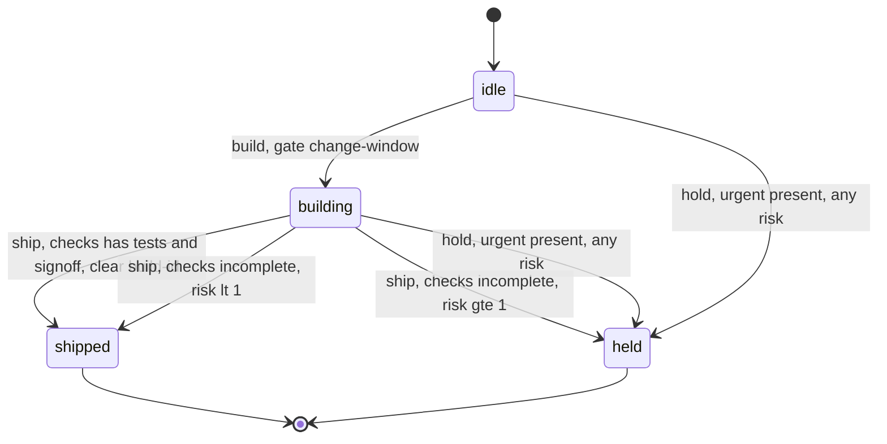

This model adds three features to the minimal state machine:

- **Transitions can write and clear values.** `ship-clean` writes
  `phase = shipped` and clears `build-id`. The `hold-urgent` rows can
  write `phase = held` from either `idle` or `building`.
- **Three `ship` rows partition `checks × risk` over `phase = building`.**
  `contains` on the set, its negation under `unless`, and `lt`/`gte` on
  the integer cover every combination in that state without overlap.
- **The gate runs after selection.** `change-window` is consulted once
  `begin` has been chosen. A denial returns `flow-gate-denied`.

One escape row per outcome handles uncovered combinations, such as
`build` when `phase` is not `idle`. Lint reports three
`graph-coverage-closed-by-escape` advisories.

The JSON-derived diagram expands the `hold-urgent` rows by their `gt`
and `lte` guards. Edge labels include additional writes and clears:

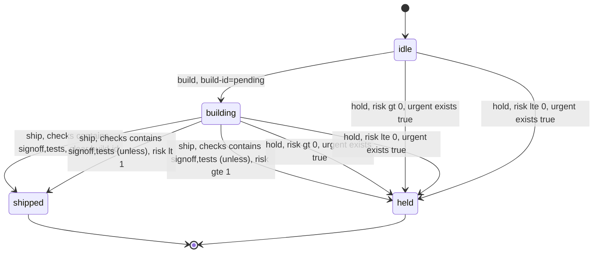

## Integrating models into a large prompt workflow: RDR

[rdr](https://github.com/cwensel/rdr) uses large prompts, packaged as
skills, to develop design records through proposal, review, finalization,
and implementation. intrastate supplies decisions within those prompts:
which stage runs next, whether a review repeats, when implementation
returns, and which status changes are allowed.

The `rdr` CLI reads record markdown and produces facts as `--tag key=value`
arguments. The skill passes those facts to intrastate and uses the
returned decision to continue its work:

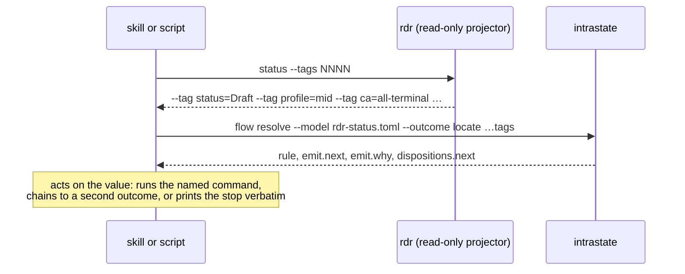

Five models separate navigation, review control, implementation checks,
and record updates. Counts below describe the versions used for these
examples:

| model | class | outcomes | rows | cells proved | escape rows |
| --- | --- | ---: | ---: | ---: | ---: |
| `rdr-status.toml` | decision-table | 8 | 88 | 4,252 | 0 |
| `rdr-write.toml` | state-machine | 8 | 72 | 2,084 | 0 |
| `rdr-launch.toml` | decision-table | 5 | 36 | 1,365 | 0 |
| `rdr-cascade.toml` | decision-table | 2 | 15 | 186 | 0 |
| `rdr-loop.toml` | decision-table | 2 | 12 | 40 | 0 |
| **total** | | **25** | **223** | **7,927** | **0** |

Guards using `in` and `unless` allow one row to cover many cells. These
models cover every cell with ordinary rows and use no escape rows.
Cases requiring the workflow to stop have explicit rows that emit a
`stopped:` value.

### Stage selection and chaining: `rdr-status.toml`

This table selects the next stage from the record's current facts.
Eight outcome groups keep each decision's input space separate:
`locate` determines the overall stage, while `lens` selects a pre-lock
review. Coverage is checked per group, so unrelated dimensions do not
multiply the number of cells to check.

The `next` output uses a `chain` disposition to request another decision:

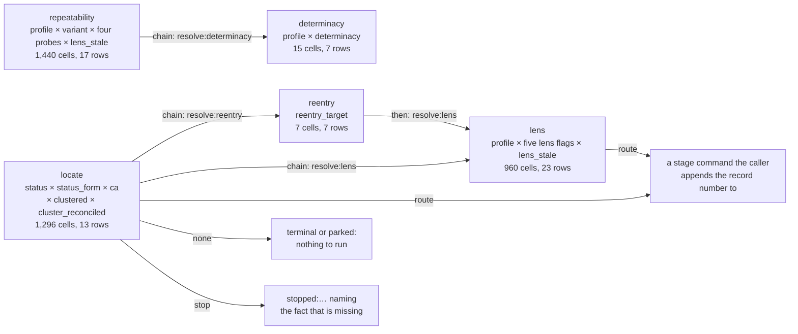

The wrapper resolves `locate`, follows `chain` results, and then returns
a command (`route`), an inactive result (`none`), or a stop reason
(`stop`). Stage skills call the other groups as needed; for example,
`repeatability` can chain to `determinacy`.

The `lens` group selects a review based on the record's profile and
completed review evidence:

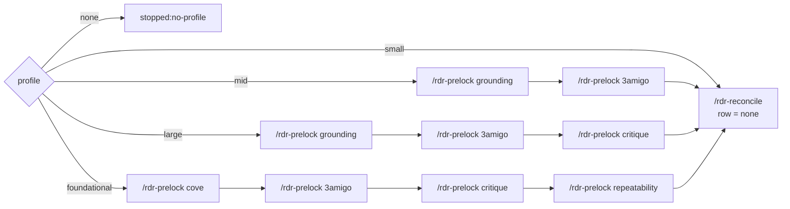

The arrows show the review sequence. The table selects the next review
from flags derived from evidence on disk. It owns no state. The
`lens_stale` dimension allows a review to reopen when its evidence
predates the record's re-entry into the workflow.

Two authoring choices make this routing checkable:

- **Put decision dimensions in guards.** Match atoms scope a group;
  they do not contribute dimensions to its coverage analysis.
- **Declare dimensions as `required` and `single_valued`.** Represent
  known absence with a domain member such as `profile = none`. It then
  has explicit coverage, usually through a row that emits a stop reason.

### Handling stage results: `rdr-cascade.toml`

After each stage, the orchestrating prompt receives a result packet.
The `packet` group maps `verdict × blocking × retry × action` to
advance, rerun, park, or stop: eight rows cover 96 cells.

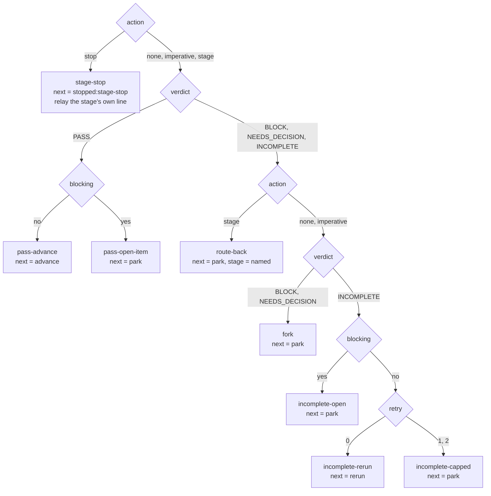

Missing `next_action` is represented as `action = none`. The first
return uses `retry = 0`, and the retry count saturates at 2. A named
return stage is represented by `action = stage`.

The `posture` group uses `profile × status × ask_each` to determine
which actions need human confirmation. Seven rows cover 90 cells.
`--ask-each` requires confirmation for every action; other rows preserve
the confirmation level required by the record.

### Enforcing retry limits: `rdr-loop.toml`

This model gives review prompts an explicit rerun decision. The
`lens-loop` group covers 32 cells across `iter × found × net_new × fix`
with eight rows:

| rule | iter | found | net_new | fix | next |
| --- | --- | --- | --- | --- | --- |
| `loop-converged` | any | none | none | any | `converged` |
| `loop-diff-inconsistent` | any | none | some | any | `stopped:ledger-diff-inconsistent` |
| `loop-no-pass-on-disk` | 1 | some | any | any | `stopped:ledger-diff-inconsistent` |
| `loop-rerun` | 2, 3 | some | any | substantial | `rerun` |
| `loop-small-fix` | 2, 3 | some | any | small | `converged` |
| `loop-flapping-net-new` | over | some | some | any | `stopped:verdict-flapping` |
| `loop-flapping-substantial` | over | some | none | substantial | `stopped:verdict-flapping` |
| `loop-over-small` | over | some | none | small | `converged` |

Rows explicitly reject inconsistent inputs: new findings with nothing
found, or findings reported when no review pass exists on disk.
`iter = over` prevents a fourth pass; rows that would require one emit
`stopped:verdict-flapping`. The `cluster-cap` group applies a similar
limit across `iter × open`, with four rows covering eight cells.

### Implementation checks and delegation: `rdr-launch.toml`

The implementation prompt delegates five decisions to this model:
inline versus delegated execution, completion, predecessor checks,
shard routing, and execution budget. Its 36 rows cover 1,365 cells.

The size decision selects the first failing condition. Each later row
requires all earlier conditions to pass, making the guards mutually
exclusive. The policy is encoded in the guards:

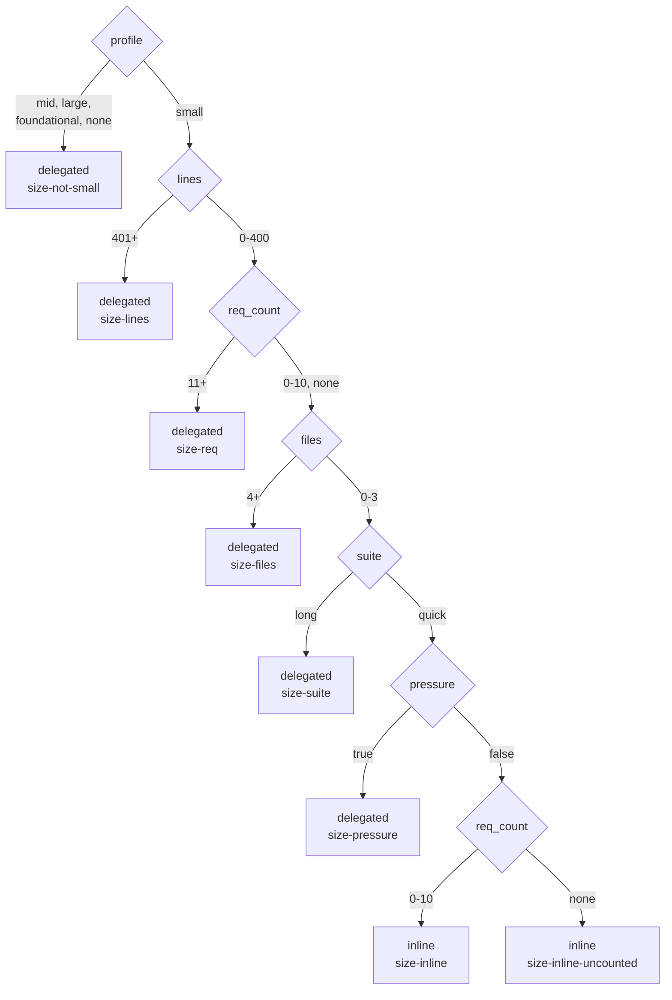

The caller supplies `files`, `suite`, and `pressure` from current
execution evidence; `rdr` supplies the other dimensions. The prompt
resolves the decision at each phase boundary, allowing it to switch to
delegated execution during a run. The precheck uses the initial values
and `req_count = none`, which has its own row.

The `complete` group covers 288 cells with ten rows. Missing verification
has an explicit result: an unread coverage ledger is represented by
`impl_orphans = none` and emits `stopped:coverage-unread`.

The `budget` group covers 24 cells with six rows across
`suite_green × elapsed × ask × commits`. It determines when a Phase 2
implementation session returns, using the latest test result, elapsed
time, recent action, and commit count. This lets the prompt enforce an
execution budget at defined checkpoints.

### Applying record changes: `rdr-write.toml`

This state machine models record operations, including finalization,
re-entry, and index updates. It owns two status tags. Command accessors
read them through `rdr`, and edit accessors apply supported writes
directly to the markdown artifacts.

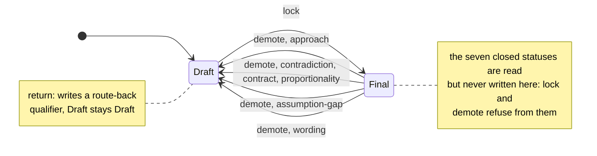

`lock` advances a record only when the finalization gate is written and
current and no joint decision is open. `demote` specifies a Status-line
qualifier naming the re-entry stage; `return` specifies a qualifier while
keeping the record in `Draft`:

| blocker class | re-enters at | `demote` writes | `return` writes |
| --- | --- | --- | --- |
| approach | propose | `Final → Draft` | qualifier only |
| contradiction, contract, proportionality | refine | `Final → Draft` | qualifier only |
| assumption-gap | resolve | `Final → Draft` | qualifier only |
| determinacy | prelock | refused: not a re-entry from Final | qualifier only |
| spike, assumption-disturbed | reconcile | refused: not a re-entry from Final | qualifier only |
| wording | finalize, re-lock only | `Final → Draft` | nothing: the lock pass fixes it in place |
| none | | `stopped:no-blocker-class` | `stopped:no-blocker-class` |

The `lock` group covers 1,620 cells across
`status × status_form × gate_written × gate_stale × joint_check_home`
with seven rows. Two advance `Draft` to `Final`; the others emit
`stopped:no-gate-written`, `stopped:gate-stale`,
`stopped:joint-decision-open`, `stopped:not-lockable`, or `none` for a
record that is already `Final`. Locking is idempotent.

A state-machine row can declare `advance = false` to decide without
changing owned state; 62 of this model's 72 rows use it. The following
sequence shows resolution, application, and read-back for `lock`:

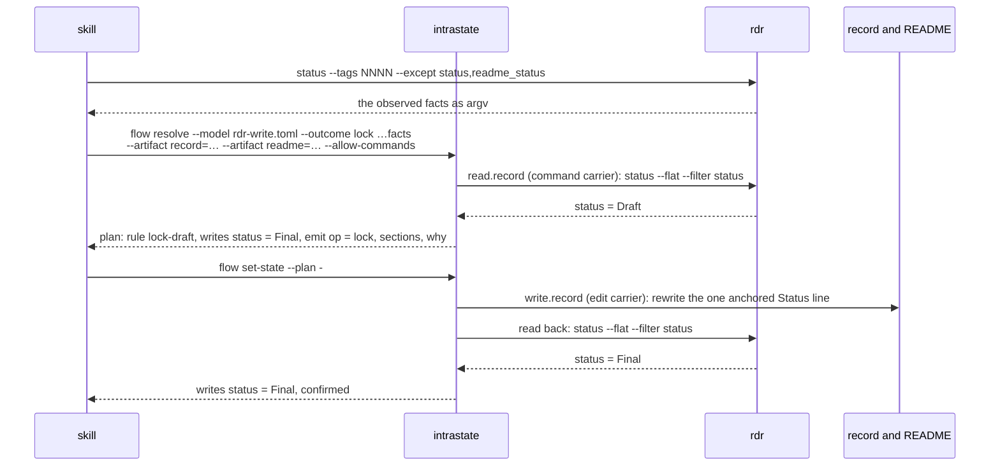

Owned tags must come from the model's readers. Supplying one with
`--tag` returns `flow-tag-owned`. Here, `[read.record]` and `[read.readme]`
use commands declared in the model.

The writers use an `anchor` that must match exactly one line and a
`replace` expression applied in-process. Both declare `read_back = true`
so the readers verify the written values.

The `readme` group synchronizes the index with the record. Twenty rows
cover 99 cells across `readme_status × status`:

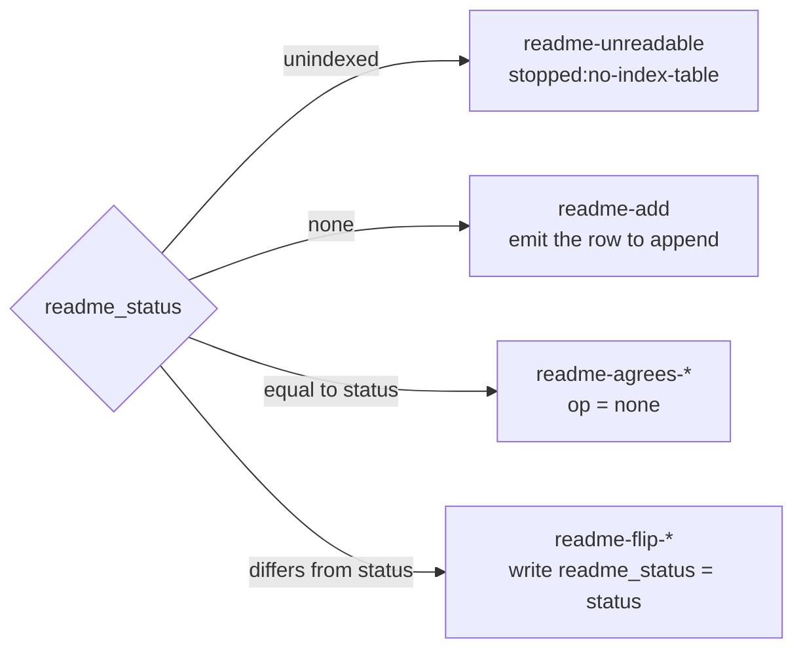

`set-state` applies `lock` and `readme-flip`. Other operations emit edit
instructions for the caller, including changes that incorporate author
prose. The prompt can therefore use the model to select an operation
while retaining responsibility for composing its text.

Re-entry instructions must be persisted: the `return` operation adds a
qualifier to the record's Status line. `rdr` then exposes it as a fact
for the navigator's next decision.

## Results and refusals

A prompt integrating intrastate needs to distinguish a valid workflow
stop from a failure to resolve:

| Result | Meaning | Caller action |
| --- | --- | --- |
| Selected row with emitted values | The model resolved the inputs | Dispatch on the output or disposition |
| `stop` disposition, such as `stopped:no-profile` | The model explicitly requires the workflow to stop; resolution succeeds at exit 0 | Report the reason and follow the workflow's stop handling |
| `flow-no-match` | No row matches and no applicable escape handles it | Inspect inputs and model coverage |
| `flow-guard-unevaluable` | A guard cannot be evaluated | Establish the missing or invalid fact |
| `flow-ambiguous-match` | Multiple rows are enabled | Resolve the conflicting rules |
| `flow-gate-denied` | A gate denied the selected transition | Follow the gate's refusal details |

Output keys and values are checked against declared emit domains at load
time. Known absence can be represented by an explicit domain member such
as `none`; the caller must supply that value intentionally. An omitted
fact is not automatically converted to a sentinel or `false`.

## Reproducing the diagrams

Use these commands to lint the models and inspect their exports:

```sh
# the bundled examples
for m in models/examples/*.toml; do intrastate lint --model "$m"; done

# the tool's own graph, as DOT, rendered with graphviz
intrastate graph --model models/examples/release-grammar.toml --emit dot | dot -Tsvg > release.svg

# the normalized graph as JSON: tags with domains, rows with atoms, groups
intrastate graph --model models/examples/pricing-decision-table.toml --emit json | jq .

# the same over the rdr models, from a checkout of that repository
intrastate lint --model models/rdr-status.toml
intrastate graph --model models/rdr-write.toml --emit json | jq '.groups'
```

To update the cell counts, multiply the declared domain sizes of the
keys used in each group's guards. The JSON export's `tags` and `rows`
fields provide those domains and keys.

### Deriving a diagram from the export

This standalone jq example generates the derived state diagrams above.
It uses guarded owned values as state names and labels transitions with
their remaining guards and writes. For decision tables, it emits one
flowchart per outcome group, omitting the prose fields `why`, `surface`,
`sections`, and `edit` for readability. Save it as `graph-to-mermaid.jq`:

```jq
def lit: if type=="array" then join(",") else tostring end;
def atom: "\(.key) \(.operator) \(.literal|lit)"
        + (if .block=="unless" then " (unless)" else "" end);
def owned: [.tags[] | select(.provenance=="owned") | .name];

def sm:
  owned as $own
  | ([.rows[].atoms[] | .key] | unique
     | map(select(. as $k | $own|index($k)))) as $state
  | def isstate: .key as $k | $state|index($k);
    "stateDiagram-v2",
    (.initial | map(select(isstate)) | map(.value|lit) | join(" ")
     | "    [*] --> \(.)"),
    (.rows[] | select(.kind=="transition") | . as $r
      | ([$r.atoms[] | select(.block=="all" and isstate
            and (.operator=="eq" or .operator=="in")) | .literal[]]) as $from
      | ([$r.writes[] | select(isstate) | .value|lit] | join(" ")) as $to
      | ([$r.writes[] | select(isstate|not)
            | select(.key as $k | $own|index($k))
            | if (.value|lit)=="<clear>" then "clear \(.key)"
              else "\(.key)=\(.value|lit)" end]) as $extra
      | ([$r.atoms[] | select(isstate|not) | atom] + $extra
         | join(", ")) as $label
      | (if ($from|length)==0 then ["any"] else $from end)[] as $f
      | "    \($f) --> \(if $to=="" then $f else $to end) : \($r.outcome)"
        + (if $label=="" then "" else ", " + $label end)),
    (.terminal[]? | map(select(isstate)) | map(.literal|lit) | join(" ")
     | "    \(.) --> [*]");

def dt:
  .groups[] as $g
  | ($g.context|split("/")[1]) as $o
  | ($o|gsub("[^A-Za-z0-9]";"_")) as $oid
  | "flowchart LR",
    "    O_\($oid)([\"--outcome \($o)\"])",
    (.rows[] | select(.outcome==$o)
      | (.identity|gsub("[^A-Za-z0-9]";"_")) as $id
      | ([.atoms[] | atom] | join("<br/>")) as $guard
      | ([.emit[]? | select(.key!="why" and .key!="surface"
            and .key!="sections" and .key!="edit")
          | "\(.key) = \(.value|lit)"] | join("<br/>")) as $emit
      | "    O_\($oid) --> R_\($id)[\"\(.identity|split(".")[1])"
        + (if .kind=="escape" then " (escape)" else "" end)
        + "<br/>\(if $guard=="" then "no guard" else $guard end)\"]",
        (if $emit!="" then "    R_\($id) --> E_\($id)[\"\($emit)\"]"
         else empty end)),
    "";

if .class=="state-machine" then sm else dt end
```

```sh
intrastate graph --model models/examples/pricing-decision-table.toml --emit json \
    | jq -r -f graph-to-mermaid.jq
```

For the pricing model, this produces the four-row flowchart in
[Minimal decision table](#minimal-decision-table), using guard atoms
such as `tier eq free`. Larger models produce denser diagrams; use the
JSON export to inspect individual rows and simplify diagrams for the
decision being documented.
