# Examples, drawn

This document is the picture book. [model-authoring.md](model-authoring.md)
explains the grammar and the two model classes; this one draws the models
that ship with intrastate and the models a real consumer built on it, so a
reader can see the shape of a state machine and a decision table before
reading a line of TOML, and see what the tool proves about each.

Every model here lints today. The four under
[`models/examples/`](../models/examples/) are gated by `make graph-lint`;
the five from the [rdr](https://github.com/cwensel/rdr) repository lint at
exit 0 with an empty findings list. The row and cell counts quoted below
are computed from `intrastate graph --emit json`, not copied from comments.

Two things to keep in mind while reading the diagrams:

- **A decision table has no order.** Where a table is drawn as a tree
  below, the branch order is the picture's, chosen for legibility. The
  model itself is a flat set of rows, each guard a conjunction, and lint
  proves that every assignment of the guarded dimensions lands on exactly
  one row. Any tree that reproduces the same leaves is an equally valid
  drawing.
- **The tool's own export is coarser than these drawings.** `intrastate
  graph --emit dot` exports the reachability relation as a *declared
  over-approximation*: states that no guard tells apart are merged into
  one node. It is the right artifact for diffing in CI and for proving
  "no path does X"; it is not the per-state picture a human wants. The
  diagrams here are drawn from the rules by hand. The `json` export does
  carry every row, guard, and write, and a short jq program over it
  (given in full at the end) derives a plainer but faithful diagram; the
  two bundled state machines are shown both ways so the drawings can be
  checked against the export.

## Why the tool exists

A workflow's routing logic tends to live as prose inside the thing that
runs it: a skill, a script, an agent prompt. "If the profile is mid and
grounding has not run, run grounding; if grounding has run but 3amigo has
not, run 3amigo; otherwise…" Every run re-reads that ladder and re-walks
it. Nothing checks that the ladder has a rung for every case, and a
missing rung is not an error at authoring time: it is a wrong answer,
handed to someone months later, that looks exactly like a right one.

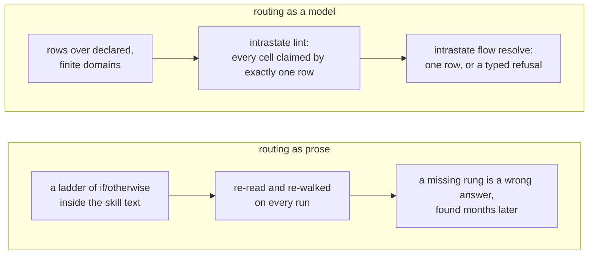

intrastate moves the ladder into data with finite, declared domains, so
that a linter can enumerate the product of those domains and prove that
every cell is claimed by exactly one row. At runtime the resolver refuses
rather than guesses: two rows enabled at once is `flow-ambiguous-match`,
a fact it cannot decide is `flow-guard-unevaluable`, and no matching row
is `flow-no-match`. The consumer described in the second half of this
document put it plainly in one of its model headers: a missing branch is
"a lint failure here, not a wrong answer to a human three months from
now."

Two model classes ship, and they answer two different questions:

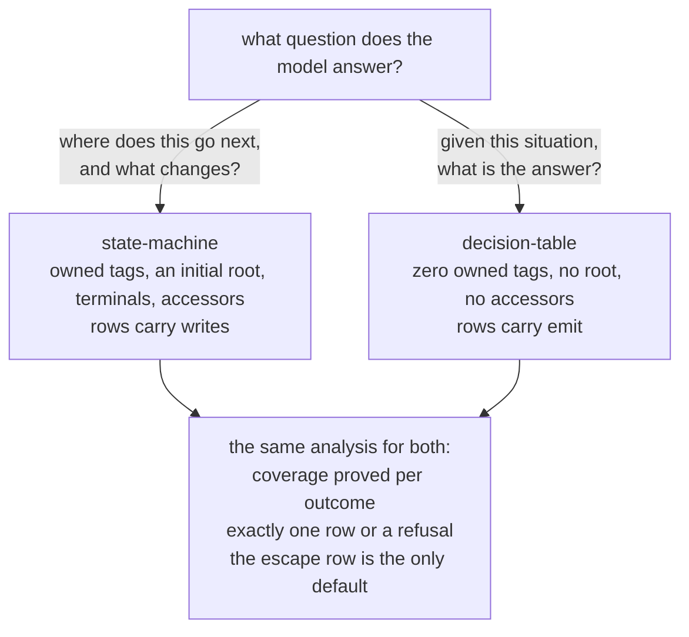

## A state machine, minimal

[`review-state-machine.toml`](../models/examples/review-state-machine.toml)
owns one tag, `status`, over a four-value domain, and advances it through
three recognized outcomes.

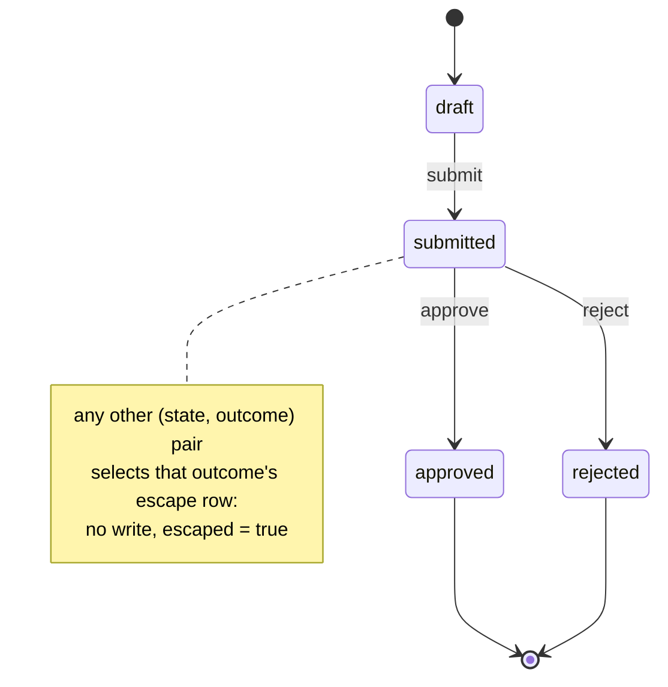

The three ordinary rows, as the transition table the diagram was drawn
from:

| rule | outcome | guard | write |
| --- | --- | --- | --- |
| `submit` | `submit` | `status = draft` | `status = submitted` |
| `approve` | `approve` | `status = submitted` | `status = approved` |
| `reject` | `reject` | `status = submitted` | `status = rejected` |

Three more rows carry no guard and no write: `submit-otherwise`,
`approve-otherwise`, `reject-otherwise`, each declared `escape =
["no_match"]`. They exist because coverage is proved **per outcome, over
the guarded dimensions**, for a state machine exactly as for a table.
`submit` is guarded on one of `status`'s four values; without the escape
row, the other three assignments are `graph-coverage-gap` and the model
does not lint. With it, the model lints at exit 0 and reports the
advisory that says how coverage was closed:

```console
$ intrastate lint --model models/examples/review-state-machine.toml
  graph-coverage-closed-by-escape: the coverage of group review/approve is closed by the bare escape row "approve-otherwise" rather than proved over its declared domains (rule="approve-otherwise" element="review/approve")
  graph-coverage-closed-by-escape: the coverage of group review/reject is closed by the bare escape row "reject-otherwise" rather than proved over its declared domains (rule="reject-otherwise" element="review/reject")
  graph-coverage-closed-by-escape: the coverage of group review/submit is closed by the bare escape row "submit-otherwise" rather than proved over its declared domains (rule="submit-otherwise" element="review/submit")
```

Driving it from an empty store. The model's `[read.review-state]` and
`[write.review-state]` bind role `review`, so the caller supplies
`--artifact review=<path>`:

```console
$ intrastate flow init-state --model review-state-machine.toml --artifact review=state.json
absent: (none)
artifacts.review: state.json
seeded[0]: status

$ cat state.json
{"status":"draft"}

$ intrastate flow next --model review-state-machine.toml --artifact review=state.json
candidates[0].next.status: submitted
candidates[0].outcome: submit
candidates[0].rule: submit
outcomes[0]: submit
outcomes[1]: approve
outcomes[2]: reject
owned.status: draft
readers[0]: review-state
```

`next` reports one candidate from `draft`: only `submit` has a guard the
state satisfies. Asking for `approve` anyway does not refuse; it selects
the escape row and says so:

```console
$ intrastate flow resolve --model review-state-machine.toml --artifact review=state.json --outcome approve
escape_class: no_match
escaped: true
next: (none)
rule: approve-otherwise
writes: (none)
```

Resolving `submit` returns a plan, and the plan is data. Nothing is
written until `set-state` applies it, and `set-state` reports success
only after reading the value back:

```console
$ intrastate flow resolve --model review-state-machine.toml --artifact review=state.json --outcome submit --as json \
    | intrastate flow set-state --model review-state-machine.toml --artifact review=state.json --plan -
owned.status: submitted
writers[0]: review-state
writes.status: submitted

$ intrastate flow next --model review-state-machine.toml --artifact review=state.json
candidates[0].outcome: approve
candidates[0].rule: approve
candidates[1].outcome: reject
candidates[1].rule: reject
owned.status: submitted
```

For comparison, this is what the tool's own export draws. Because no
guard distinguishes `submitted` from `approved` or `rejected`, the export
merges them into one node, and the escape rows make every outcome an edge
out of every node:

```console
$ intrastate graph --model models/examples/review-state-machine.toml --emit dot
// declared-over-approximation
digraph "review" {
  label="review (declared-over-approximation)";
  "status=approved,rejected,submitted,;";
  "status=draft,;" [shape=doublecircle, xlabel="initial"];
  "status=approved,rejected,submitted,;" -> "status=approved,rejected,submitted,;" [label="approve"];
  "status=approved,rejected,submitted,;" -> "status=approved,rejected,submitted,;" [label="reject"];
  "status=approved,rejected,submitted,;" -> "status=approved,rejected,submitted,;" [label="submit"];
  "status=draft,;" -> "status=approved,rejected,submitted,;" [label="approve"];
  "status=draft,;" -> "status=approved,rejected,submitted,;" [label="reject"];
  "status=draft,;" -> "status=approved,rejected,submitted,;" [label="submit"];
}
```

That is sound for what it is for. A universal claim proved over it holds
at runtime; an existence claim may be spurious. It is not the diagram
above, and it is not meant to be.

The `json` document carries what the DOT relation drops: every row with
its guard atoms, writes, and outcome, and every tag with its domain. The
jq program in [Reproducing the pictures](#reproducing-the-pictures) reads
that and renders a state diagram whose states are the values of the
owned keys the rows guard on:

```console
$ intrastate graph --model models/examples/review-state-machine.toml --emit json \
    | jq -r -f graph-to-mermaid.jq
stateDiagram-v2
    [*] --> draft
    submitted --> approved : approve
    submitted --> rejected : reject
    draft --> submitted : submit
    approved --> [*]
    rejected --> [*]
```

That is the hand-drawn diagram at the top of this section, minus the
note. Escape rows carry no guard on the owned key, so they contribute no
edge, which is the right reading: an escape row is not a transition.

## A decision table, minimal

[`pricing-decision-table.toml`](../models/examples/pricing-decision-table.toml)
owns nothing. It maps a situation, `tier × region`, to an answer. Both
dimensions are two-valued, so the product is four cells, and four rows
claim them. The model lints with an **empty** findings list: nothing is
closed by escape, everything is proved.


The same table in its classical form, a truth table rotated ninety
degrees, where the condition rows on top span every combination and the
action rows below say what each combination yields:

| | free-eu | free-us | paid-eu | paid-us |
| --- | --- | --- | --- | --- |
| tier | free | free | paid | paid |
| region | eu | us | eu | us |
| **plan** | basic | basic | pro | pro |
| **dpa** | required | none | required | none |

Asking it. No artifact is bound, because there is no owned state to read;
the dimensions arrive as `--tag`:

```console
$ intrastate flow resolve --model pricing-decision-table.toml --outcome decide --tag tier=paid --tag region=eu
emit.dpa: required
emit.plan: pro
escaped: false
next: (none)
observed.region: eu
observed.tier: paid
rule: paid-eu
writes: (none)
```

Leave a dimension out and the resolver does not pick a default. It says
which atoms it could not decide, and over which rows:

```console
$ intrastate flow resolve --model pricing-decision-table.toml --outcome decide --tag tier=paid
error: flow-guard-unevaluable: a guard predicate could not be decided over the assembled state
  flow-guard-unevaluable: rule `paid-eu`: the atom on `region` could not be decided (absent) (locator="pricing:paid-eu" rule="paid-eu" key="region" operator="eq" literal="eu" block="all")
  flow-guard-unevaluable: rule `paid-us`: the atom on `region` could not be decided (absent) (locator="pricing:paid-us" rule="paid-us" key="region" operator="eq" literal="us" block="all")
```

The `emit` vocabulary in this model is declared: `plan` is `basic | pro`,
`dpa` is `required | none`. A row emitting a key no `[emit.*]` table
names, or a value outside its domain, refuses at load. The answer block
is a checked fact, not free text.

### An emit domain partitioned into dispositions

[`routing-decision-table.toml`](../models/examples/routing-decision-table.toml)
is the same 2×2 shape with one difference: its `next` key's domain is
declared in two named parts, and the resolver reports which part the
selected row's value fell in.

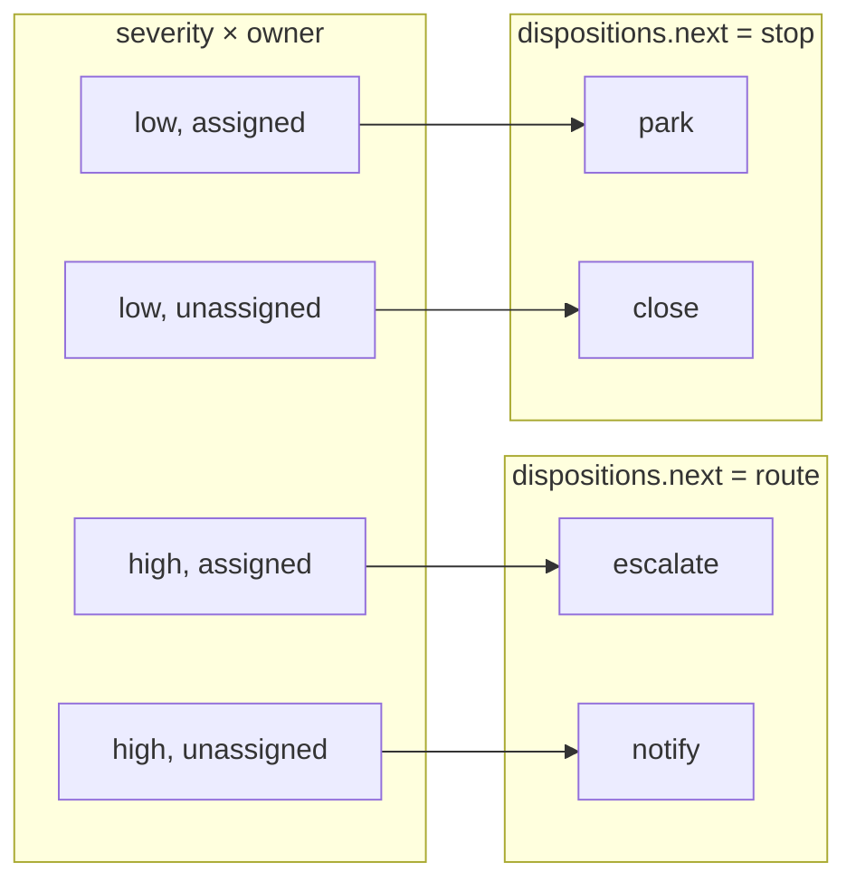

```console
$ intrastate flow resolve --model routing-decision-table.toml --outcome triage --tag severity=high --tag owner=unassigned
dispositions.next: route
emit.next: notify
rule: high-unassigned
```

intrastate fixes no disposition vocabulary. `route` and `stop` mean what
the model's author says they mean; the tool guarantees only that a member
is listed under exactly one disposition and that the token arrives
verbatim. A caller branches on `dispositions.next` instead of on a string
prefix of `emit.next`. The consumer below leans on exactly this to chain
one table into another.

## The grammar surface

[`release-grammar.toml`](../models/examples/release-grammar.toml) is the
model every snippet in the authoring guide is copied from. It is a state
machine, `idle → building → shipped | held`, chosen to carry every
construct the grammar admits: all five tag kinds, the guard operators past
`eq`, block-level negation with `guard.unless`, a rule-level `clear`, a
`[gate.<id>]` accessor, and contexts reused by `use` and chained by
`inherits`.

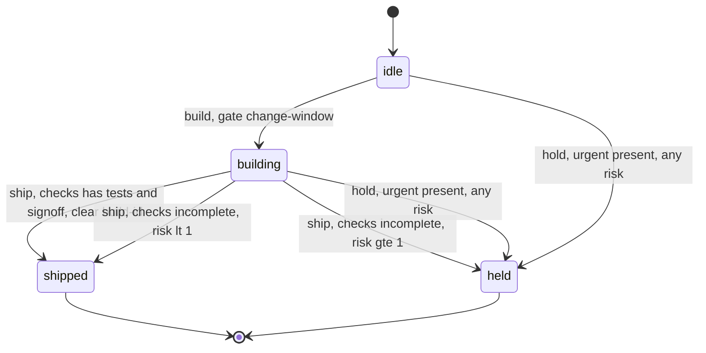

What the diagram is showing that the minimal machine did not:

- **Output hangs off the transition, not the state.** `ship-clean` writes
  `phase = shipped` *and* clears `build-id`; the two `hold-urgent` rows
  write the same `held` from two different states. This is the Mealy
  shape the authoring guide names.
- **Three `ship` rows partition `checks × risk` over `phase = building`.**
  `contains` on the set, its negation under `unless`, and `lt`/`gte` on
  the int together cover every assignment with no overlap, so that arm is
  proved rather than closed by escape.
- **The gate runs after selection.** `change-window` is consulted once
  `begin` has been chosen; a deny is `flow-gate-denied`, a refusal, never
  a second candidate.

Like the review machine, it carries one bare escape row per outcome and
so lints with three `graph-coverage-closed-by-escape` advisories. The
assignments the ordinary rows do not claim, a `build` asked of anything
but `idle` for instance, are what the escape rows absorb.

The same machine derived from the JSON export, one edge per row. The
hand drawing above merged the two `hold-urgent` rows, which split `risk`
at zero only so the model exercises `gt` and `lte`; the derivation keeps
them apart, and puts the non-state write `build-id = pending` and the
`clear` on the edge label where the Mealy shape says they belong:

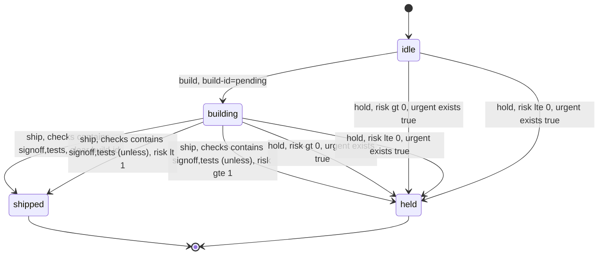

## In the wild: the rdr flow

[rdr](https://github.com/cwensel/rdr) is a design-record process for
agentic coding: a set of skills that take a record from a seed through
proposal, refinement, verification, a pre-lock lens row, a finalization
gate, and implementation. Which stage a record is at, which lens it owes
next, whether a return packet advances or parks, whether a Stage 8 leg
should return: every one of those used to be a prose ladder inside a
skill, re-walked by a model on every run.

The flow now splits that work between two binaries that never call each
other. `rdr` is a read-only projector: it reads record markdown and
renders **facts** as a `--tag k=v` argv. `intrastate` resolves those facts
against a model and returns the **transition**. The composition is one
shell line, and the only coupling is the fact names.

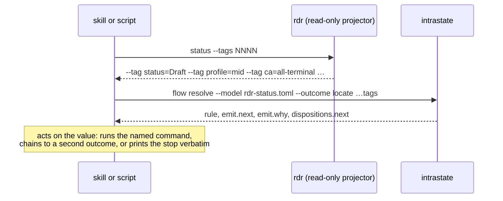

The doctrine the flow states for itself is that exact state lives in a
tool call, never in prose. The *state* (counts, ids, edges, which folders
exist) comes from `rdr`; the *transition* comes from `intrastate`; a
result is consumed as a value, never re-derived. Five models carry the
transitions:

| model | class | outcomes | rows | cells proved | escape rows |
| --- | --- | ---: | ---: | ---: | ---: |
| `rdr-status.toml` | decision-table | 8 | 88 | 4,252 | 0 |
| `rdr-write.toml` | state-machine | 8 | 72 | 2,084 | 0 |
| `rdr-launch.toml` | decision-table | 5 | 36 | 1,365 | 0 |
| `rdr-cascade.toml` | decision-table | 2 | 15 | 186 | 0 |
| `rdr-loop.toml` | decision-table | 2 | 12 | 40 | 0 |
| **total** | | **25** | **223** | **7,927** | **0** |

Two things stand out in that table. The first is the ratio: a few hundred
rows claim several thousand cells, because a row's guard may use `in`
over several members and `unless` over the complement, so one row claims
many cells. The second is the last column. None of these models closes
any group by escape; every cell is claimed by an ordinary row, and where a
situation has no honest answer the row emits a `stopped:` token naming
what is missing. One header says why an escape row was tried and removed:
"every cell it claimed was already claimed, so it was unreachable as well
as unproved."

### The navigator: `rdr-status.toml`

The flagship table answers "I lost my place; what do I run next?" Its
header records the incident that motivated it: a proof-of-concept over a
partial table found 208 of 512 cells unclaimed, a hole prose had carried
silently.

It is eight outcome groups, not one, because the analysis bounds the
product **per group**. Splitting the question splits the product: `locate`
ranges over the coarse position, `lens` over the lens row, and neither
pays for the other's dimensions. The groups chain through the `chain`
disposition of the `next` emit key, which is exactly the partitioned
domain the routing example above introduced:

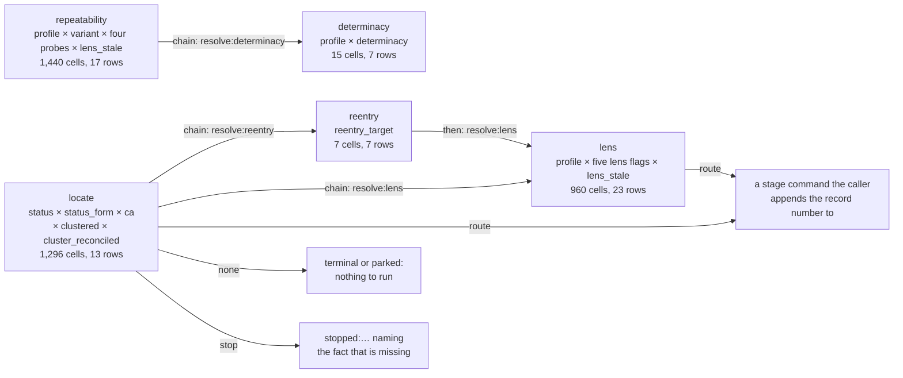

The wrapper script that lists every in-flight record's next step is a
loop over exactly those dispositions: resolve `locate`; while the
disposition is `chain`, resolve the outcome the value names; then print
`route` with the record number appended, `none` with the parked reason,
or the `stop` token verbatim. The other groups (`critique`,
`repeatability`, `floor`, `after-lock`) are asked directly by the stage
skills that own them; `repeatability` chains to `determinacy` when the
trigger for its lite variant is a judgement written on the record.

The `lens` group is the one that reads most like a state machine, and it
is worth seeing why it is not one:

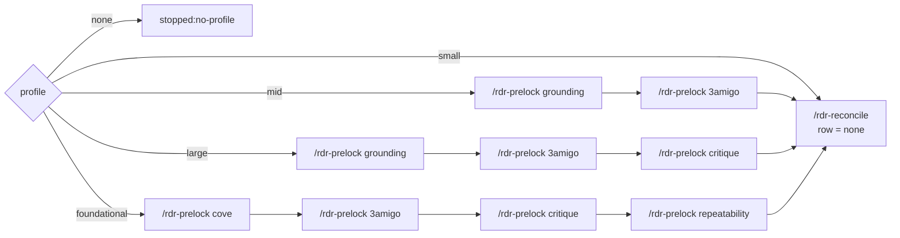

Each box is a row. The arrows are not transitions the model performs;
they are the order in which the lens flags flip from `false` to `true` as
evidence folders appear on disk, and the row selected is always "the
first flag on this profile's row that is still false." The state lives in
the artifacts, `rdr` reads it, and the table is stateless by doctrine: a
position computed from the artifacts cannot drift from them. A seventh
dimension, `lens_stale`, re-opens a lens whose evidence predates a
re-entry's demote date, which is how the same rows serve a record on its
second pass through the flow.

Two rules from the header that every row here obeys:

- **Dimensions are guard atoms, never match atoms.** A match atom scopes
  the group and contributes nothing to the product. A table discriminated
  by match atoms ranges over an empty product that any one row closes,
  and lints green whether or not it is complete.
- **Every dimension is `required` and `single_valued`.** Where the
  underlying field is genuinely sometimes absent, the fact table declares
  a sentinel member (`profile = none`, `reentry_target = none`) and the
  renderer always emits the key. The sentinel's cell is then an ordinary
  cell an ordinary row claims, usually with a `stopped:` answer. Absent is
  never silently read as false.

### The cascade: `rdr-cascade.toml`

The draft-to-lock orchestrator receives a return packet from each stage
and must decide: advance, re-run, park, or relay a stop. That was a prose
ladder over `verdict × blocking × retry × action`. The table's `packet`
group is 96 cells, eight rows, drawn here as one of the trees that
reproduces its leaves:

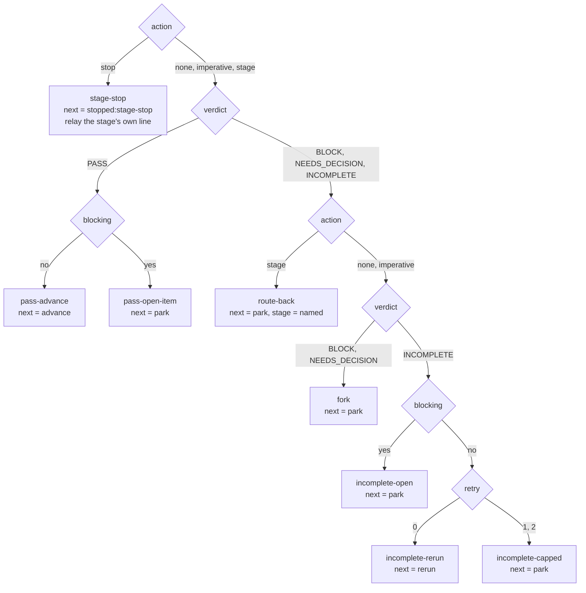

Absence is a declared member: a packet with no `next_action` is `action =
none`, and a first return is `retry = 0`. The route-back is a *member of
the `action` dimension*, not a second dimension, because a stage stop and
a named return stage share the packet's one imperative slot. And `retry`
saturates at 2: there is no cell in which a third silent re-run happens.

The sibling `posture` group (90 cells, seven rows) decides how much to
confirm with the human from `profile × status × ask_each`, and it is a
small example of a rule that can only raise the answer: `--ask-each` maps
every cell to "confirm everything," and no row reads lower than the
record's own field would earn.

### The two caps: `rdr-loop.toml`

Two re-run caps were prose that counted passes by hand. The `lens-loop`
group is `iter × found × net_new × fix`, 32 cells, eight rows:

| rule | iter | found | net_new | fix | next |
| --- | --- | --- | --- | --- | --- |
| `loop-converged` | any | none | none | any | `converged` |
| `loop-diff-inconsistent` | any | none | some | any | `stopped:ledger-diff-inconsistent` |
| `loop-no-pass-on-disk` | 1 | some | any | any | `stopped:ledger-diff-inconsistent` |
| `loop-rerun` | 2, 3 | some | any | substantial | `rerun` |
| `loop-small-fix` | 2, 3 | some | any | small | `converged` |
| `loop-flapping-net-new` | over | some | some | any | `stopped:verdict-flapping` |
| `loop-flapping-substantial` | over | some | none | substantial | `stopped:verdict-flapping` |
| `loop-over-small` | over | some | none | small | `converged` |

Two cells are impossible on a consistent diff, net-new anchors with
nothing found and anchors found with no pass on disk, and the table says
so rather than leaving them to fall through. `over` is one past the cap,
so a re-run at `over` *is* the forbidden fourth pass, and the two rows
there that would need one stop instead. The `cluster-cap` group is the
same idea over `iter × open`, eight cells, four rows.

### The Stage 8 gates: `rdr-launch.toml`

The implementation launch prompt routed by AND-gates in prose: a SIZE
gate deciding inline versus delegated from five caps, a COMPLETION gate
from four conditions, a predecessor PRECHECK, a SHARD route, and a leg
BUDGET. Five outcome groups, 36 rows, 1,365 cells.

The size gate is the clearest example of how a ladder becomes rows
without a hit policy. The prose said "the first failing signal wins." The
table encodes that order by conjoining every earlier cap's *passing* value
into each later row's guard, so the rows are disjoint by construction and
no tie-break is ever needed:

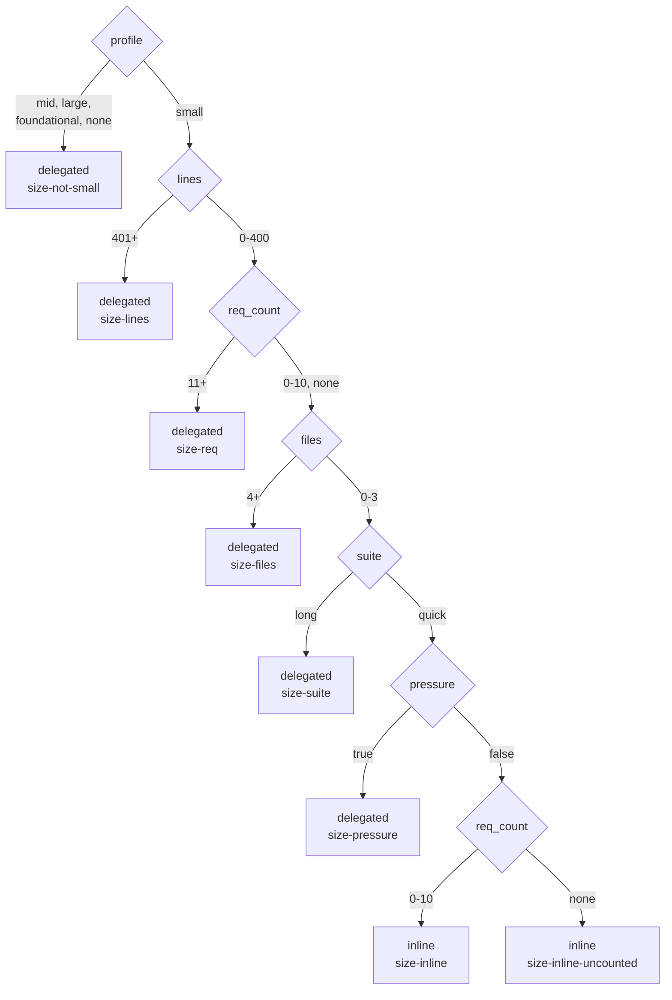

Three of the six dimensions (`files`, `suite`, `pressure`) are not facts
`rdr` renders. They are caller-supplied `--tag` values the orchestrator
binds from what the world shows it, never estimated and never remembered.
The same row is re-asked at every phase boundary, and a `delegated`
answer mid-run *is* the fallback; there is no second table for it. At
the precheck, before anything has happened, those tags sit at their floor
values and `req_count` is `none`, and the row for that cell is what makes
the inline path honest rather than a guess.

The `complete` group (288 cells, ten rows) is the same construction over
the six completion signals, and it is where the "a skipped check must
never read as a passed one" rule is most visible: an unread coverage
ledger is `impl_orphans = none`, a declared member, and its row emits
`stopped:coverage-unread` rather than falling into the `COMPLETE` cell.

The `budget` group (24 cells, six rows) decides when a Phase 2 leg
returns, from `suite_green × elapsed × ask × commits`. Its dimensions are
the last suite exit, the clock, `git rev-list --count`, and what the leg
just did. The header explains the cap with a measurement: context grew
about ten thousand tokens a minute over recorded legs, so a thirty-minute
cut returns a fresh leg from the capsule instead of letting the harness
compact a long one.

### The write side: `rdr-write.toml`

One of the five is a state machine, and it is the one that changes the
record. `rdr` is read-only by doctrine ("it never writes to a record"),
and adding write verbs to it was rejected: every such verb is Go that has
to be kept correct, and the win being chased was not a binary that writes
but smaller prompts and higher determinism. So the structural edits the
flow performs (claim a number, add or flip the index row, lock, demote,
size the profile, name the stage a blocker returns to, walk the search
ladder before asking the author) became rows, and the two owned tags they
advance are read and written through accessors that are `rdr` itself.

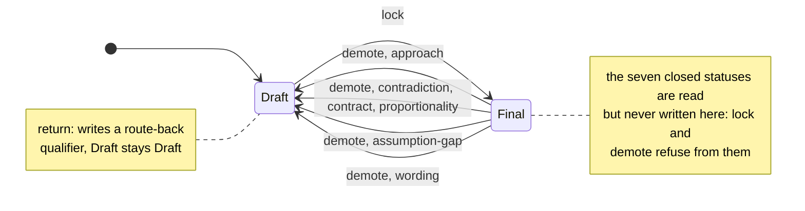

The `lock` edge is taken only when the gate is written and current and no
joint decision is open; every other `lock` cell decides without moving.
Each `demote` edge also writes a qualifier onto the Status line naming
the stage the record re-enters at, and `return` writes the same kind of
qualifier without leaving `Draft`:

| blocker class | re-enters at | `demote` writes | `return` writes |
| --- | --- | --- | --- |
| approach | propose | `Final → Draft` | qualifier only |
| contradiction, contract, proportionality | refine | `Final → Draft` | qualifier only |
| assumption-gap | resolve | `Final → Draft` | qualifier only |
| determinacy | prelock | refused: not a re-entry from Final | qualifier only |
| spike, assumption-disturbed | reconcile | refused: not a re-entry from Final | qualifier only |
| wording | finalize, re-lock only | `Final → Draft` | nothing: the lock pass fixes it in place |
| none | | `stopped:no-blocker-class` | `stopped:no-blocker-class` |

The `lock` group is the largest product in any of the five models: 1,620
cells over `status × status_form × gate_written × gate_stale ×
joint_check_home`, claimed by seven rows. Two rows advance `Draft` to
`Final`; the other five decide without advancing and emit the reason:
`stopped:no-gate-written`, `stopped:gate-stale`,
`stopped:joint-decision-open`, `stopped:not-lockable`, or `none` for a
record that is already `Final`, because the lock is idempotent.

A state-machine row that decides without advancing is declared
`advance = false`, and this model is mostly such rows: 62 of its 72. It is
a state machine because two groups genuinely move owned state, and
because the owned state must be *read through the model's accessors*, not
supplied as argv. The composition therefore has one more step than the
navigator's:

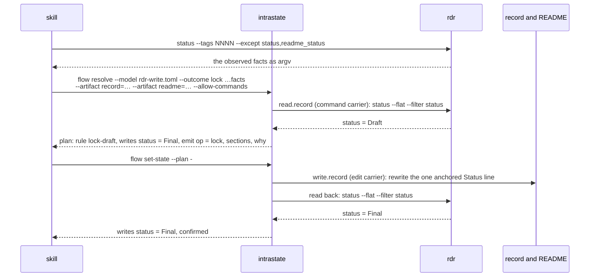

The two owned tags are excluded from the rendered argv because the
resolver refuses an owned key supplied as `--tag` (`flow-tag-owned`);
they arrive through `[read.record]` and `[read.readme]`, which are
`command` accessors whose argv is fixed in the model and visible to lint.
The writers are `edit` accessors: an `anchor` pattern that must select
exactly one line and a `replace` that rewrites it, applied in-process with
no shell. `read_back = true` on both means the same tool that rendered
the fact confirms the write, so a read-back cannot disagree with the
vector the row guarded on.

The `readme` group keeps the index row in step with the record over
`readme_status × status`, 99 cells, twenty rows:

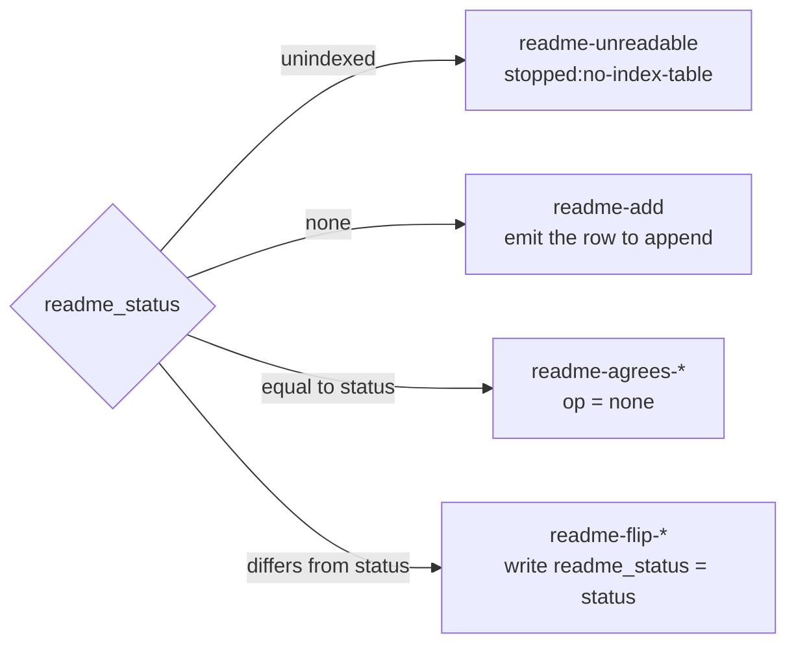

Only `lock` and `readme-flip` are applied by `set-state`. The other
operations emit an edit the caller applies, and the header says this is
permanent, not a stop-gap: an `edit` carrier substitutes a *planned
value*, and `profile`, `demote`, and `readme-add` interpolate author prose
that no fact supplies. Turning them into carriers would make the caller
type the prose as a tag for the table to interpolate, which is the
transcription this seam exists to remove, relocated rather than removed.

The `return` group carries a lesson the header calls out. It used to be
decide-only: the packet named the stage and nothing reached the record,
so a Draft routed back from Stage 4 looked, to the very next skill,
exactly like a Draft that had reached Stage 4 on its own. Two skills
deadlocked on it, each correct, neither able to move. The fix was to make
the row write a qualifier onto the record's own Status line, so that the
route-back became a fact `rdr` renders and the navigator routes on.

## What the pictures cannot show

The diagrams show shape. The guarantees are in what lint and the resolver
refuse, and those are the reason the consumer above rebuilt its routing
as models:

- **Coverage is enumerated, not assumed.** 223 rows claim 7,927 cells,
  and `intrastate lint` fails on the first unclaimed one. The 208-cell
  hole that motivated the navigator would have been a lint failure.
- **There is no hit policy.** Where two rows would both be enabled, the
  model does not lint. Order, priority, and authoring position never
  break a tie, because a tie-break the model did not author is a decision
  no reviewer approved. DMN's `First` and `Priority` policies are exactly
  what is refused here.
- **Absent is not false.** A fact that could not be established is
  rendered as a declared sentinel member, and its cell is claimed by a row
  that usually answers with a `stopped:` token. A refused read never lands
  in the resolver's argv; the wrapper scripts test the read before
  substituting it.
- **A stop is a value, not an exit code.** `stopped:no-profile` is an
  `emit.next` member under the `stop` disposition, returned at exit 0
  like any other answer. The caller branches on the disposition. What
  exits non-zero is a *refusal*: an unmodeled outcome, an undecidable
  guard, an ambiguous match, a denied gate.
- **The emit vocabulary is checked.** Every stage command, stop token,
  and edit operation these models can answer with is a declared member of
  an `[emit.*]` domain. A misspelt stop token is a load failure, not a
  string a skill reads as a stage.

## Reproducing the pictures

Every model above lints and exports with the shipped binary:

```sh
# the bundled examples
for m in models/examples/*.toml; do intrastate lint --model "$m"; done

# the tool's own graph, as DOT, rendered with graphviz
intrastate graph --model models/examples/release-grammar.toml --emit dot | dot -Tsvg > release.svg

# the normalized graph as JSON: tags with domains, rows with atoms, groups
intrastate graph --model models/examples/pricing-decision-table.toml --emit json | jq .

# the same over the rdr models, from a checkout of that repository
intrastate lint --model models/rdr-status.toml
intrastate graph --model models/rdr-write.toml --emit json | jq '.groups'
```

The per-group cell counts quoted in this document are the product of the
declared domain sizes of the keys each group's rows guard on, which is the
product `intrastate lint` proves coverage over. They were computed from
the `tags` and `rows` members of the JSON export; recomputing them after
a domain changes is the way to keep this document honest.

### Deriving a diagram from the export

The two derived state diagrams above came from this jq program. It is not
part of the tool and it is deliberately plain: one edge per transition
row, states named by the values of the owned keys the rows guard on, and
for a decision table one flowchart per outcome group with the guard atoms
on the row and the emit block beside it. It skips the prose emit keys
(`why`, `surface`, `sections`, `edit`) so the boxes stay readable. Save it
as `graph-to-mermaid.jq`:

```jq
def lit: if type=="array" then join(",") else tostring end;
def atom: "\(.key) \(.operator) \(.literal|lit)"
        + (if .block=="unless" then " (unless)" else "" end);
def owned: [.tags[] | select(.provenance=="owned") | .name];

def sm:
  owned as $own
  | ([.rows[].atoms[] | .key] | unique
     | map(select(. as $k | $own|index($k)))) as $state
  | def isstate: .key as $k | $state|index($k);
    "stateDiagram-v2",
    (.initial | map(select(isstate)) | map(.value|lit) | join(" ")
     | "    [*] --> \(.)"),
    (.rows[] | select(.kind=="transition") | . as $r
      | ([$r.atoms[] | select(.block=="all" and isstate
            and (.operator=="eq" or .operator=="in")) | .literal[]]) as $from
      | ([$r.writes[] | select(isstate) | .value|lit] | join(" ")) as $to
      | ([$r.writes[] | select(isstate|not)
            | select(.key as $k | $own|index($k))
            | if (.value|lit)=="<clear>" then "clear \(.key)"
              else "\(.key)=\(.value|lit)" end]) as $extra
      | ([$r.atoms[] | select(isstate|not) | atom] + $extra
         | join(", ")) as $label
      | (if ($from|length)==0 then ["any"] else $from end)[] as $f
      | "    \($f) --> \(if $to=="" then $f else $to end) : \($r.outcome)"
        + (if $label=="" then "" else ", " + $label end)),
    (.terminal[]? | map(select(isstate)) | map(.literal|lit) | join(" ")
     | "    \(.) --> [*]");

def dt:
  .groups[] as $g
  | ($g.context|split("/")[1]) as $o
  | ($o|gsub("[^A-Za-z0-9]";"_")) as $oid
  | "flowchart LR",
    "    O_\($oid)([\"--outcome \($o)\"])",
    (.rows[] | select(.outcome==$o)
      | (.identity|gsub("[^A-Za-z0-9]";"_")) as $id
      | ([.atoms[] | atom] | join("<br/>")) as $guard
      | ([.emit[]? | select(.key!="why" and .key!="surface"
            and .key!="sections" and .key!="edit")
          | "\(.key) = \(.value|lit)"] | join("<br/>")) as $emit
      | "    O_\($oid) --> R_\($id)[\"\(.identity|split(".")[1])"
        + (if .kind=="escape" then " (escape)" else "" end)
        + "<br/>\(if $guard=="" then "no guard" else $guard end)\"]",
        (if $emit!="" then "    R_\($id) --> E_\($id)[\"\($emit)\"]"
         else empty end)),
    "";

if .class=="state-machine" then sm else dt end
```

```sh
intrastate graph --model models/examples/pricing-decision-table.toml --emit json \
    | jq -r -f graph-to-mermaid.jq
```

Over the pricing table that prints the four-row flowchart drawn by hand
in [A decision table, minimal](#a-decision-table-minimal), with the
guard spelled as atoms (`tier eq free`, `region eq eu`) rather than as
prose. Over the rdr navigator it prints eight flowcharts, one per group,
that are complete and unreadable at once, which is why the drawings in
this document are by hand: the export is the source of truth for
*what the rows are*, and a drawing is a choice about *what to show*.
