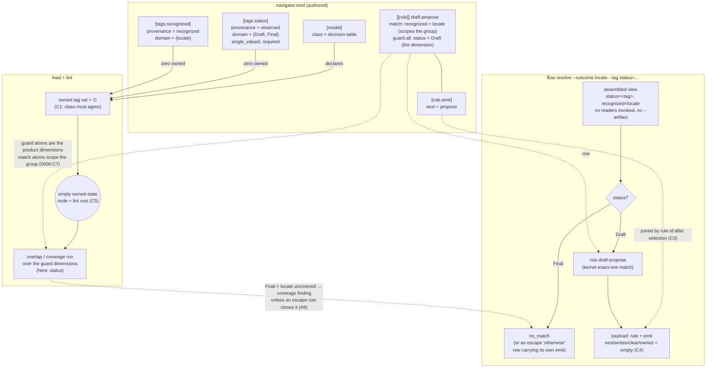

# Recommendation 0010: Owned state is optional: stateless decision tables are first-class

> Revise during planning; lock at implementation. After lock, content is never
> amended; structure may be migrated to the current template by tooling.
> If wrong, abandon code and iterate RDR.

<!-- Section classes: **Required** (never omit). **Conditional**
(delete the whole section if N/A — do NOT leave it blank or
N/A-bulleted). -->

## Metadata

- **Date**: 2026-08-26
- **Status**: Final
  <!--
  - `Deferred` is the parked-with-a-revisit-trigger status for a
    Draft that cannot proceed because **no acceptable mechanism
    exists yet** — every in-our-control path is ruled out and the
    one that would work is outside our control. It is a *pause in
    the lifecycle*, not an exit from it: the RDR stays intact and
    re-enters at the stage it stopped when the trigger fires.
    Carry the condition on the live value:
    `Deferred [revisit when <condition>]`, and say in the same
    field what was ruled out and why (Alternatives Considered
    carries the long form). Distinct from `Abandoned`, which is
    terminal — an Abandoned RDR is closed, owes a post-mortem, and
    never re-enters. A Deferred RDR owes **no** post-mortem
    (nothing was implemented), and its `Priority` records what the
    fix is *worth*, not what is scheduled. Do not defer merely to
    park work that is possible but unfunded — that is a Priority,
    not a Status.
  - `Demoted` is the terminal status for an RDR judged
    *not RDR-shaped* — the decision was never a real
    design fork, so it leaves the RDR lifecycle and is
    refiled as a plain issue. Carry the destination on the
    live value: `Demoted [→ <issue link>]`, and record the
    same link under **Related Issues**. A `Demoted` RDR runs
    no further stages. (Distinct from the 07.1 *demotion*
    below, which is a `Final → Draft` flip that keeps the
    RDR in the lifecycle — that flip never writes
    `Status: Demoted`; see the disambiguation note there.)
  - A Draft demoted from Final by the 07.1 cluster gate
    carries a qualifier on the live value:
    `Draft [revised from Final YYYY-MM-DD; re-verify A2,A4
    — <one-line reason>]`. It is still a `Draft` for every
    binary Draft/Final gate; only Stage 4 (scoped
    re-verify) and Stage 7 (re-lock) parse the qualifier.
    The Stage 7 flip to `Final` overwrites the whole value,
    so the qualifier self-clears at re-lock — no separate
    cleanup. This 07.1 "demotion" is a *verb* describing the
    Final→Draft flip; it is **not** the `Demoted` status
    above (which exits the lifecycle to an issue) — do not
    conflate the two. (`Reverted` above is the unrelated
    terminal "implementation rolled back" status — also do
    not conflate.)
  - A Final tolerated at the 07.1 gate under a JOINT-DECISION
    carries `Final [joint decision → <home §-anchor>: <the
    open question>]`. It is still a `Final` for every binary
    gate. The qualifier is an **open obligation, not a
    coherence claim**: it says the named question is
    unanswered here, not that this RDR agrees with the answer.
    So it does not self-clear. When the home answers, this RDR
    owes a scoped check of that answer against its own
    normative fences before it re-locks or implements —
    consistent → drop the qualifier and record the clearing;
    contradicts fenced text → a 07.1 SPEC-DEFECT. A re-lock
    that comes first carries the qualifier forward unchanged;
    it is never silently dropped.
  -->
- **Type**: Architecture
- **Profile**: foundational — five contracts (C1 class declaration, C2 class-conditioned rule shape, C3 `[rule.emit]`, C4 resolve payload, C5 ∅-rooted lint) are facets of one seam, "is a zero-owned-tag model a legal class and what does resolve answer over it"; it produces for 0002/0005/0006 and spans `internal/table`, `internal/graphlint`, and `internal/cli`.
  <!-- Do not paste the matrix below into the field; it is the
  Stage 5 routing latch, provisional on `Draft`, made
  authoritative by Resolve.
  Sized by BLAST RADIUS — the MAX of two axes, not
  contract count or word count.
  (1) contract axis: small = one contract, no user-facing
  surface (skips Stage 5); mid = one contract + user-facing
  surface OR locks a contract; large = locks an enum/hash/
  format/grammar/destructive-op; foundational = cross-RDR
  producer / spans modules.
  (2) accretion axis (HARD floor): if `Seam Lineage` below
  carries ≥2 closed prior point-fixes at this locus, Profile
  is floored at FOUNDATIONAL regardless of the contract axis
  — a seam with prior point-fixes is never small/mid (it
  spans the prior RDRs/patches = the matrix's cross-RDR
  trigger). The only escape is a written accretion disposition
  in the Seam Lineage field. This floor is what stops a
  "one contract → mid" sizing from under-gating an accreting
  seam.
  Matrix: rdr/stages/README.md. Seed estimates from the design
  shape; Resolve overwrites from the verified count; Stage 8
  Gate locks it at Draft → Final. Never skip lenses off a
  Draft Profile until Resolve has run. -->
- **Priority**: High
- **Related Issues**: intrastate#zdat (seed; stays open as the defect tracker), rdr#thsc (umbrella), rdr#tmxk (the consumer model that motivates this), intrastate#1mv1 (sibling seed, now RDR 0011 — `flow next` verb semantics; cross-cite, not a facet)
- **Predecessors**: 0002-transition-table-as-reviewable-data, 0005-skill-integration-cli-contract, 0006-graph-lint-authority-and-guarantees
- **Overrides**: 0002:C2 and 0002:C3 (the closed `[model]` layout gains an optional `class` key; the rule layout gains `[rule.emit]`) — additive; 0002:C4 ("an ordinary transition rule MUST contain a write block", `internal/table/normalize.go::normalizeRule`, category `malformed_rule_shape`) — conditioned on the `state-machine` class; 0002:C19 (closed dump column vocabulary gains `emit`); 0005:C1 (the `flow resolve` success payload gains `emit`; `--artifact` unrequired is a consequence of its own reader scoping, not an override); 0006:D-reachability-relation (the root is the declared initial owned state *or*, for the `decision-table` class, the empty owned-state node); 0006's closed `reason` set for `graph-unprovable-coverage` (`internal/graphlint/taxonomy.go`, asserted exhaustively by `TestReq80`) — **appended, not conditioned**: a fourth member `no-participating-dimension` carries C5's group-level arm, and this is the one clause of this RDR that is not additive on its owner's grammar, so it needs 0006's assent (A14). Confirmed at propose as NOT overridden: 0006:C18 (missing root stays a blocking finding for the `state-machine` class, `internal/graphlint/analysis.go::checkDanglingEdge`), 0002:C2's write-only-owned-tag clause (unreachable with zero owned tags), 0005 DEV-8's demand set (`internal/cli/flow_exec.go::invokedReaders`, already empty over no owned keys).
- **Seam Lineage**: no prior accretion

## Problem Statement

A model author who wants intrastate only to *decide* — which row of a
decision table applies to the observed dimensions — and has no state of their
own to carry between resolves, cannot write that model as what it is. Today
they must declare a dummy owned tag, an `[initial]`, read/write accessors,
and hand `flow resolve --artifact` a scratch file in an undocumented format.
They discover this when a straightforward decision-only model is refused at
resolve with `flow-owned-state-unavailable` on the write-only key until a
scratch artifact is seeded (verified 2026-08-26 with a proof-of-concept
navigator model). The workaround obscures the model's intent, leaks a
consumer-invented file format, and adds accessor surface the author never
wanted.

The system-internal requirement: the model grammar, lint, and resolve
currently assume every model is a state machine. Every ordinary rule must
carry a write block (RDR 0002:C4, `internal/table/normalize.go::normalizeRule`
→ `CatMalformedRuleShape`); a missing `[initial]` is reported as a dangling
edge (RDR 0006:C18, `internal/graphlint/analysis.go::checkDanglingEdge`); and
resolve demands the write target as owned state (RDR 0005 DEV-8,
`internal/cli/flow_exec.go::invokedReaders` demand set = RequiresOwned ∪
guard keys). The design question is whether a model with zero owned tags is a
legal, first-class model class — and if so, what `flow resolve` returns over
it (the selected row's identity, an authored `emit` block of literal
key/values, or something else), and what each lint rule means when the owned
set is empty. Exhaustiveness/coverage lint over the table's **guard**
dimensions must keep working unchanged — guard atoms, not match atoms, are
what `internal/guard/product.go::Dimensions` collects into the scoped product
(`0006:C7`, `0003:C13`), so a decision table authors its discriminators as
`[rule.guard.all.<key>]`; a match-discriminated table has an empty product
and takes C5's `graph-unprovable-coverage` instead. The PoC surfaced a
208/512 coverage hole in a partial
table, which is the property that makes stateless tables worth supporting at
all. Stateful models are unchanged; intrastate stays generic (no consumer
knowledge, no artifact discovery).

## Critical Assumptions

- **A1 Seeding reachability at the empty owned-state node makes every group of
  a decision-table model reachable, so overlap and coverage produce the same
  findings the scratch-tag PoC produced (the 208/512 hole reproduces with the
  owned tag removed).**
  - **Status**: Verified
  - **Method**: Spike
  - **Evidence**: `internal/graphlint/analysis.go::nodeSatisfiesMatch`
    consults only owned atoms, so an owned-atom-free context is satisfied by
    the ∅ node. Executed, not derived: `evidence/spikes/emptyroot/emptyroot_test.go`
    drives the exported `graphlint.Run` over a 512-cell nine-dimension model
    (`evidence/spikes/a1-baseline.toml`) in three arms
    (`evidence/spikes/a1-emptyroot.out`) — **A** as loaded with a scratch
    owned tag: 1 node, `graph-coverage-gap` 64/512 + `graph-redundant-row`;
    **B** owned tag stripped, no root (current behaviour): **0 nodes,
    `graph-dangling-edge` only — the coverage finding disappears**; **C**
    stripped with the ∅ root seeded (C5's proposal): **1 node, the finding
    set of arm A restored cell-for-cell**. Arm B is the false green C5
    exists to close. Thresholds probed separately
    (`evidence/spikes/a1-thresholds.out`): the product bound is **2048** and
    fires only at 4096 (`graph-product-too-large`), so a 512-cell group is
    not withheld; the second `0006:C12` arm is not a group-*size*
    suppression but a per-tag one — a dimension without `single_valued =
    true` takes `graph-unprovable-coverage` (`internal/graphlint/coverage.go::emitStructurallyUnprovable`).
  - **If wrong**: coverage is silently vacuous over decision tables — exit 0
    with an unproven table, the exact outcome 0006:C18 forbids.
- **A2 With zero owned tags the reader demand set is empty, so `flow resolve`
  and `flow next` invoke no reader, raise no `flow-artifact-missing`, and a
  bound `--artifact` for an uninvoked role is ignored rather than refused.**
  - **Status**: Verified
  - **Method**: Source Search
  - **Evidence**: `internal/cli/flow_exec.go::invokedReaders` unions
    `Row.RequiresOwned` with `internal/cli/flow_exec.go::guardOwnedKeys`, which
    filters on `Provenance != table.ProvenanceOwned` — the demand is keyed on
    owned provenance, so zero owned tags yields an empty demand set;
    `internal/cli/flow_exec.go::runReaders` checks `r.artifacts[...]` only
    inside its loop over the invoked names, so an empty set performs zero
    binding checks and raises no `flow-artifact-missing`. `flow next` shares
    the same path (`internal/cli/flow_next.go` calls `invokedReaders(req.model, "")`),
    so there is one demand path, not two. The ignore-not-refuse clause holds
    because no validation of supplied bindings exists:
    `internal/cli/flow_input.go::parseArtifacts` splits `role=path` and never
    consults the model, and every artifact consumer is a lookup-by-need,
    never a sweep over supplied bindings — so a binding for an uninvoked role
    is silently ignored. (`read-state` runs every declared reader, unchanged.)
  - **If wrong**: a decision table still needs a scratch artifact — the
    problem statement's refusal survives.
- **A3 The kernel returns a plan over an empty owned view when every
  candidate row carries empty `RequiresOwned`, `Writes`, and `NextTags`.**
  - **Status**: Verified
  - **Method**: Source Search
  - **Evidence**: `internal/resolve/resolve.go::missingOwned` iterates
    `RequiresOwned` only and returns nil for empty. The whole `Resolve` entry
    path was read, not just that symbol: its two preconditions are
    `Table.CheckValid()` (0009 escape shape) and
    `internal/resolve/precondition.go::CheckInput` (a reserved-key scan) —
    neither guards on `len(owned)`, an empty view, an initial state, or
    non-empty `Writes`. An empty `row.Match` matches vacuously, and
    `internal/resolve/resolve.go::planOf` copies `NextTags`/`Writes`
    unconditionally, yielding empty. Escape rows already normalize to
    both-empty (`0002:C14`, `0002:C15`) and resolve today.
  - **If wrong**: `flow resolve` over a decision table refuses on a kernel
    precondition, and the class needs a kernel change RDR 0001 owns.
- **A4 `emit` can join the closed dump column vocabulary under `0002:C19`, and
  every checked-in model or fixture carrying an explicit `[dump]` column list
  is updated in the same change.**
  - **Status**: Verified
  - **Method**: Source Search
  - **Evidence**: `internal/table/dump.go::dumpColumns` is the closed
    ten-column vocabulary. `internal/table/load.go::loadDump` refuses in both
    directions, and the omitted arm is the decisive one — it loops the
    vocabulary and fails `CatMalformedDumpDeclaration` with "column … is
    omitted" for any member not `seen`, commented there as "a truncated dump
    is a refusal, never a silent narrowing (`0002:C19`)". An explicit `[dump]`
    list is therefore required to be **exhaustive**, so adding `emit` breaks
    every existing declaration at load until edited. **Count confirmed exact:
    103** files under `internal/table/testdata/` declare `[dump]`, all 103
    with an explicit `order =` list (`grep -rl '^\[dump\]' internal/table/testdata/ | wc -l`);
    the 73 further repo-wide matches (176 repo-wide, less the 103) are all under
    `docs/rdr/0002-*/evidence/`, i.e. 0002's spike fixtures. Absent `[dump]`,
    `loadDump` sets `DumpOrder = DumpColumns()`, so the default set picks up
    `emit` for free, satisfying C3's default-set clause. `models/rdr.toml`
    declares none — confirmed, and it is the only file in `models/`.
    **The census counted TOML only, and that was the gap**: the vocabulary is
    also asserted from Go, as a slice literal, at
    `internal/table/dump_test.go::TestReq95_DumpColumnVocabularyIsClosedAndVerbatim`
    — `want := []string{…}` compared by `reflect.DeepEqual` twice (against
    `table.DumpColumns()` and against a fixture's decoded `DumpOrder`), under
    a comment reading "the one place the record forbids re-derivation". So the
    edit set is 103 TOML `order` lists **plus** that Go expectation; the
    Testing Strategy's licensed-diff rule names both shapes (3 and 4) rather
    than leaving the Go one to surface as a red test mid-sweep.
  - **If wrong**: every existing `[dump]` declaration refuses at load until
    edited, or `emit` is undumpable and the dump stops carrying "every
    field" of the normalized value.
- **A5 The kernel's exact-one selection is the decision-table hit policy the
  motivating consumer needs; no first-hit, priority, or collect policy is
  required.**
  - **Status**: Verified
  - **Method**: Prior Art
  - **Evidence**: model prior only — ⚠ no corpus coverage for decision-table
    hit policies (research/prior-art.md K1). Confirmed against the consumer
    tracker itself rather than from memory: rdr#tmxk requires that
    `intrastate lint --model` "must prove every status×profile×ca×lens cell
    has exactly one row", which is the kernel's exact-one policy stated as
    the consumer's own acceptance criterion — no first-hit, priority, or
    collect policy appears anywhere in that requirement. The corpus gap is
    real and stays declared: this is verified as *sufficient for the
    motivating consumer*, not as a general survey of hit policies.
    **Reversibility, since the verification is single-consumer:** exact-one is
    the kernel's existing policy for every class (`0001`), so this RDR locks
    no new selection semantics and adds no policy key to the grammar. A later
    first-hit or priority policy is therefore a grammar addition on `[model]`
    or `[[rule]]` — the same additive shape `class` itself takes — and not a
    reversal of anything decided here; a table authored today keeps meaning
    what it means. That is why no extension point is reserved now: reserving
    one would fix a shape for a policy nobody has specified.
  - **If wrong**: a decision table that relies on row precedence is refused
    `flow-ambiguous-match` and the class needs a selection rule the kernel
    does not have.
- **A6 A flat, string-valued `[rule.emit]` table is sufficient for the
  motivating consumer's answer, because every value that consumer needs from
  the table is a fixed string known at authoring time — per-invocation data
  (an RDR number, a path) is supplied by the caller, never interpolated by
  the table.**
  - **Status**: Verified
  - **Method**: Peer RDR
  - **Evidence**: re-verified at Stage 6 against the consumer's **actual emit
    keys**, not against the rendered example the critique lens refuted
    (`evidence/spikes/a6-emit-keys.md`). rdr#tmxk states verbatim "the
    selected row (or an `emit`) is the answer", and its answer is one
    *routing decision*. That decision's rendered form is
    `rdr/skills/rdr-status/SKILL.md:168` — "the exact command to run, e.g.
    `Next: /rdr-prelock 0046 critique`" — which decomposes into exactly three
    parts: the **stage verb** (`/rdr-prelock`, a closed set of skill names),
    the **lens** (`critique`, the closed set `grounding|cove|3amigo|critique|
    repeatability`), and the **record number** (`0046`). The first two are
    fixed strings known when the table is authored; the third is the argument
    the caller already holds — the user typed it — so it is never a table
    value and the table never interpolates it. **The earlier reading — "a
    flat string carries the rendered command whole" — was wrong, and the
    correction narrows the claim rather than widening the type.** The match
    side confirms the same shape: every fact the routing table keys on is a
    closed enum of authoring-time literals
    (`rdr/models/rdr-facts.toml:79,99,144,257,552` — Status, qualifier,
    Profile, CA-plan, gate state), and facts are `probe`/`field` *inputs*,
    never values the table must render. Judgment cells route to a
    stop-packet row, again a fixed `stopped:<code>` string. So sufficiency
    rests on the narrower, now-checked claim: **every value the motivating
    consumer needs from the table is a fixed string known at authoring
    time**, with per-invocation data supplied by the caller. A consumer
    needing the table itself to interpolate — a template language in an emit
    value — is the widening A6 defers, and this RDR does not provide one:
    emit values are uninterpreted and compared by exact byte equality (C3),
    so a `{id}` in a value is literal text, not a substitution.
  - **If wrong**: consumers pack structure into strings (a command with
    arguments is one string today), and the wire shape needs an `any`-typed
    value later (a widening, not a break).
- **A7 `internal/graphlint/engine.go::Fingerprint` and 0006's finding
  identity do not read `emit`, so editing an emit block never changes a
  finding's identity.**
  - **Status**: Verified
  - **Method**: MVV Test
  - **Evidence**: the static half is now read rather than assumed:
    `internal/graphlint/engine.go::Fingerprint` is a hand-written
    field-by-field serialization — no reflection, no marshal, no whole-`Row`
    hashing — over exactly two fields, `row.Atoms` (`Key`, `Block`,
    `Operator`, `Literal`) and `row.NextTags` (`Key`, `Value`). It reads
    neither `Writes`, `RuleID`, `SourceLocator`, `Outcome`, `RequiresOwned`,
    `Gate`, nor `Escape`, so a new non-graph `Emit` field cannot perturb it.
    The MVV test that edits only an emit block and compares fingerprints
    remains the assertion; this reading is what makes it a confirmation
    rather than a discovery.
  - **If wrong**: golden lint outputs churn on emit edits, and `0006:C15`'s
    ordering key gains a non-graph input.
- **A8 Strict decoding refuses an unknown `[model]` key, so a
  `class = "decision-table"` model loaded by a binary predating this RDR
  refuses as `unknown_schema_field` rather than silently loading as a
  machine.**
  - **Status**: Verified
  - **Method**: Spike
  - **Evidence**: run against the current (pre-change) binary and captured at
    `evidence/spikes/a8-strict-decode.out` (analysis: `evidence/spikes/a8-analysis.md`;
    independently reproduced by the A1 spike at `evidence/spikes/a1-zero-owned-class.out`).
    `class = "decision-table"` on `[model]` refuses `unknown_schema_field`,
    exit 2, on **both** load paths — envelope `model-invalid` under `lint`
    and `flow-model-invalid` under `flow resolve`/`flow next` — so the
    misattributed `graph-dangling-edge` the "If wrong" arm fears never
    occurs: load fails fail-fast before any graph lint runs. Mechanism:
    `internal/table/source.go::decodeStrict` calls `dec.DisallowUnknownFields()`
    and raises `CatUnknownSchemaField`. Strictness is **recursive over the
    struct graph**, so an unknown key on `[[rule]]` — including `[rule.emit]`
    — likewise refuses `unknown_schema_field` today: a second old-binary
    protection, meaning an old binary cannot silently drop an authored emit
    block either. Assert on the category and exit status, never the message
    text, which is upstream-owned by `pelletier/go-toml/v2` (`0002:C24`,
    `internal/table/category.go`).
  - **If wrong**: an old binary lints a decision table as a rootless machine
    and reports `graph-dangling-edge` — loud, but misattributed.
- **A9 The "otherwise" row of a decision table is an escape row rescuing
  `no_match` that carries `[rule.emit]`; it closes coverage only under
  0006's advisory (`graph-coverage-closed-by-escape`), never as a silent
  default, and the rescued plan reports `escaped = true`.**
  - **Status**: Verified
  - **Method**: MVV Test
  - **Evidence**: each clause checked against source and the peer contract.
    `0006:C10`'s "declared classes" are the rescuable *failure* classes —
    it fixes the union "per (scoped row group × declared rescuable class) —
    `no_match` and `ambiguous_match` only" — and the implementation matches
    (`internal/graphlint/coverage.go::bareEscapeFor` filters on
    `slices.Contains(row.Escape, class)`). C10's second paragraph makes the
    `ambiguous_match` arm vacuously closed for an overlap-free group, so a
    decision table needs an escape row for `no_match` only. The advisory is
    real and *fires by design* on a bare escape row
    (`internal/graphlint/coverage.go` emits `CodeCoverageClosedByEscape` so
    that "a bare green does not satisfy the clause") — never a silent
    default, as claimed. `escaped = true` is reached: `resolve.Plan.Escaped`
    is set only by `internal/resolve/resolve.go::escapeOrRefuse`'s exact-one
    rescue arm and surfaced as `"escaped"` by
    `internal/cli/flow_resolve.go::resolvePayload`. Nothing in the escape
    path forbids `emit` — the escape prohibitions key on `Write`/`Clear`/`Gate`
    presence only (`internal/table/normalize.go::normalizeRule`).
    **Consequence carried, not restated:** `0002:C5` scopes rescue per
    outcome, so "the otherwise row" is per-outcome — a table over an
    N-outcome alphabet needs N escape rows (or one `in`-atom rule expanding
    to N), which the Phase 4 authoring docs must say. **Why this gets a doc
    where the match-atom mistake gets a fence (C5):** the two are not the
    same shape at lint. A missing rescue row is *already reported* — the
    unrescued outcome's group takes its ordinary `graph-coverage-gap`,
    because `internal/graphlint/coverage.go::bareEscapeFor` is scoped per
    group and per rescued class, so no rescue is found and nothing closes the
    claim. The match-discriminated table, by contrast, closes **clean** and
    reports nothing at all — a silent green, which is why it needed a new
    arm. Here lint names the symptom and the doc names the remedy; a
    dedicated "outcome has no rescue row" code would be a 0006 taxonomy
    addition for a case 0006 already reports, so it is not taken.
  - **If wrong**: authors reach for an overlapping catch-all ordinary row
    and hit `flow-ambiguous-match`, or a default row hides a coverage hole.
- **A10 Every one of the fourteen 0006 finding codes is, over a
  decision-table model *rooted per C5*, either exercised unchanged
  (`graph-overlap`, `graph-coverage-gap`, `graph-unprovable-coverage`,
  `graph-redundant-row`, `graph-coverage-closed-by-escape`,
  `graph-product-too-large` — both its group and traversal arms) or provably
  silent (`graph-dead-end`, `graph-always-present-owned`,
  `graph-owned-before-write`, `graph-single-valued-state`,
  `graph-terminal-escape`, `graph-unreachable-rule`, `graph-vacuous-atom`).
  `graph-dangling-edge` is the one code that splits by arm: its missing-root
  arm is silent under C5's override of `0006:C18`, its terminal-predicate arm
  stays live and is C2's enforcement of the `terminal` prohibition.
  `graph-unprovable-coverage` is exercised unchanged *as a code* but gains a
  class-conditioned arm under C5 — a zero-participating-dimension group,
  which over a state machine is legitimate and silent — booked as A13.**
  - **Status**: Verified
  - **Method**: MVV Test
  - **Evidence**: the taxonomy was enumerated rather than paraphrased —
    `internal/graphlint/taxonomy.go` declares **ten blocking + four advisory
    = fourteen** codes; `graph-lint-failed` is the aggregate CLIError code
    (`0006:C14`), not an invariant, and is out of scope. Two corrections the
    verification forced, both now folded into the claim above: the code is
    `graph-owned-before-write` (not "owned-before-match"), and A10's separate
    "product bound"/"node ceiling" are **one** code,
    `graph-product-too-large`, under two call sites
    (`internal/graphlint/coverage.go` for the group product,
    `internal/graphlint/analysis.go::checkNodeCeiling` for the traversal).
    The silent bucket is grounded per code: `checkSingleValuedState` iterates
    an empty `writesOf`; `checkOwnedBeforeMatch` filters on `ProvenanceOwned`
    and finds none; `checkDeadEnd` and
    `checkTerminalEscape` return early on absent terminals; `checkVacuousAtoms`
    requires a `guard` atom with `exists` over a `Required` tag, which a match
    atom never is. **Two codes are silent for a reason this RDR does not
    control, and the distinction matters**: `checkUnreachableRules`
    (`internal/graphlint/analysis.go`) and `checkAlwaysPresentOwned` (same
    file) each return early on `len(a.model.Initial) == 0` — *before* reaching
    the reachable set or the provenance filter. A decision table still has an
    empty `[initial]` under C5 (the class supplies a traversal root, it does
    not populate `Initial`), so both stay silent — but by the old key, not by
    the class and not by the ∅ node satisfying every context. That is why C5
    lists them as vacuous rather than class-keying them, and it is a
    standing trap: converting either site to the class test would flip it
    live over every decision table.
    **The load-bearing correction:** the six "exercised unchanged" codes are
    unchanged *only because C5 supplies the root* — this is a property of
    C5, not of the zero-write model. On shipped source
    `internal/graphlint/reach.go::reach` returns no nodes for an empty
    `Initial`, `internal/graphlint/groups.go::checkGroups` `continue`s past
    overlap, redundancy, and coverage for every unreachable group, and
    `internal/graphlint/analysis.go::checkDanglingEdge` fires its root arm
    unconditionally — so the shipped behaviour over a rootless model is one
    `graph-dangling-edge` and silence everywhere else. Executed in the A1
    spike, arm B (`evidence/spikes/a1-emptyroot.out`). That root arm is
    therefore silent here by C5's override of `0006:C18`, which is scoped
    to this class alone — not by the model's zero writes.
    **The code has a second arm, and it does not go silent with the first:**
    `checkDanglingEdge` also emits over each terminal predicate reading a
    non-owned tag, at `element = terminal[i]` rather than `element = model`.
    Executed, both arms firing on one model:
    `evidence/spikes/cove-dt-terminal/result.md`. `0006:C3` carries dangling
    edge and declared terminal/escape handling as distinct classes and
    `0006:C18` names only the absent root, so the override reaches the root
    arm alone. The terminal arm cannot false-positive over a zero-owned model
    — every terminal predicate necessarily reads a non-owned tag — so it is
    live by design and is what makes C2's `terminal` prohibition a refusal
    0006 already owns rather than a new one.
  - **If wrong**: a machine-only invariant fires on every decision table, or
    stays silent on a defect it should report.
- **A11 `flow next` over a decision-table model succeeds unchanged — no
  owned demand, empty `required`/`next`/`writes` per candidate, every rule
  a candidate — under cli/0011:C1's candidate predicate.**
  - **Status**: Verified
  - **Method**: MVV Test
  - **Evidence**: the cross-reference was checked in both directions and is
    coherent — cli/0011:C1 (Final) does state its demand-set term "is empty
    over a model with zero owned tags (`0010:C4`)", and C4 does entail it
    (`owned` and `readers` empty over a decision-table model). `required` is
    built from the owned demand set and is empty here:
    `internal/cli/flow_next.go` sets `Required: slices.Clone(row.RequiresOwned)`
    with a nil-to-`[]string{}` normalization, and `RequiresOwned` is derived
    from the write block and clear list alone (`0002:C14`), both absent under
    C2 — so it serializes `[]`, never `null`. C1's own match-block term adds
    the row's match-block *owned* keys, of which a decision table has none.
    **Caveat pinned for the MVV:** "every rule a candidate" holds for an
    invocation that supplies no *conflicting* `--tag` — C1 names `no_match`
    as the one probe disposition that excludes, so a supplied tag whose value
    contradicts a row's match atom does exclude that row. The MVV step must
    therefore pass no `--tag`, or tags satisfying every row, or the assertion
    fails against a correct implementation. (Note cli/0011:C1 is Final but
    unimplemented — shipped `flow next` strips `probe.Match` wholesale, which
    admits every rule *a fortiori*; the claim holds under both the shipped
    code and C1-as-specified.)
  - **If wrong**: `next` over a decision table refuses or reports nonsense,
    and this RDR owes a class-specific clause on 0011's seam.

- **A12 Splitting `graph-dangling-edge` by arm is implementable without a
  taxonomy change: the missing-root arm can be class-keyed while the
  terminal-predicate arm stays unconditional, and no consumer of the finding
  set distinguishes the two by code alone.**
  - **Status**: Verified
  - **Method**: MVV Test
  - **Evidence**: both halves now executed. *Mechanism*: both arms live in one
    function (`internal/graphlint/analysis.go::checkDanglingEdge`, emitting at
    :118 and :139) and emit one code, distinguished only by `element` (`model`
    vs `terminal[i]`) — both firing on one model,
    `evidence/spikes/cove-dt-terminal/result.md`. *Consumer side* (the half
    that was open, now closed at `evidence/spikes/a12-consumers.md`): **twelve
    consumers enumerated**, none broken. The decisive structural fact is that
    `table.Model` has **no `Class` field today and no `class` layout key
    exists**, so every checked-in fixture is state-machine class by
    construction and C5's predicate is *bit-identical* to today's behaviour
    over all of them. Root-arm consumers (`invariants_0006_test.go:70,206,893`,
    `findings_0006_test.go:102`, `lint_fixtures_0006_test.go:112`,
    `lint_gate_0006_test.go:25,155`, `lint_mvv_0006_test.go:128`) all assert on
    **code only** over models declaring no `class`, so class-keying cannot
    reach them. The terminal arm's sole consumer (`TestReq129`) runs a **rooted**
    model, where the root arm was already silent — so keeping the terminal arm
    unconditional changes nothing there either. `taxonomy.go:25,67` and
    `findings_0006_test.go:251-261` (REQ-73's blocking-set literal) are
    membership assertions over an unchanged code string. The one rootless
    checked-in fixture, `pos-no-initial.toml`, is consumed by
    `internal/table` **loader** tests only (`accessors_test.go:498`,
    `roundtrip_test.go:1023`), never by graph lint, so it carries no lint
    expectation to break. Baseline green: `go test ./internal/graphlint/...`
    → `ok 3.499s`.
    **Implementation trap this verification surfaced, carried into Phase 2:**
    the root-arm predicate must be spelled as the *augmenting OR* —
    `class == "decision-table" || len(Initial) > 0` — never as the class test
    alone. Spelled as class alone it would silence the root arm for every
    rootless *state-machine* model, flipping `TestReq32` and the `0006:C18`
    guarantee; spelled as the OR it is additive, which is what makes A12's
    "without a taxonomy change" true.
  - **If wrong**: the arms cannot be split without a new finding code, and
    C2's "none of these is a new refusal" fails for `terminal` — the
    prohibition then needs either a load-time check (a new refusal C1's
    agreement check would have to grow) or a taxonomy addition 0006 owns.
- **A13 A decision-table group with zero participating guard dimensions can
  take `graph-unprovable-coverage` from inside `checkCoverage`'s
  `len(dims) == 0` branch, ahead of `emitCoverageArms`, without disturbing
  the state-machine class, where a zero-dimension group is legitimate and
  stays silent.**
  - **Status**: Verified
  - **Method**: MVV Test
  - **Evidence**: `evidence/spikes/a13-zerodim.md`, executed against the
    **real** loader and engine (`table.Load` +
    `graphlint.Run(graphlint.NewRequest(m))`) from a spike package under the
    evidence dir; `internal/` untouched (`git status --porcelain internal/`
    empty), baseline green
    (`go test ./internal/graphlint/... ./internal/table/...`). The site was
    already pinned at pre-lock — the zero-dimension branch is explicit at
    `internal/graphlint/coverage.go::checkCoverage` (`len(dims) == 0` →
    `emitCoverageArms` → **return**), and
    `internal/guard/product.go::Dimensions` collects guard atoms only. Both
    open halves are now demonstrated.
    **Q1 — no double-report, but the early `return` is load-bearing.** Traced
    and executed: over a zero-dimension group the product is the *empty*
    product (one empty assignment) and IS projectable, so
    `emitCoverageArms`'s `!Projectable()` guard does not fire;
    `coverageUnionFor` takes its own `len(Dimensions) == 0` arm
    (`coverage.go:415`), where membership alone decides, so **every**
    zero-dimension group closes every arm, and `bareEscapeFor` then emits
    `graph-coverage-closed-by-escape`. A gap can never accompany it (the union
    equals the product by construction). So a *naive* insertion — emit, then
    fall through — **would double-report** exactly the pair C5 forbids. C5's
    precedence is achievable at the site and cheaply: the branch is a
    self-contained `emitCoverageArms(g); return` pair
    (`coverage.go:34-42`), so the class-keyed arm emits and **returns**,
    suppressing the closure advisory. Demonstrated that this forfeits nothing
    else: `TestQ1b_ZeroDimBranchEmitsOnlyTheClosureArm` establishes the
    closure advisory is the **only** invariant-4 output over a zero-dimension
    group — no gap, no withholding, no bound refusal can arise on this path.
    The state-machine limb stays byte-identical to today's.
    **Q2 — the sweep, and the blast radius is total.**
    `TestQ2_FixtureSweepForZeroDimensionGroups` walked every checked-in
    fixture root: **151 zero-dimension groups across 37 of 37 loadable
    fixtures** — every one of them, including the production model
    `models/rdr.toml` (its `draft-no-match-escape` and `terminal-archive`
    groups). The 67 refusals are `testdata/neg/`, deliberate loader-negatives
    that never reach lint. **None declares `[model].class`**, so all 151 sit
    in the state-machine default and must stay silent. This confirms A13's
    "legitimate and stays silent" clause empirically and converts the
    class-keying from a design preference into a hard requirement with a
    measured cost: an unconditionally-keyed arm would newly fire a **blocking**
    code on 151 groups, turning every fixture and the production model red at
    once. Loud rather than silent — the 0006 suite would fail immediately —
    but this is the measurement that makes the fence's scoping non-negotiable.
  - **If wrong**: the fence must be enforced at load rather than lint — and
    until then C5's coverage guarantee stays conditional on the guard
    authoring shape, which is the outcome the Problem Statement claims.
- **A14 `no-participating-dimension` can be appended to 0006's closed
  `reason` set without breaking `TestReq80`'s exhaustive assertion or any
  other consumer of `graphlint.Reasons()`, and 0006 accepts the append.**
  - **Status**: Verified
  - **Method**: MVV Test
  - **Evidence**: `evidence/spikes/a14-reason-append.md`; all three halves
    verified, the append **demonstrated green**, and committed `internal/`
    never modified (the experiment ran on a scratch copy;
    `git status --porcelain internal/` empty throughout).
    **Mechanical**: the set is declared closed and append-only in shipped
    source (`internal/graphlint/taxonomy.go:56-63`, `:87-92`), and `Reasons()`
    returns `slices.Clone(reasons)` (`:103-104`), so no consumer can alias
    kernel state. Consumers enumerated: **exactly one** in the tree is
    append-sensitive — `TestReq80`'s sorted literal. Every production site
    either assigns rather than enumerates (`coverage.go:120,162,166,277`,
    `engine.go:109`, `clierr.Finding.Reason`) or switches **with a
    `default`** (`coverage.go::unprovableMessage`, :235-247), and Go has no
    exhaustiveness check on string constants; no JSON golden pins the set.
    ⚠ **False-positive warning for anyone grepping `Reasons()`**:
    `internal/resolve/guard.go:81` is a *different, unrelated* two-member set
    (`absent`/`uncomparable`, `0007:C8`); graphlint neither imports nor
    references it, and 0011 explicitly keeps that seam unchanged.
    **Test**: `TestReq80` (`findings_0006_test.go:511-543`) asserts three
    things — the sorted-literal set, that every `graph-unprovable-coverage`
    emission carries a member (the half that later covers C5's arm, and that
    fails outright on `""`), and that no other code carries a reason
    (unaffected). The update is a two-line source append plus one sorted-position
    literal edit; on the scratch copy `go build ./...` and `go test ./...`
    came back **fully green** across all nine packages.
    **Owner assent — structural, no reopen, NOT a route-back.** 0006 is
    `Implemented`, `Overrides: None`. The set is normative via **REQ-80**
    (0006 `§technical-design`'s reason table;
    `0006/artifacts/req-list.md:217`), not via any numbered C-contract
    (checked C8, C13, C17, BR5). The decisive reading is 0006's own contrasting
    vocabulary: where it means a set that may **not** grow it writes "closed
    **at**" and names the members (`0006:C17`, the advisory tier; echoed at
    `taxonomy.go:37-38`); where it means a set that may grow it writes
    **append-only** (`0006:C14`, `0006:D-wire-byte-format`). So `closed` =
    no value outside the set is legal, `append-only` = the set may be
    extended but never reordered, narrowed, or redefined. **An append is the
    sanctioned evolution, and 0006 pre-authorized it**; no 0006 sentence
    becomes false (the three members keep spelling, trigger, remedy, and
    order; REQ-81 untouched; `reason` stays scoped to this code alone). The
    table's framing — "one code, three triggers, each with a *different*
    remedy" — grounds the set in remedy distinctness, not the number three,
    and the fourth trigger's remedy ("author the discriminators as guard
    atoms") is genuinely distinct. Peer precedent for the house pattern:
    **0008** (Implemented) added a validation category on 0002's
    "including at minimum" extensible list, and **0011** (Final) added the
    reason token `not-evaluated` on a CLI list while explicitly declining to
    widen the adjacent closed kernel set — the project already distinguishes
    an authorized append from a prohibited one and books each in Overrides.
    Honest caveat: after the append 0006's TD table enumerates three of four
    members. That is inherent to any append-only set owned by a locked record,
    and is what "code is the source of truth; RDRs give the history"
    contemplates — `taxonomy.go` is authoritative for the set, and this RDR's
    Overrides metadata is the durable record of the fourth member.
    **Implementation constraint this verification fixes** (belongs to C5's arm,
    surfaced here): the new arm MUST supply its own message rather than routing
    through `coverage.go::unprovableMessage`, whose `default` limb would
    otherwise phrase it as "declare the domain" — a remedy for a dimension that
    does not exist.
  - **If wrong**: C5's fence cannot carry a truthful `reason`, so it either
    fails REQ-80 or states a remedy that does not apply; the fence then moves
    to load-time or waits on a 0006 taxonomy change.
- **A15 An exported `Model.Class` field whose empty zero value reads as
  `state-machine` is sufficient for the four class readers, and the
  agreement check has a step available in the window at/after `loadTags`
  and before `checkAccessorBindings`.**
  - **Status**: Verified
  - **Method**: Source Search
  - **Evidence**: `evidence/spikes/a15-class-readers.md`. The convention half
    was already grounded at pre-lock: `table.Model`
    (`internal/table/model.go:369`) carries thirteen exported fields and one
    projection method (`::KernelTable`, :398) with no field accessor, so an
    exported field is the type's existing convention and an accessor would be
    its sole exception. **What was open — reader reach — is now traced, and
    all four readers reach the model where they run:** `normalizeRule` via
    `*loader.model` (`internal/table/normalize.go:282,335`), `reach` via its
    own `*table.Model` parameter (`internal/graphlint/reach.go:90`), and both
    graph-lint checks (`checkDanglingEdge` :112, `checkCoverage`
    `coverage.go:33`) via `analysis.model` (`analysis.go:29,63`). **The
    load-bearing risk was the projection, and it does not bite:**
    `graphlint.Request` carries the **full `*table.Model`**
    (`internal/graphlint/engine.go:13,19,59`), never the `KernelTable`
    projection — so an exported field on `Model` is genuinely sufficient and
    no projection needs widening. Ordering holds: `loadModelHeader` is `run`'s
    **first** step (`internal/table/load.go:68`), `normalizeRules` its ninth
    (:201), and the graph-lint readers run only after load completes entirely
    (`internal/cli/lint.go:99,115`) — so no reader can observe the class
    before it is set. The C1 window is confirmed as stated: the step slice
    matches, and the window at/after `loadTags` (:99) and before
    `checkAccessorBindings` (:360, genuinely `run`'s last step) spans **six**
    insertion points, at every one of which the parsed class and the loaded
    tags are both present.
  - **If wrong**: the class needs an accessor (or an unexported field) after
    all, and C1's storage clause plus the *Authority* ownership row change
    shape — a normative edit, not an implementation detail.

## Proposed Solution

### Approach

A model declares its **class** in `[model]`: `class = "state-machine"` (the
default when the key is absent — every existing model is unchanged) or
`class = "decision-table"`. A decision-table model declares **zero owned
tags**, and the loader refuses a `"decision-table"` model that declares any
owned tag. The check is **one-directional** (C1): a zero-owned
`"state-machine"` model still loads and is left to lint, because refusing it
would convert `0006:C18`'s missing-root finding into a load failure for every
rootless machine — and would make this RDR's own class-omitted negative
control (MVV step 6) unwritable. Everything a state machine needs *because it has owned
state* — `[initial]`, `terminal`, owned readers and writers, the write block
on every ordinary rule, `--artifact` at resolve — is absent from a decision
table by construction, and each absence is enforced by a rule 0002/0005/0006
already have rather than by a new one (C2); the only new refusal is the
class/owned-set agreement check (C1). The one thing a decision table cannot
express today, an *answer*, is authored as an optional `[rule.emit]` table of
literal string key/values on any rule of either class; the normalized row
carries it, the dump renders it, and the `flow resolve` payload returns it
beside the selected `rule`. Lint treats the decision-table class as a graph
with one node — the empty owned-state — so 0006's reachability filter admits
every group and overlap/coverage run unchanged over the authored guard
dimensions (`0006:C7`; match atoms scope the group and contribute none);
the machine-only invariants (root, dead end, always-present, owned-before-
match, terminal handling) are vacuous by construction and stay silent. The
missing-root finding (`0006:C18`) is untouched for the state-machine class.

The class is **declared, not inferred** from the empty owned set. The
sibling discriminator in this codebase — `Row.Kind` (ordinary vs escape,
dump column `kind`) — is inferred from the *presence* of an `escape` list
(`internal/table/model.go::Row.Kind`, `len(r.Escape) > 0`; `normalizeRule`
validates escape shape but never computes the kind), and it is per-row, not
per-model; nothing in the tree infers a
class from an absence, and 0006 rests on exactly the rule that an absent root
is a defect, never an empty graph (`0006:C18`). ⇒ inferring "decision table"
from "no owned tags" would turn a forgotten `provenance = "owned"` into a
lint-clean table; declaring it makes the mismatch a load failure on the
arm that matters — a declared decision table carrying owned state — while a
zero-owned machine stays a lint finding, not a load refusal (C1).

### Technical Design

Three seams change, each additively on its owner's grammar:

1. **Grammar and load** (`internal/table`): `sourceModel` gains `class`;
   `sourceRule` gains `emit`; `normalizeRule` conditions the no-write-block
   arm of `CatMalformedRuleShape` on the class; the loader adds a
   class/owned-set agreement check (`CatMalformedModelDeclaration`, new arm)
   in a step at or after `loadTags`, since `loadModelHeader` runs before the
   tag table exists (C1); `Row` gains `Emit []EmitValue` sorted by key;
   `dumpColumns` gains `emit`, appended last. `table.Model` gains the class
   as an exported `Class string` field whose **zero value reads as
   `state-machine`** (C1), so a
   hand-constructed `table.Model` that never passed the loader keeps today's
   behaviour rather than silently becoming a decision table. **That field is
   the single source for "what class is this" — not for "is there a root",
   which stays a separate question.** Of the four shipped
   `len(Initial) == 0` sites, exactly two become class-aware:
   `internal/graphlint/reach.go::reach` and `checkDanglingEdge`'s missing-root
   arm, both *augmenting* that test per C5. The other two,
   `checkAlwaysPresentOwned` and `checkUnreachableRules`
   (`internal/graphlint/analysis.go`), keep the bare `len(Initial)` test —
   they are silent over a decision table by that key, and class-keying them
   would flip them live on every row (A10). Any site asking "is this a
   decision table" reads the `Class` field (empty = `state-machine`, C1) and
   never re-derives it from
   `len(owned) == 0`. The
   kernel row (`internal/resolve/resolve.go::Row`) is
   untouched — `emit` never crosses the kernel boundary; the CLI joins it
   back on `Plan.RuleID`, which is unique per *rule* and shared by that
   rule's expanded rows — sound for emit, which is rule-scoped (C3).
2. **Lint** (`internal/graphlint`): `reach` seeds the traversal at the ∅ node
   when the model's class is decision-table — its guard becomes
   `class == decision-table || len(Initial) > 0`, augmenting the existing
   `len(Initial) == 0` early return rather than replacing it, so a rootless
   state machine still traverses nothing; `checkDanglingEdge`'s missing-root
   arm keys on class the same way. `checkCoverage`'s zero-dimension branch
   gains the class-keyed `graph-unprovable-coverage` arm, emitted inside the
   `len(dims) == 0` branch ahead of `emitCoverageArms` (C5, A13). No new
   finding **code** — but the `reason` discriminator that code carries gains
   a fourth member, `no-participating-dimension`, appended to 0006's closed
   set (C5, A14). That append is the one non-additive edge in this RDR: the
   reason vocabulary is 0006's, so it needs 0006's assent.
3. **CLI** (`internal/cli`): `resolvePayload` gains `emit` and nothing else —
   text mode falls out of 0005's generic payload renderer with no change to
   it (C4). `invokedReaders` and `runReaders` are unchanged — the empty demand set
   already makes `--artifact` unrequired (0005:C1 "A reader no candidate row
   needs MUST NOT run"). `flow next` is not touched by this RDR (its
   candidate predicate is cli/0011:C1; A11).

Data flow for a decision table: TOML → loader (class check, no owned tags,
rows with empty `RequiresOwned`/`Writes`/`NextTags`, populated `Emit`) →
lint (root ∅, groups over the authored guard dimensions) → `flow resolve --outcome
<o> --tag k=v…` → kernel exact-one → payload `{rule, emit, next: {},
writes: {}, …}`.

#### Normative Contracts

**C1**

```normative
`[model]` MAY carry `class`, a string whose only admitted values are
`"state-machine"` and `"decision-table"`; an absent `class` MUST be read as
`"state-machine"`. A `class` outside that set is `malformed model
declaration`. The agreement check is **one-directional**: a
`"decision-table"` model MUST declare zero tags of provenance `owned`, and a
non-zero owned count under that class is a `malformed model declaration` load
failure whose detail names the class and the owned count, rendered as the
token `owned=<n>`. A `"state-machine"` model MUST NOT be refused for
declaring zero owned tags — that model is rootless, and `0006:C18` reports it
as `graph-dangling-edge` at lint, which is the pre-existing behaviour this
RDR leaves untouched (a load refusal there would convert a lint finding into
a load failure for every rootless model and make this RDR's own
class-omitted control unwritable). The class is model data and is carried on
the loaded model; nothing downstream infers it from the owned set.

The class is carried as an **exported `Class string` field on
`internal/table/model.go::Model`**, whose zero value — the empty string —
MUST be read everywhere as `"state-machine"`, so a hand-constructed
`table.Model` is a state machine without naming a class. An exported field,
not an accessor: `Model` today is a plain exported-field record whose every
member (`ID`, `Version`, `Outcomes`, `Initial`, `Tags`, `Readers`,
`Writers`, `Gates`, `DumpOrder`, `Rows`) is exported and which carries no
field accessor at all (its one method, `Model.KernelTable`, is a
projection), so an accessor-only class would be the single exception in the
type and would still not be enforceable. The "one writer, four readers"
ownership in *Authority* is therefore a **review obligation, not a
mechanized one** — as that section already states for the fifth-site risk.
A reader MAY spell the zero value through a small helper rather than
repeating the empty-string comparison, but the field is the storage and no
reader re-derives the class from the owned set.

The check MUST run after the tag table is loaded, not in the `[model]` header
step: `internal/table/load.go::run` fixes the order `loadModelHeader,
loadOutcomes, loadTags, loadAccessors, loadDump, loadContexts, loadInitial,
loadTerminal, normalizeRules, checkAccessorBindings`, so `l.model.Tags` is
empty while the header loads. The class is read in `loadModelHeader` (it is
`[model]` data) and the agreement is checked in a step at or after
`loadTags`, so an undeclared-tag refusal precedes a class-disagreement
refusal under `run`'s fail-fast order. The position is fixed at **both**
ends: the check MUST run at or after `loadTags` and **before
`checkAccessorBindings`**, `run`'s last step. The ceiling is what makes the
doubly-malformed case determinate — a decision-table model that declares
both an owned tag and `[initial]` refuses as `malformed model declaration`
naming the class and `owned=<n>`, never with the accessor-binding
writer-arity diagnostic C2 notes is "survivable but not self-explanatory".
Any step in that window satisfies this clause; the RDR fixes the window,
not the step's name.
```

Overrides, additively: `0002:C2` (the closed `[model]` layout) and `0002:C3`
("`[model]` MUST contain `id` and `version`" — still true; `class` is a third,
optional key). ⇒ every existing model loads unchanged — measured, not
asserted: of the checked-in `[model]`-carrying TOML files under `internal/`
and `models/`, **zero** declare an empty owned set, so the decision-table arm
of the check cannot fire on any of them, and the one-directional shape means
the state-machine arm has no refusal to fire at all. The class becomes a
reviewable line in the artifact 0002 makes reviewable.

**C2**

```normative
A decision-table model MUST NOT declare `[initial]`, `terminal`, or any
accessor whose `keys` name an owned tag, and its ordinary rules MUST NOT
carry a write block or a clear list. None of these is a new refusal: each is
already unauthorable once the owned set is empty — an `[initial]` key or a
write/clear key that is not a declared owned tag refuses as `unknown tag`
(undeclared) or, once declared and non-owned, as `malformed accessor
binding`: `internal/table/load.go::loadInitial` admits a declared observed
key and defers, and the refusal lands in `checkAccessorBindings`, `run`'s
last step, because every `[initial]` entry is a written tag and the writer
arity check demands exactly one writer, which a decision table declares
none of. That diagnostic names writers rather than `[initial]`, which is
survivable but not self-explanatory. The apparent gap — a decision table
declaring `[initial]` over an observed tag *and* a writer accessor for that
tag, which would satisfy the arity check — is closed earlier and harder:
`loadAccessors` refuses any writer naming a non-owned tag as `write to
non-owned tag` (`internal/table/load.go`, `0002:C2`), and provenance is a
declared `[tags.<tag>]` field, never inferred from having a writer. So with
no writer the arity check refuses, with a writer the accessor check refuses,
and the prohibition holds in both arms with no new refusal. And a
terminal predicate over a non-owned tag is 0006's `graph-dangling-edge`
terminal arm, which C5 keeps live for exactly this reason. `0002:C4`'s "an ordinary
transition rule MUST contain a write block" is conditioned on class: it binds
the `"state-machine"` class only, and the `malformed rule shape` arm that
enforces it MUST NOT fire for a `"decision-table"` model. Rule ids, the
match-block obligation, shared contexts, guards, gates, escape rules, and
outcome binding are unchanged in both classes.
```

⇒ a decision-table row is the shape an escape row already has at the kernel
boundary — empty `RequiresOwned`, `Writes`, `NextTags` (`0002:C14`,
`0002:C15`) — so the kernel sees nothing new (A3).

**C3**

```normative
Any rule, ordinary or escape, in either class MAY carry `[rule.emit]`: a flat
TOML table whose values MUST be strings. `sourceRule.Emit` is typed
`map[string]string`, so a non-string value — a nested table
(`[rule.emit.sub]`) included — is refused by the decoder as a type error,
which `internal/table/source.go::decodeStrict` maps to `malformed TOML`
(`CatUnknownSchemaField` is the unknown-*key* arm and does not apply to a
well-named key of the wrong type). The assertion is on the category, never
on upstream message text (`0002:C24`), and no hand-written type check is
added. The
normalized row carries `Emit []EmitValue`, a **new** row-level type
`{Key, Value string}` — *not* `TagValue`, whose `Value` is a `[]string`
member sequence and which drags in `cloneTagValues`, `renderTagValues`, and
the clear-sentinel path that emit keys must not have. Duplicate keys are
unreachable — a TOML table refuses them in the decoder before this code runs
— so normalization sorts by key and asserts no dedup pass; "duplicate-free"
is a property of the source grammar, not an obligation on the loader.
`Row.Emit` MUST be carried through `internal/table/normalize.go::expand` for
every expanded row, which builds each row from the seed literal rather than
copying `base`. The carried sequence MAY be **shared** across the rows one
rule expands to — no clone is required. `Emit` is never mutated after
normalization: it is read by the dump column and by the `resolvePayload`
join and by nothing else, and both are readers. This is the deliberate
counterpart to the type choice above — `EmitValue` exists precisely to stay
clear of `TagValue`'s `cloneTagValues` path, so requiring a clone here
would reintroduce the machinery the new type avoids. Sharing and cloning
are indistinguishable to S3's byte-for-byte assertion; the clause is stated
so an implementer does not add a defensive copy and read it as contract. Emit keys are NOT tag keys: they are
undeclared, uninterpreted, compared by exact byte equality, and MUST NOT be
matched, guarded, written, or read by any accessor — the same carried-through
treatment `[model.metadata]` receives under `0002:C2`. Normalization MUST
carry the block on the row as a key-sorted sequence; an
absent block normalizes to an empty sequence, and a **present but empty**
`[rule.emit]` normalizes to the same empty sequence rather than refusing —
`emit` keys on length, not on key presence, which is the opposite of the
escape-block rule in the same function (`internal/table/normalize.go`
refuses a write/clear/gate block "EVEN AN EMPTY ONE" under `0002:C4`). The
divergence is deliberate: an empty write block is an authoring error because
a transition must write, while an empty emit block is a row that answers
nothing, which C4 already renders as `{}`. `emit` MUST join the closed
dump column vocabulary (`0002:C19`) **appended last**, after `escape` — the
existing order is fixed verbatim as the normative fixtures author it
(`internal/table/dump.go::dumpColumns`), so appending is the only insertion
that leaves every existing column at its existing index and confines the
fixture diff to one added trailing field. Its cell is rendered as
`key=value` pairs in key order, bracketed like `writes` (`[a=x; b=y]`), with
the value emitted as the raw authored string — **not** through
`renderValue`, whose quoting and bracketing key on a tag's declared kind and
member count, neither of which an undeclared emit key has. An empty block
renders as the empty bracket the `writes` column already uses for an empty
sequence. A `[dump]` column list MUST name it, and the default column set
used when `[dump]` is absent MUST include it for both classes. `emit` MUST
NOT be added to the kernel row; it is table data joined back by rule id
after selection — a join that is sound because emit is authored per *rule*
and every row a rule expands to carries the same block, so the existing
first-match `internal/cli/flow_resolve.go::rowByID` is correct as it stands.
`0002:C4` makes the rule *id* unique among rules, not among expanded rows
(`normalize.go::expand` mints one row per match-block member, distinguished
by `Suffix`), so no per-row uniqueness is claimed or needed here.
```

⇒ the normalized value, and therefore the dump, is the single reviewable
carrier of the answer (0002's premise); the kernel stays JDR 0001-shaped.

**C4**

```normative
The `flow resolve` success payload MUST carry `emit`: a JSON object of
string values, keys in byte order, present as `{}` — never `null`, never
omitted — when the selected row authored none. Its **position is fixed**:
`emit` is declared immediately after `Gates` in
`internal/cli/flow_resolve.go::resolvePayload`, taking that struct from
thirteen fields to fourteen; the declaration order is the JSON key order
Go's encoder emits. `Gates`, not `Rule`, is `emit`'s predecessor: the
pre-edit struct already declares `Model, Revision, Observed, Owned,
Readers, Outcome, Rule, Gates, Next, Writes, Clear, Escaped, EscapeClass`,
so `rule` and `emit` are adjacent only across the gate results, and
displacing `Gates` would rewrite a key order this RDR does not own.
Position is
specified for the same reason C3 fixes the dump column's ("appended last,
after `escape`") — the repo asserts payload JSON inline in Go tests, so an
unfixed position is an unlicensed diff waiting on whichever implementer
guesses differently. `emit` sits next to the selection block because the
two are one answer: the row selected, and what it says. `next`, `writes`, `clear`, `owned`, and `readers` keep their
`0005:C1` shapes and are empty over a decision-table model.

Gate evaluation is **unchanged and prior to the emit join**: gates on the
selected row run after kernel selection and before the payload is built
(`internal/cli/flow_exec.go::runGates`, then
`internal/cli/flow_exec.go::gateVerdictFailure`), and a deny is
`flow-gate-denied` — a refusal, never a payload, so `emit` is never
computed on a denied selection. A success payload's `gates` is therefore
always an all-allow list. This RDR adds no gate behaviour and takes no
`Overrides` entry against it; the clause is stated because `emit`'s
position is declared relative to `Gates`.

`escaped` is an existing payload field this RDR does not move: it stays at
its declared position between `clear` and `escape_class`. A plan rescued
by an escape row carries that escape row's **own** `emit`, joined on the
same `Plan.RuleID` path as any other selection —
`internal/resolve/resolve.go::planOf` sets `RuleID` from the rescuing row
(`internal/resolve/resolve.go::escapeOrRefuse` passes it with
`escaped=true`), so `rowByID` returns the escape row and C3's per-rule
join needs no escape-specific arm. An escape row authoring no `[rule.emit]`
renders `{}` like any other. Text mode is
**not** specified by this RDR: `emit` is a payload field like any other and
renders through the generic payload renderer 0005 owns
(`internal/cli/respond/text.go::writeTextPayload`), which emits one
path-qualified leaf per line — `emit.<key>: <value>` — and renders an empty
block as `emit: (none)` via `flatten`'s empty-container arm. That arm is
load-bearing for 0005 ("a renderer that dropped empty containers would erase
exactly the distinction REQ-66 turns on"), so this RDR MUST NOT introduce a
per-verb text special case for `emit`; no `Overrides` entry against 0005's
text rendering is taken, and Phase 3 does not touch that file. `--artifact` is
not required when the invoked reader set is empty — a consequence of
`0005:C1`'s reader scoping, restated here, not a new rule — and an
`--artifact` binding for a role no invoked reader needs MUST be ignored.
`--outcome` remains required in both classes. `flow next`, `flow read-state`,
and `flow set-state` are unchanged by this RDR. `flow next` carrying no
`emit` is **deliberate, not an oversight**: its candidate preview reports what
a row would require and write without evaluating anything, and over a
decision table that trio is empty by C2 — enumeration is all `next` offers
for this class, and the answer is what `resolve` selects. A caller that wants
the answer calls `flow resolve`. Adding `emit` to the candidate preview is
`0010:BR4`, rejected.
```

⇒ a caller's answer is `rule` plus `emit`; a consumer that needs no literal
payload maps `rule` and authors no emit.

**C5**

```normative
Graph lint over a `"decision-table"` model MUST root the reachability
relation at the empty owned-state node; the reachable set is exactly that
node, and every selection context is reachable. The root is keyed on the
declared class read from the loaded model, **augmenting** the existing
`len(Initial)` test rather than replacing it: a state-machine model with an
empty `[initial]` MUST still traverse nothing and take `0006:C18`'s
missing-root finding, so the seeding predicate is "decision-table class OR a
non-empty declared root", never "class alone". Overlap (invariant 3),
coverage and withholding (invariant 4), the redundant-row, vacuous-atom, and
unreachable-rule advisories, the node ceiling, and the product bound MUST run
unchanged over the authored **guard** dimensions — the ones
`internal/guard/product.go::Dimensions` collects from `guard.all`/`guard.unless`
alone (`0006:C7`, `0003:C13`), not the tags' `observed` provenance, which is
orthogonal to whether an atom participates in the product.

A `"decision-table"` group whose scoped product has **zero participating
dimensions** MUST take `graph-unprovable-coverage` naming the group, and MUST
NOT be reported as covered. The code is existing; the **`reason`
discriminator it carries is not**, and that is a dependency on 0006, not a
free reuse. `0006` fixes `reason` as a closed, append-only three-value set
(`dimension-not-finite`, `tag-not-single-valued`, `row-can-refuse`;
`internal/graphlint/taxonomy.go`), asserted exhaustively — and asserted to be
carried by *every* emission of this code — by
`internal/graphlint/findings_0006_test.go::TestReq80_UnprovableCoverageCarriesAReasonFromTheClosedSet`.
All three members are dimension-scoped and name a per-dimension remedy; a
group-level emission has no dimension to name and its remedy ("author the
discriminators as guard atoms") is not among them. This RDR therefore
requires a **fourth reason value**, `no-participating-dimension`, appended to
that set. The append is 0006's to make — it is the one clause here this RDR
cannot land additively on its own — and it is booked as A14. `reason` is
normative for this fence: an emission carrying `""` fails REQ-80 outright, and
one borrowing a dimension-scoped member states a remedy that does not apply.

The emission site is likewise fixed, because the obvious one cannot fire:
`internal/graphlint/coverage.go::checkCoverage` returns from its
`len(dims) == 0` branch after `emitCoverageArms`, **above**
`emitUnprovableDimensions` and `emitWithholdings`, and
`emitStructurallyUnprovable` is a loop over `guard.Dimensions`, which is empty
in exactly this case — so the arm MUST be emitted inside the `len(dims) == 0`
branch and MUST precede `emitCoverageArms`, whose `bareEscapeFor` path would
otherwise close the group first. Where both would apply, this finding is
reported and `graph-coverage-closed-by-escape` MUST NOT be: a group with no
dimension to prove over is unproven whether or not an escape row rescues it.
Precedence is delivered by **returning** from the class-keyed arm, not by
ordering alone: emitting and then falling through to `emitCoverageArms` yields
*both* findings over a zero-dimension group carrying a bare escape row, which
is the double-report this clause forbids (executed, A13,
`evidence/spikes/a13-zerodim.md`). The early return forfeits nothing, because
the closure advisory is the only invariant-4 output reachable on this path —
no gap, no withholding, and no bound refusal can arise where the union equals
the product by construction.

The class fence rests on a table that discriminates with `[rule.match.<key>]` atoms
contributes no guard dimension (`0006:C7`, `0003:C13`;
`internal/guard/product.go::Dimensions` collects from `guard.all`/
`guard.unless` alone), so its scoped product is the empty product carrying a
single empty assignment, which any one ordinary row's coverage union equals —
the group closes clean **whether or not the table is complete**. This
paragraph's emission was conditional on A13 and A14; **both closed Verified at
Stage 6**, so the fence is a demonstrated behaviour and not only a MUST this
RDR commits to. The site admits the arm, and the early `return` is what
delivers the precedence stated above (A13, executed against the real engine);
the `reason` append runs green across the whole suite, and 0006's assent is
structural rather than solicited — its owner declared the set append-only,
which is the sanctioned growth path (A14). The arm MUST supply its **own
message** rather than routing through
`internal/graphlint/coverage.go::unprovableMessage`, whose `default` limb
would phrase the remedy as "declare the domain" — a remedy for a dimension
that does not exist. Over a state
machine that shape is legitimate (a group may genuinely range over no guard
dimension), which is why the clause binds the decision-table class only: for
this class an exhaustiveness claim over nothing is precisely the vacuous
coverage the Problem Statement names as the reason to build this, and a
green lint over an incomplete table is the defect, not the baseline. `0010:BR6`
rejected announcing *the class* as noise; this announces an unprovable
*group*, which is invariant 4's existing job.

The missing-root arm of
invariant 1 (`0006:C18`), dead end (2), always-present-owned (5),
owned-set-before-match (6), and single-valued state are vacuous by
construction over this class and MUST NOT emit. Lint MUST NOT report the
class itself as a finding: no finding's `Code`, `Element`, `Message`, or
`Detail` may name the class or the string `decision-table`, which is the
assertable form of the clause (the code partition A10 fixes is the other
half). Invariant 1's **terminal-predicate arm**
MUST stay live: `0006:C18` scopes the override to the absent root, and
`0006:C3` carries dangling edge and declared terminal/escape handling as
distinct invariant classes, so silencing the code wholesale would remove
C2's enforcement of the `terminal` prohibition. Over a decision table the arm
cannot false-positive — with zero owned tags every terminal predicate reads a
non-owned tag — so it is the refusal C2 relies on, not a vacuous check.
Declared-terminal handling (7) proper, and the escape arm of it, stay silent
by construction: they key on a declared terminal, which C2 forbids. Over a
`"state-machine"` model every 0006 invariant, `0006:C18` included, is
unchanged.
```

⇒ "unchanged coverage over the authored guard dimensions" is a consequence of 0006's
own reachability filter (`internal/graphlint/groups.go::checkGroups` runs
coverage only for reachable groups) once the root exists, not a parallel
coverage path.

#### Authority

Cue: the class is one decision read at four sites that "must agree" (the
drift risk below), and C1 fixes exactly one writer for it. Note the four
class readers are **not** the four `len(Initial) == 0` sites — two of those
(`checkAlwaysPresentOwned`, `checkUnreachableRules`) must stay root-keyed and
never learn the class (A10, Technical Design item 1). Agreement is a review
obligation, not a mechanized one: nothing in the build refuses a fifth site
that re-derives the class from `len(owned) == 0`.

| Input / decision | Writer (canonical) | Readers | Call sites | Sibling arms | Which is canonical |
| --- | --- | --- | --- | --- | --- |
| model class | `loadModelHeader` reads it; the agreement check runs at/after `loadTags` and before `checkAccessorBindings` (C1) | `normalizeRule`, `reach`, `checkDanglingEdge` root arm, `checkCoverage` zero-dim arm | one per reader | the owned tag set (`len(owned) == 0`) | **the declared `class` on the loaded model**, the exported `Model.Class` field whose empty zero value reads as `state-machine`; the owned set is never re-derived downstream (C1) |
| row kind (ordinary/escape) | `normalizeRule` (validates shape) | `Row.Kind()` derives it | dump `kind` column, `bareEscapeFor` | — | `internal/table/model.go::Row.Kind`, presence-inferred, per-row — the contrast case, not a reusable mechanism |
| the answer (`emit`) | `[rule.emit]` on the authored row | dump column, `resolvePayload` | joined by `Plan.RuleID` after selection | the kernel row's `NextTags` (the PoC's pseudo-owned shape, BR2) | **the normalized row's `Emit`**; never the kernel row (C3) |
| reachability root | `reach` | `contextReachable` → `checkGroups` | one | `[initial]` (state-machine) vs ∅ (decision-table) | the class, per C5 — not `len(Initial)` |

#### Load-Bearing Decisions

- **Identity** — row identity is unchanged (`0002:C4` rule id). `emit`
  joins the normalized row *value* and so the dump's byte identity; whether
  it joins `internal/graphlint/engine.go::Fingerprint` is A7's question and
  the answer this RDR wants is *no* — emit is not graph-bearing.
- **Wire / byte format** — `emit` on the wire is a JSON object of
  string→string, keys in byte order, HTML escaping disabled like every other
  payload map (`0005:C1`); in the dump it is one column, `key=value` pairs in
  key order, bracketed like `writes`.
- **Naming** — `class` with values `state-machine` / `decision-table`.
  Rejected: `kind` (collides with `[tags.<tag>] kind`, the type-model key),
  `type` (same), `stateless = true` (names what the model lacks, not what it
  is). `emit` for the answer block. Rejected: `output` (0002 already uses
  "output" for the dump), `result`, `answer`.
- **Selection / predicate** — unchanged: the kernel's exact-one match is the
  decision table's hit policy (A5); two matching rows is
  `flow-ambiguous-match` in both classes, and an escape row rescues it the
  same way.

#### Illustrative Code

Illustrative — a two-dimension decision table and the resolve envelope it
yields; tests must not assert these literally.

```toml
outcomes = ["locate"]

[model]
id = "navigator"
version = 1
class = "decision-table"

[tags.status]
provenance = "observed"
kind = "enum"
domain = ["Draft", "Final"]
single_valued = true
required = true

[tags.recognized]
provenance = "recognized"
kind = "enum"
domain = ["locate"]
single_valued = true
required = true

[[rule]]
id = "draft-propose"
[rule.match.recognized]
eq = "locate"
[rule.guard.all.status]
eq = "Draft"
[rule.emit]
next = "propose"
```

A decision table's discriminating dimensions are authored as **guard** atoms,
not match atoms. This is 0006/0003's existing split, not a rule this RDR
introduces: `0006:C7` and `0003:C13` fix that match keys select a row's group
and "contribute no assignment to either side", while
`internal/guard/product.go::Dimensions` collects the product's dimensions from
`guard.all`/`guard.unless` atoms alone. A table that discriminated with
`[rule.match.status]` would have zero participating dimensions and an empty
scoped product, which any single ordinary row closes — so C5 makes that shape
take `graph-unprovable-coverage` rather than pass clean whether or not `Final`
were covered. `single_valued` licenses treating the domain as a
partition (`0003:C5`); `required` keeps the guard atom from refusing
`guard_unevaluable` and withholding the claim.

```sh
intrastate flow resolve --model navigator.toml --outcome locate \
  --tag status=Draft --as=json
# → {"type":"ok","data":{"rule":"draft-propose","emit":{"next":"propose"},
#    "next":{},"writes":{},"clear":[],"owned":{},"readers":[],…}}
```

Non-normative — how the sections above interlink at load and lint, and how
one `flow resolve` call walks the observed dimensions to a row and its
`emit`. Contracts C1–C5 govern; the figure only illustrates them.



### Capability Dependencies

| Needed Capability | Source | Status | Spec Impact |
| --- | --- | --- | --- |
| Model class declaration | This RDR | Introduced | C1 |
| Class-conditioned rule shape | This RDR (over `0002:C4`) | Introduced | C2 |
| `[rule.emit]` on the row and in the dump | This RDR (over `0002:C19`) | Introduced | C3 |
| `emit` on the resolve payload | This RDR (over `0005:C1`) | Introduced | C4 |
| ∅-rooted reachability | This RDR (over `0006:D-reachability-relation`) | Introduced | C5 |
| Reader scoping that makes `--artifact` unrequired | Predecessor 0005 (`0005:C1`, `invokedReaders`) | Available | none |
| Coverage over the group's authored dimensions | Predecessor 0006 (`0006:C7`) | Available | none |
| Kernel plan over empty `RequiresOwned` | Predecessor 0002 (`0002:C14`) | Available | A3 |

### Existing Infrastructure Audit

| Needed Capability | Existing Surface | Known Limit | Decision | Spec Impact |
| --- | --- | --- | --- | --- |
| Uninterpreted literal block on model data | `internal/table/model.go::Model.Metadata` (`[model.metadata]`) | model-level, `any`-typed, not dumped | Reuse the treatment, not the field — `[rule.emit]` is row-level and string-valued so it can be a dump column | C3 |
| Root of the reachability traversal | `internal/graphlint/reach.go::reach` | returns no nodes without `[initial]` | Extend: seed ∅ for the decision-table class | C5 |
| Missing-root finding | `internal/graphlint/analysis.go::checkDanglingEdge` | keys on `len(Initial)` | Extend: key on class | C5 |
| Ordinary-rule write obligation | `internal/table/normalize.go::normalizeRule` (`CatMalformedRuleShape`) | unconditional | Extend: condition on class | C2 |
| Reader demand set | `internal/cli/flow_exec.go::invokedReaders` | none — empty demand already invokes nothing | Reuse unchanged | C4 |
| Resolve payload | `internal/cli/flow_resolve.go::resolvePayload` | no answer field | Extend: `emit` | C4 |
| Dump vocabulary | `internal/table/dump.go::dumpColumns` | closed list | Extend: `emit` | C3 |

### Decision Rationale

The contract question is *whether a model with zero owned tags is a legal
class and what resolve answers over it*. Four answers were scored:

| Criterion | A: mandatory owned state, documented dummy-tag convention | B: class inferred from the empty owned set | **C: class declared in `[model]`, owned set must agree** | D: separate model kind + `flow decide` verb |
| --- | --- | --- | --- | --- |
| Correctness fit (author writes the model as what it is) | fails — the scratch artifact and dummy accessor are the defect | fits | fits | fits, but duplicates the kernel's exact-one at a second verb |
| Silent misclassification | n/a | a forgotten `provenance = "owned"` becomes a lint-clean table | refused at load on the misclassifying arm (a declared table carrying owned state); a zero-owned machine stays `0006:C18`'s lint finding, not a load refusal (C1) | refused (separate schema) |
| Prior-art alignment | matches pytransitions' auto-injected `'initial'` state — the workaround peers had to add an opt-out for (K3) | SCXML's targetless transition is per-transition, not per-machine; no peer infers machine class from absence | DMN treats the table as a declared artifact (model prior, A5); 0006:C18's "absent root is a defect" preserved verbatim | no peer splits select from apply at the verb (K2) |
| Overrides required | none | 0002:C4, 0002:C2/C19, 0005:C1, 0006:C18 + D-reachability | 0002:C2/C3/C4/C19 additively, 0005:C1 payload, 0006 D-reachability; **0006:C18 untouched** | a second grammar and verb; 0005:C1's four-verb closure |
| Reversibility | n/a | → declared later is a grammar addition | → inferred later is dropping a key | hard — two schemas to converge |
| Blast radius / cost | zero code; recurring consumer cost | one arm flip in lint + resolve payload | B plus one `[model]` key and one load check | new verb, payload, help, tests |

C wins on the misclassification and overrides rows: it is B plus one
declared line, and that line is what lets `0006:C18` stand unchanged and
makes the class reviewable in the artifact. A is the status quo the problem
statement rejects; D pays for a verb the kernel already provides.

For the answer, an authored literal `emit` block is chosen over the two
shapes Briefly Rejected names (row identity alone; the PoC's pseudo-owned
tag): it is the sibling design doc's own "same row → same output" framing
(K4), and it keeps the answer inside the reviewable artifact.

Premortem: hardened — critic verdict PASS, no switch forced; ledger
`docs/rdr/0010-stateless-decision-tables/evidence/propose-premortem/critic.md`.
Ground-sweep: clean (33 anchors); ledger
`docs/rdr/0010-stateless-decision-tables/evidence/grounding-sweep/sweep.md`.
Joint-check: fires on cli/0011 (Final) — shared anchor
`internal/cli/flow_exec.go::invokedReaders` (unchanged here, extended
there), shared literal `no_match`, and the coupling that `flow next` over a
no-tag decision table lists every rule only under cli/0011:C1's
absent-match-key rule. Disposition: **cite-don't-restate** — cli/0011:C1 is
the sole normative home for `flow next`; this RDR cites it (A11, C4) and
adds no class clause. Absence arm: the refusals this RDR converts to
acceptances — the no-write-block `malformed rule shape` arm and the
missing-root `graph-dangling-edge` — are relied on by the `Implemented`
predecessors 0002 (C4) and 0006 (C18, S15); they are named under
`Overrides` and conditioned on class rather than removed, and the coupling
rides to 7.1 through `Overrides`. Bridge sub-check: n/a — neither plan
retires a surface the other introduces.

## Alternatives Considered

### Alternative 1: Keep owned state mandatory; document the dummy-tag convention

**Description**: Leave 0002/0005/0006 as they are and publish the workaround:
declare one owned enum, an `[initial]`, a read/write accessor pair on a
scratch role, and seed the scratch artifact before the first resolve.

**Pros**:

- No code change; no override of any locked clause.
- Peer precedent: pytransitions injects a default `'initial'` state when
  none is given.

**Cons**:

- The model lies about itself — a reviewer reads a state machine that has
  no state.
- The scratch artifact's format is consumer-invented and undocumented
  (intrastate has no artifact discovery by design), so every consumer
  reinvents it.
- The write-only owned tag is exactly the shape `0002:C2`'s accessor arm
  calls "not merely unbound but unusable".

**Reason for rejection**: it is the problem statement, restated as policy.

### Alternative 2: Infer the class from the empty owned set

**Description**: No new declaration; a model declaring zero owned tags *is* a
decision table, and every machine-only obligation is conditioned on
`len(owned) > 0`.

**Pros**:

- One key fewer in the grammar; nothing to keep in agreement.
- Identical lint and resolve behaviour to the chosen approach once the
  class is known.

**Cons**:

- The class becomes a property of what the author *omitted*. A state
  machine whose author mis-declares its state tag as `observed` silently
  becomes a decision table, lints clean, and resolves with empty writes —
  the "empty reachable set read as clean" failure `0006:C18` was written to
  forbid.
- Overrides `0006:C18` itself, where the chosen approach leaves it verbatim.
- No adjacent path infers from absence: `Row.Kind` is inferred from the
  presence of `escape` (`internal/table/model.go::Row.Kind`), and per-row.

**Reason for rejection**: one declared line buys a load-time refusal on the
misclassifying arm — a declared table carrying owned state — and keeps 0006's
root rule intact for the zero-owned machine, which inference would silently
reclassify (C1).

### Alternative 3: A separate model kind with its own `flow decide` verb

**Description**: A distinct schema (`[decision]` or a separate file kind) and
a fifth verb that evaluates it, leaving `flow resolve` machine-only.

**Pros**:

- No conditioning inside the existing grammar; the machine grammar never
  learns about tables.

**Cons**:

- The kernel's exact-one selection already *is* the decision-table hit
  policy; a second verb re-exposes it with a second payload and help text.
- `0005:C1` closes the skill-integration surface at four verbs; a fifth is a
  producer change on a locked contract for no new semantics.
- Two schemas share tags, contexts, guards, gates, escape rows, and lint —
  everything but the write block — and would drift.

**Reason for rejection**: it duplicates a seam to avoid one conditional.

### Briefly Rejected

- **Answer = row identity only**: already carried as `rule`; alone it forces
  every consumer to keep an out-of-band rule→action map beside the model.
- **Answer = pseudo-owned `next` tag (the PoC's shape)**: is the defect.
- **`any`-typed emit values**: `[model.metadata]` precedent, but a dump
  column needs a deterministic rendering; raised as A6, widenable later.
- **`emit` in the `flow next` candidate preview**: readable without
  evaluation, but `flow next` is cli/0011's seam this cycle; deferred as a
  rider for the record that next owns the preview.
- **`--outcome` optional when the model declares one outcome**: applies to
  both classes; parked as a plain kata at triage.
- **A new lint finding announcing the class**: the class is reviewable in
  `[model]`; a finding would be noise on every clean table.

## Context

### Background

The motivating consumer is a decision model under rdr#thsc (rdr#tmxk); the
refusal it hit is the Problem Statement's. Kata triage on intrastate#zdat
framed the three-way fork Alternatives Considered scores, parked the
`--outcome` single-outcome default as a plain kata (it applies to both
classes), and ruled this seed is not a facet of intrastate#1mv1 (now
cli/0011).

Constraints: locked RDRs are never amended — this RDR supersedes the named
clauses of 0002/0005/0006 additively. Keep intrastate generic. `make check`
gates every change.

### Technical Environment

Go CLI (`bin/intrastate`; `make check` = fmt/vet/lint/build/graph-lint/test).
Related components: `internal/table` (rule-shape normalization, RDR 0002),
`internal/graphlint` (graph authority, RDR 0006), `internal/cli/flow_exec.go`
(resolve demand set, RDR 0005), `internal/resolve` kernel `Row` and planned
owned-tag `Writes` (RDR 0001/0007). Design history: `docs/rdr/0001–0009`,
`docs/jdr/0001`. Conventions in `AGENTS.md` (respond gateway, CLIError codes,
SilenceUsage).

## Research Findings

### Investigation

Read first, before enumerating (research/prior-art.md): the decision-table
artifact is defined by combination coverage (`developer-testing.pdf` p.142),
peer state-machine engines admit a transition that changes no state
(stateless `InternalTransition`; SCXML "transition without target"), and
peers *require* an initial state, with pytransitions silently injecting a
default one — the dummy-state workaround as prior art. ⚠ no prior-art
coverage for decision-table hit policies (DMN) in the corpora; that claim is
model prior and lives in A5. In-repo findings are listed under Key
Discoveries and anchored in the Existing Infrastructure Audit; the
sibling-path check for a class discriminator (no path infers a class from
an absence) is the Approach's rationale for declaring the class.

### Key Discoveries

- **Documented** — 0006's reachability filter, not its missing-root finding,
  is what would make coverage vacuous over a rootless model
  (`internal/graphlint/reach.go::reach` returns no nodes without a root;
  `internal/graphlint/groups.go::checkGroups` runs coverage only for
  reachable groups) — so suppressing the finding alone is not enough; the
  class needs a root (C5).
- **Documented** — `nodeSatisfiesMatch` consults owned atoms only, so a
  single ∅ node reaches every owned-atom-free context.
- **Documented** — the seed's "0002 write-only-owned-tag clause" needs no
  override: a decision table has no owned tags at all, so the clause is
  unreachable, not contradicted.
- **Documented** — `--artifact` becomes unrequired with no CLI change:
  `invokedReaders` demands nothing, and `runReaders` checks bindings for
  invoked names only.
- **Verified** (PoC, 2026-08-26, scratch-tag form) — a partial 512-cell
  table reports a 208-cell coverage hole. A1 asked whether it reproduces
  without the scratch tag: it does. A spike seeding the ∅ root over the
  stripped model returns the scratch-tag arm's finding set cell-for-cell,
  while the same model with no root returns only `graph-dangling-edge`
  (`evidence/spikes/a1-emptyroot.out`).
- **Documented** — coverage is proven over **guard** dimensions;
  `[rule.match.<key>]` atoms scope a row's group and "contribute no
  assignment to either side" (`0006:C7`, `0003:C13`,
  `internal/guard/product.go::Dimensions`). A decision table must therefore
  author its discriminating dimensions as `guard.all`/`guard.unless` atoms —
  which is what the A1 spike and the consumer PoC (rdr#tmxk) both do. A
  match-discriminated table has an empty scoped product closed by row
  membership alone (`internal/graphlint/coverage.go`), which C5 now fences
  with `graph-unprovable-coverage` instead of a silent green. Each such
  dimension also needs `single_valued` (to be a
  partition rather than a power set, `0003:C5`) and `required` (or the guard
  can refuse `guard_unevaluable` and the claim is withheld). This is 0006's
  existing rule, not a new one; only this RDR's illustrative example had
  drifted from it.
- **Assumed** — DMN "unique" hit policy ≡ kernel exact-one (A5).

## Trade-offs

### Consequences

- Positive: a decision-only model is authored as one, with no accessor
  surface, no scratch artifact, and a reviewable `class` line.
- Positive: every 0006 exhaustiveness guarantee applies to decision tables
  through the existing group machinery; no second coverage path.
- Positive: `0006:C18` and every state-machine behaviour are untouched;
  existing models load, lint, and resolve byte-identically except for the
  new `emit` payload field and dump column.
- Negative: one conditional (`class`) enters the loader, the rule-shape
  check, the lint root, and coverage's zero-dimension arm — four sites that
  must agree, all reading one accessor (C1).
- Negative: `emit` widens the dump vocabulary, so every explicit `[dump]`
  column list must name it (A4).
- Negative: the answer is string-valued; structured answers wait for a
  widening.

### Risks and Mitigations

- **Risk**: the four class-keyed sites drift (loader admits what lint
  refuses).
  **Mitigation**: the agreement check lives in the loader only (C1); lint
  and normalize read the loaded class, never the owned set.
- **Risk**: coverage over a decision table is vacuous through a path the
  ∅ root does not reach (e.g. the product bound or node ceiling short-
  circuits on a one-node graph).
  **Mitigation**: A1's spike asserts the PoC's exact finding set; the MVV
  requires a *positive* coverage finding before the clean run.
- **Risk**: a consumer treats `emit` keys as tags and expects them matched.
  **Mitigation**: C3 forbids it and the loader never declares them; a
  `[rule.match.<emit-key>]` refuses as `unknown tag`.
- **Risk**: an old binary meets a new model.
  **Mitigation**: strict decoding refuses the unknown `[model]` key (A8).
- **Risk**: a large decision table trips the product bound and its coverage
  claim is refused.
  **Mitigation**: measured, not feared — the bound is **2048** declared
  assignments (`internal/guard/product.go::Bound`) and the node ceiling
  **4096** (`internal/graphlint/taxonomy.go::NodeCeiling`); a 512-cell table
  reports its gap normally while a 4096-cell one takes
  `graph-product-too-large` naming the bound
  (`evidence/spikes/a1-thresholds.out`). Both are BLOCKING findings, never a
  silent green, so the bound is an authoring ceiling — narrow a domain or
  split the table — not a correctness hazard. Note the product ranges over
  *guard* dimensions only, so the ceiling binds a table in proportion to
  what it actually proves.
- **Risk**: an author discriminates a decision table with `[rule.match.<key>]`
  atoms, which are group-scoping keys and not product dimensions
  (`0006:C7`, `0003:C13`). The table then has an empty scoped product that
  any single ordinary row closes — absent a fence it would lint clean
  **whether or not it is complete**, the exact vacuous-coverage outcome this
  RDR exists to prevent, and the one path that produces it silently.
  **Mitigation**: a contract, not documentation — C5 requires a
  decision-table group with zero participating dimensions to take
  `graph-unprovable-coverage`, so the silent-green path is closed by lint
  rather than by authoring convention. **Demonstrated at Stage 6**: the arm's
  emission site (A13) and the `reason` member it needs (A14) are both
  Verified against the real engine — the site admits the arm with an early
  `return` that delivers C5's precedence, and the append runs green across
  the suite with 0006's assent structural rather than solicited (`append-only`
  is 0006's own sanctioned growth path). The measured stake: **151
  zero-dimension groups across 37 of 37 loadable fixtures**, all
  state-machine class, so the class-keying is a hard requirement — an
  unconditional arm would redden every fixture and the production model. The Illustrative Code, MVV step 1, and
  Testing Strategy scenario 4 still author the guard shape and carry the
  match-only control, which now asserts a *positive* finding and is thereby
  discriminable from a lint that never ran. This is the one behaviour change
  0006 takes beyond the root: 0006's participation rule is inherited verbatim,
  and the new finding is an existing code (invariant 4's) over a group the
  class makes newly reachable.
- **Risk**: authors write an overlapping catch-all ordinary row as the
  "otherwise" and hit `flow-ambiguous-match`.
  **Mitigation**: A9 — the idiom is an escape row rescuing `no_match` with
  an emit; documented beside the class in the authoring docs (Phase 4).

### Failure Modes

- **Visible**: class/owned-set disagreement → `flow-model-invalid` with a
  `malformed model declaration` finding naming the class and count; a write
  block on a decision-table row → `write to non-owned tag` / `unknown tag`;
  a `[dump]` list omitting `emit` → `malformed dump declaration`.
- **Silent (guarded)**: a decision table with no coverage findings when it
  should have them. Two distinct paths, both now guarded: the ∅-root
  regression (the traversal seeds nothing, `checkGroups` skips every group)
  and the zero-dimension table (dimensions authored as match atoms, so the
  scoped product is empty and closes by row membership). Diagnosis:
  `intrastate lint --as=json` over a deliberately partial table must report
  a coverage finding, and over a match-discriminated table must report
  `graph-unprovable-coverage` (C5) — neither may exit 0 with `[]`. The MVV
  pins the first and the match-only control pins the second.
- **Recovery**: drop `class` (the model still loads and lint reports it as a
  rootless machine — `graph-dangling-edge`, exactly as today) or add
  `provenance = "owned"` state and an `[initial]` to make
  it a machine; nothing persistent is written by this RDR.
- **Diagnosis path**: `intrastate dump` shows the `emit` column and empty
  `next`/`writes`; `flow resolve --as=json` shows `readers: []` and
  `owned: {}` — a non-empty `readers` over a declared decision table means
  the class check did not run.

## Implementation Plan

### Prerequisites

- [x] All Critical Assumptions verified — A1–A15 all `Verified` as of Stage 6
  reconcile; the A1 spike ran first and settled that C5 needs nothing beyond
  the ∅ root
- [x] `flow next` ownership settled — cli/0011 is Final (A11 cites 0011:C1)
- [x] **0006 assents to appending `no-participating-dimension` to its closed
  `reason` set (A14)** — the one clause of this RDR that is not additive on
  its owner's grammar. **Assent is structural, not solicited**: 0006 declares
  the set "closed, **append-only**" (REQ-80), and its own vocabulary reserves
  "closed **at** …" for sets that may not grow (`0006:C17`) — so an append is
  the sanctioned evolution and 0006 need not be reopened. Demonstrated green
  across the full suite (`evidence/spikes/a14-reason-append.md`); peer
  precedent in 0008 and 0011. Phase 2 can land the C5 fence.

### Minimum Viable Validation

1. Author a decision-table model: `class = "decision-table"`, two observed
   enum dimensions of two values each — each declared `single_valued` and
   `required`, and **discriminated by `[rule.guard.all.<key>]` atoms**, with
   `[rule.match.recognized]` binding the outcome — one recognized outcome,
   three ordinary rules each carrying `[rule.emit]`, no `[initial]`, no
   accessors. The guard-block authoring is what makes the two dimensions
   participate in the scoped product (`0006:C7`, `0003:C13`); a table
   discriminating by match atoms has an empty product and takes C5's
   `graph-unprovable-coverage` instead, so it could not exhibit step 2's
   coverage finding.
2. `intrastate lint --model m.toml --as=json` → exit 2 with one coverage
   finding naming the uncovered cell (a *positive* finding, proving
   coverage ran with no root declared).
3. Add the fourth rule; lint → exit 0, findings exactly `[]` — no code from
   the 0006 taxonomy present (A10). Variant: replace the fourth rule with an
   escape row rescuing `no_match` carrying `[rule.emit]` → exit 0 with only
   the `graph-coverage-closed-by-escape` advisory (A9).
4. `intrastate flow resolve --model m.toml --outcome <o> --tag a=x --tag
   b=y --as=json` with no `--artifact` → exit 0; `data.rule` is the fourth
   rule's id, `data.emit` equals its authored block, `data.next`,
   `data.writes`, `data.owned` are empty, `data.readers` is `[]`.
5. `intrastate dump --model m.toml` renders the `emit` column for every row
   with no `[dump]` declared; `flow next --model m.toml --as=json` with no
   `--artifact` → exit 0, every candidate with empty `required` (A11).
6. Negative controls: the same model with `class` omitted → lint
   `graph-dangling-edge` naming the absent `[initial]` (0006:C18
   unchanged); with one `provenance = "owned"` tag added → load refusal
   `malformed model declaration`; `models/rdr.toml` lints and resolves as
   before.

End-state: a stateless model lints for coverage and resolves to `rule` +
`emit` with no owned state, no accessor, and no artifact, while every
state-machine model behaves as it did.

Consumer-side acceptance, stated so the tracker has a criterion: the
motivating navigator model (rdr#tmxk) is authorable as
`class = "decision-table"` with its dimensions as guard atoms and its answer
as `[rule.emit]`, and its caller reaches that answer with one
`flow resolve --outcome <o> --tag …` carrying **no** `--artifact` and no
scratch file. That rewrite happens in the consumer repo, not here —
intrastate stays generic and `models/rdr.toml` is untouched — so
intrastate#zdat closes on the generic fixture passing, and the consumer
rewrite is tracked on rdr#tmxk. The two are distinct completions; neither
substitutes for the other.

### Phase 1: Grammar and Load

Intent: make the class a declared, checked fact and let a row carry an
answer — `class` in `sourceModel`, `emit` in `sourceRule`, the agreement
check, the class-conditioned rule-shape arm, `Row.Emit`, and the `emit` dump
column, with every `[dump]`-carrying fixture updated.

### Phase 2: Lint Root

Intent: root the decision-table class at ∅ so 0006's invariants run
unchanged — `reach` seeds by class, `checkDanglingEdge` keys its root arm on
class, and the graph-lint fixtures gain a decision-table pair (partial →
coverage finding; complete → clean) plus the class-omitted control.

### Phase 3: Resolve Payload

Intent: return the answer — `emit` on `resolvePayload`, joined by rule id
after selection, rendered in text mode; the output contract doc gains the
field and a decision-table invocation.

### Phase 4: Model and Docs

Intent: land the motivating shape without consumer knowledge — a generic
decision-table fixture under `internal/*/testdata`, `docs/cli-output-contract.md`
gaining the `emit` field and a decision-table invocation, and the model
authoring docs gaining the class. Done for the authoring doc specifically:
it states that a decision table's discriminating dimensions are authored as
`[rule.guard.all.<key>]` atoms and says why (match atoms scope the group and
contribute no dimension, `0006:C7`), and it documents the escape-row
"otherwise" idiom (A9). Those two are the author-facing half of the
guarantee C5 enforces at lint — the contract catches the mistake, the doc
prevents it. `models/rdr.toml` untouched.

## Validation

### Testing Strategy

Done = the MVV passes end to end under `make check`, every scenario below
has a green test, and every diff to a checked-in expectation is **licensed**
by the mechanical rule. A changed line is licensed when it differs only by one
of exactly four shapes, and by nothing else: (i) an added trailing
` emit=[…]` dump cell; (ii) an added `"emit":` payload member; (iii) an added
`"emit"` member inside a `[dump]` `order = [ … ]` list — the 103 fixtures
under `internal/table/testdata/` (A4); or (iv) an added `"emit"` in a
dump-vocabulary expectation **in Go**, namely
`internal/table/dump_test.go::TestReq95_DumpColumnVocabularyIsClosedAndVerbatim`,
which carries the ten-column vocabulary as a `want := []string{…}` literal
under two `reflect.DeepEqual` assertions and which A4's TOML-only census did
not see; it is the one expectation whose own comment forbids re-derivation, so
it is edited deliberately and named here rather than discovered mid-sweep.

Any other changed line is a regression, not a licensed diff. Shapes (iii) and
(iv) are called out because the earlier line-shaped rule admitted neither,
which would have classified every one of the required edits as a regression
and so retired the gate exactly where it was load-bearing. There is no
golden-file tree in this repo — expectations live inline in Go tests and in
`testdata` TOML/JSON — so "existing golden output" denotes exactly that set.

#### Oracle

Cue: MVV step 3 passes on findings `[]` at exit 0 — an absence-of-error
oracle, the shape that goes green against a lint that stopped running.

| MVV step | Fails if X is wrong because Y | Negative / failing control |
| --- | --- | --- |
| 1 author the table | — (setup) | match-only variant: same table discriminating by `[rule.match.<key>]` has an empty scoped product (`0006:C7`) and takes C5's `graph-unprovable-coverage` **while incomplete** — a positive finding, so the control discriminates against a lint that never ran |
| 2 partial → coverage finding | a *positive* finding naming the uncovered cell; fails if the ∅ root is missing, since `checkGroups` skips unreachable groups and the finding disappears (A1 arm B, executed) | the same model with `class` omitted → `graph-dangling-edge` at `element = model`, never a coverage finding |
| 3 complete → `[]` at exit 0 | **absence oracle — discriminated only by step 2 preceding it.** Step 2's positive finding over the same fixture proves coverage ran; `[]` then means "closed", not "never ran" | step 2 itself is the control; additionally the escape variant must yield the `graph-coverage-closed-by-escape` advisory, never a bare green |
| 4 resolve → `rule` + `emit` | fails if `emit` is dropped at the kernel boundary or joined on the wrong row; asserts `data.rule` is the *fourth* rule's id, not any row | a row authoring no emit block must return `{}`, never `null` (S5); and a rule expanded by a multi-member `in` atom must carry its block on **every** expanded row — the arm that fails silently if `expand`'s seed literal omits `Emit` (S3) |
| 5 dump + `flow next` | fails if `emit` is absent from the default column set, or if `next` demands an artifact | a `[dump]` list omitting `emit` refuses `malformed dump declaration` |
| 6 negative controls | each names the exact refusal category, not merely non-zero exit | stray `terminal` → `graph-dangling-edge` at `element = terminal[0]` (C5's live arm) |

#### Trace

Cue: five contracts bear on the MVV's end-state. Walked stepwise; witnesses
from the A1 spike (`evidence/spikes/a1-emptyroot.out`) and the cove spikes.

| MVV step | Assertions in force | Witness |
| --- | --- | --- |
| 1 load | C1 (class ⇄ owned-set agreement), C2 (no `[initial]`/`terminal`/write block), C3 (`[rule.emit]` normalizes key-sorted) | loads; zero owned tags, `Writes`/`NextTags`/`RequiresOwned` empty per row |
| 2 lint (partial) | C5 (∅ root; overlap/coverage run unchanged), C2 (rule shape not refused), A10 (which codes may fire) | arm C of the A1 spike: 1 node, `graph-coverage-gap` 64/512 + `graph-redundant-row` — arm A's set cell-for-cell |
| 2″ lint (match-discriminated) | C5 (zero participating dimensions ⇒ `graph-unprovable-coverage` carrying `reason = no-participating-dimension`, emitted ahead of `emitCoverageArms`), A13, A14 | **site and append both witnessed at Stage 6; the arm's own emission is the implementation's to write.** A13 (`evidence/spikes/a13-zerodim.md`) drove the real loader+engine: the `len(dims) == 0` branch emits *only* the closure advisory, so the class-keyed arm emitting and **returning** delivers C5's precedence and forfeits nothing — falling through instead would double-report. A14 (`evidence/spikes/a14-reason-append.md`) demonstrated the `reason` append green across the whole suite on a scratch tree, with 0006's assent structural (`append-only`). What remains is writing the arm — no unproven mechanism behind it |
| 2′ lint (stray `terminal`) | C2 (prohibition), C5 (root arm silent, terminal arm live) | `evidence/spikes/cove-dt-terminal/`: `graph-dangling-edge` at `element = terminal[0]` fires while `element = model` is overridden — **the row that was a CONTRADICTION before this pass; C5 now scopes the override to the root arm** |
| 3 lint (complete) | C5 (coverage closes), A9 (escape variant → advisory only) | findings `[]`, exit 0; escape variant → `graph-coverage-closed-by-escape` |
| 4 resolve | C4 (payload carries `emit` positioned after `rule`, `{}` never `null`), A2 (no reader invoked), A3 (kernel plans over empty owned view) | `{"rule":…,"emit":{…},"next":{},"writes":{},"owned":{},"readers":[]}` |
| 4′ resolve (expanded row) | C3 (`Emit` carried through `expand`; `rowByID` first-match join sound only if every expanded row carries the block) | **unwitnessed — new in this pass.** `normalize.go::expand` builds each row from an eight-field seed literal with no struct copy, so the carry-through is an obligation, not a property; S3 now asserts it on a multi-member `in` rule |
| 5 dump / `next` | C3 (`emit` in the default column set), A11 (`required` empty, serializes `[]`) | dump renders the `emit` column; `next` exit 0 with no `--artifact` |

No CONTRADICTION row survives. The C2 × C5 contradiction this trace found at
step 2′ was fixed in C5 and A10, with A12 booking the one remaining
unverified consequence (that the arms can be split without a taxonomy
change). The critique pass fixed two further contradictions that were not in
this table because they were contradictions of *prose against contract*, not
of contract against contract: C1's one-directional agreement check against
three narrative passages that said "both directions", and "coverage over
observed dimensions" against coverage's actual guard-dimension basis — the
latter appearing inside C5 itself, so C5 ¶1 disagreed with C5 ¶2. Two rows
were unwitnessed at the end of Stage 5. **Step 2″ is now witnessed**: Stage 6
executed both its dependencies against the real loader and engine — the
emission site and its precedence (A13) and the `reason` append (A14) — so what
it still owes is the arm's own code, not a mechanism in doubt. **Step 4′
remains an implementation obligation by design**: `normalize.go::expand`
builds each row from a seed literal with no struct copy, so the `Emit`
carry-through is something the implementation must do rather than a property
to verify beforehand, and S3 asserts it on a multi-member `in` rule.

1. **Scenario**: loader table tests over `class` — absent, each admitted
   value, an unknown value, the one disagreement direction
   (`decision-table` declaring an owned tag), and its counterpart control —
   a `state-machine` model (or one with `class` omitted) declaring zero
   owned tags, which MUST load.
   **Expected**: absent reads as `state-machine`; the unknown value and the
   decision-table-with-owned-tag disagreement refuse `malformed model
   declaration`, the disagreement's detail containing the literal token
   `owned=<n>` so the assertion is on a fixed form rather than an invented
   substring; the zero-owned state-machine **loads** and is left to lint
   (C1).
2. **Scenario**: rule-shape normalization over an ordinary rule with no
   write block, in each class.
   **Expected**: `malformed rule shape` for `state-machine`; loads with
   empty `Writes`/`NextTags`/`RequiresOwned` for `decision-table` (C2).
3. **Scenario**: `[rule.emit]` normalization — unordered keys, a non-string
   value, a nested table (`[rule.emit.sub]`), an absent block, a **present
   but empty** block; dump with and without an
   explicit `[dump]` naming `emit`; `[rule.match.<emit-key>]`; and an emit
   block on an **expanding** rule — a multi-member `in` match atom, so
   `normalize.go::expand` mints several rows from one rule. That case is
   mandatory, not optional: `expand` builds each row from an eight-field seed
   literal rather than copying `base`, so an uncarried `Emit` is dropped
   silently, and `flow_resolve.go::rowByID` is first-match, so the join then
   returns `{}` on a rule that authored an answer — a wrong answer with no
   refusal anywhere. No
   duplicate-key case: a TOML table refuses duplicates in the decoder, so
   the case is unauthorable and no dedup arm exists to test.
   **Expected**: key-sorted sequence; the non-string value and the nested
   table both refuse `malformed TOML` from the decoder's type arm, asserted
   on the category only (`0002:C24`);
   absent → empty, and present-but-empty → empty *without* refusing (the
   arm that distinguishes `emit` from the write/clear/gate blocks, which
   refuse on presence); `emit` renders `key=value` in key order as the dump's
   last column and a `[dump]`
   omitting it refuses `malformed dump declaration`; the match refuses
   `unknown tag`; and **every** row expanded from the `in`-atom rule carries
   the authored block byte-for-byte, asserted on the expanded rows and again
   through `flow resolve` on a selection that lands on a non-first expanded
   row (C3, A4).
4. **Scenario**: graph-lint fixture pair (partial → one coverage finding
   naming the cell; complete, closed by a fourth *ordinary* rule → `[]`),
   the escape-"otherwise" variant, the class-omitted control, a fingerprint
   test editing only an emit block, a **match-only negative control** —
   the same table discriminating by `[rule.match.<key>]` instead of guard
   atoms — a **two-outcome escape control** (one escape row over a
   two-outcome alphabet, which rescues one outcome and leaves the other's
   coverage open, per `0002:C5`'s per-outcome rescue scoping; A9), and a
   **stray-`terminal` control** — a decision table declaring `terminal` over
   an observed tag.
   **Expected**: exact finding lists against the full taxonomy (A10, A9);
   the escape variant yields exactly the `graph-coverage-closed-by-escape`
   advisory at exit 0, never a bare green (`internal/graphlint/coverage.go`);
   `graph-dangling-edge` at `element = model` on the class-omitted control
   (0006:C18 unchanged);
   fingerprints equal (A7); the match-only control reports exactly
   `graph-unprovable-coverage` naming the group at exit 2 **while
   incomplete** — a *positive* assertion, which is what discriminates it
   from a lint that never reached the group machinery, and which pins why
   the fixtures must author guard atoms (C5); the
   two-outcome escape control reports the unrescued outcome's coverage gap,
   pinning that "the otherwise row" is per-outcome (A9); and the
   stray-`terminal` control reports `graph-dangling-edge` at
   `element = terminal[0]` — the arm C5 keeps live, distinguishing it from
   the silenced root arm by `element` rather than by code (C2, C5).
5. **Scenario**: `flow resolve` and `flow next` over the fixture with no
   `--artifact`, and with an `--artifact` bound to an uninvoked role, in
   JSON and text modes. The fixture MUST include one selectable row
   authoring **no** `[rule.emit]` block, and the `{}`-never-`null`
   assertion MUST be taken on that row's resolve — it is the only arm on
   which `"emit": null` can surface, and the MVV's table (every ordinary
   rule carrying an emit block) cannot exhibit it.
   **Expected**: exit 0; `emit` present (`{}` when unauthored, never
   `null`); `next`/`writes`/`clear`/`owned` empty, `readers` `[]`; the
   stray binding ignored; text renders one path-qualified line per pair
   (`emit.<key>: <value>`) and the line `emit: (none)` for an unauthored
   block — the generic renderer's output, asserted as built, with no
   per-verb special case (C4, A2, A11).
6. **Scenario**: regression sweep — every checked-in model and fixture
   (`models/rdr.toml` included) under `make check`.
   **Expected**: lint, resolve, and dump output changed only by licensed
   diffs under the Done clause's rule, and every other line byte-identical.
   The old-binary arm of A8 is **not** in this scenario: `make check`
   (`fmt-check vet lint build graph-lint test`) builds one binary, the
   post-change one, and no phase produces a second toolchain. A8's
   forward-compatibility claim is discharged by its one-time spike
   (`evidence/spikes/a8-strict-decode.out`) and is not promoted to a
   standing CI obligation — strict decoding is `0002`'s behaviour, not this
   RDR's, so there is nothing here for a regression test to guard.

## Finalization Gate

Responses: 0010-stateless-decision-tables/artifacts/gate.md (Gate PASS 2026-08-26)

### Cross-Cutting Concerns

- **Incremental adoption** — addressed here. `class` is optional and its
  absence reads as `"state-machine"` (C1), so every checked-in model loads,
  lints, and resolves unchanged; the agreement check is one-directional, so
  no existing model can be newly refused. The one non-silent widening is the
  dump vocabulary: an explicit `[dump]` list must gain `emit` or fail at load
  (A4, 103 fixtures), which is `0002:C19`'s own exhaustiveness rule, not a new
  policy.
- **Versioning** — addressed here, by refusal rather than by a version field.
  A `class = "decision-table"` model met by a binary predating this RDR
  refuses at strict decode as `unknown_schema_field`, never silently loading
  as a machine (A8). The model grammar carries no version negotiation and
  this RDR adds none; `[model] version` stays the model's own version, per
  `0002:C3`.
- **Canonical-form / determinism** — this RDR makes no byte-identity or
  replay-stable-hash claim of its own, so the hash checklist does not apply.
  Two determinism obligations it does carry: `Row.Emit` is sorted by key and
  the dump renders `key=value` pairs in key order (C3), and the payload's
  `emit` object is serialized with the same byte order and HTML-escaping
  policy every other payload map already uses (`0005:C1`). Finding identity
  is explicitly *not* widened — `emit` does not join
  `internal/graphlint/engine.go::Fingerprint`, so editing an emit block never
  changes a finding's identity (A7, D-identity).
- **Concurrency model** — no concurrency surface is added. The class is read
  from the loaded model, immutable after load; lint and resolve are
  single-pass over that value.

The remaining candidate concerns do not apply: this RDR adds no build-tool,
licensing, deployment, or IDE surface; no secret or credential enters the
model or the payload; `emit` values are bounded literal strings authored in
the model, so no memory-management policy is engaged; and character encoding
is TOML's and the existing JSON payload's, unchanged.

## References

- RDR 0002 `0002:C2`, `0002:C3`, `0002:C4`, `0002:C14`, `0002:C15`,
  `0002:C19` — the grammar, rule shape, derived owned set, and dump
  vocabulary this RDR conditions or extends.
- RDR 0005 `0005:C1` — reader scoping, the resolve payload, the four-verb
  closure.
- RDR 0006 `0006:C7`, `0006:C18`, `0006:D-reachability-relation` — coverage
  over authored dimensions, the missing-root rule, the rooted traversal.
- Source reviewed: `internal/table/normalize.go`, `internal/table/load.go`,
  `internal/table/source.go`, `internal/table/dump.go`,
  `internal/table/model.go`, `internal/graphlint/reach.go`,
  `internal/graphlint/analysis.go`, `internal/graphlint/groups.go`,
  `internal/graphlint/engine.go`, `internal/cli/flow_exec.go`,
  `internal/cli/flow_resolve.go`, `internal/resolve/resolve.go`.
- Prior art (evidence/research/prior-art.md): `developer-testing.pdf` p.142
  (decision tables); `../state-machines/study/stateless/README.md` §Internal
  transitions; `../state-machines/repos/scxmlcc/doc/user-manual.md`
  §transition; `../state-machines/study/transitions/README.md` (initial
  state; default `'initial'` injection); `../state-machines/MODEL-transition.md`
  §3.
- intrastate#zdat (seed and tracker), rdr#tmxk (motivating consumer model),
  rdr#thsc (umbrella), intrastate#1mv1 / cli/0011 (`flow next`, cross-cited).
