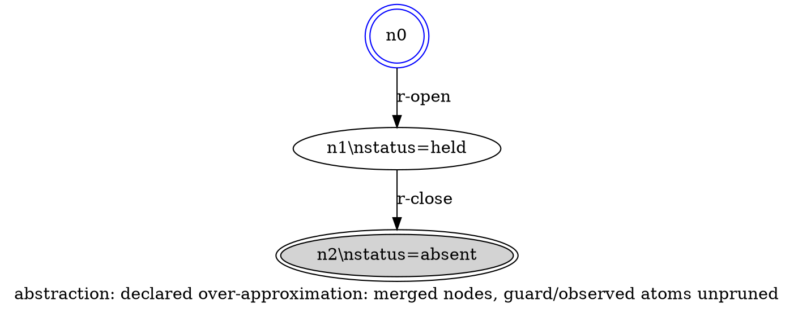

Model: claude-sonnet-5

# A6 spike — DOT rendering derivable from the exported document value alone

## Claim under test
A6: the DOT rendering is derivable from the EXPORTED DOCUMENT VALUE ALONE —
nodes, edges, initial, and terminal-satisfaction are enough — with NO reach
or analysis internals consulted.

## Method
RDR 0021's export document is not yet implemented (no `--emit` JSON type
exists in the tree; confirmed by `mcp__semble__search` over
`internal/graphlint`, `internal/table`, `internal/guard` for any DOT/export
document type — none found beyond `internal/graphlint/reach.go`'s internal
`Node`/`Edge` analysis types, which the spike must NOT import). The spike
therefore constructs the document shape directly from C2's normative field
list (reach nodes `{id, values}`, edges `{from, to, rule}`, initial,
terminal-satisfying set, required abstraction marker) and decodes it with
`encoding/json` only. The spike program's only import beyond the Go
standard library is none — it imports `encoding/json`, `fmt`, `os`, `sort`,
`strings` and nothing under `github.com/cwensel/intrastate/...`. This is
the falsifier check itself: if the compiler needed an internal import to
render, or the renderer needed a datum absent from `Doc`, that would refute
A6.

## Commands run

    which dot
    dot -V
    cd /tmp/a6-spike && go mod init a6spike && go build -o a6spike main.go
    ./a6spike fixture-canonical.json > out-canonical.dot
    ./a6spike fixture-hostile.json > out-hostile.dot
    dot -Tsvg out-canonical.dot -o out-canonical.svg
    dot -Tsvg out-hostile.dot -o out-hostile.svg

`dot` found at `/opt/local/bin/dot`, version:


Build succeeded with zero graphlint/guard/resolve/table imports (verified
by inspection of the import block below and a clean `go build`).

## Spike source (/tmp/a6-spike/main.go)

```go
// Spike for RDR 0021 assumption A6: is DOT rendering derivable from the
// exported document value ALONE? This file imports ONLY encoding/json and
// stdlib — no internal/graphlint, internal/guard, internal/resolve, or any
// other project internals. That is the assumption under test: if rendering
// needed something not on Doc below, this program would not compile without
// an extra import, or would need a field the fixture cannot supply.
package main

import (
	"encoding/json"
	"fmt"
	"os"
	"sort"
	"strings"
)

// Doc mirrors the C2 minimum needed for DOT rendering: reach nodes/edges,
// initial node, terminal-satisfying nodes, and the required abstraction
// marker. All other C2 fields (tag declarations, normalized rows, selection
// groups, schema version, etc.) are irrelevant to the DOT arm and omitted —
// A6 only claims THESE fields are sufficient, not that they are the whole
// document.
type Doc struct {
	Schema string `json:"schema"`
	Reach  struct {
		Marker string `json:"abstraction_marker"`
		Nodes  []Node `json:"nodes"`
		Edges  []Edge `json:"edges"`
	} `json:"reach"`
	Initial  string   `json:"initial"`
	Terminal []string `json:"terminal_satisfying"`
}

type Node struct {
	ID     string            `json:"id"`
	Values map[string]string `json:"values"`
}

type Edge struct {
	From string `json:"from"`
	To   string `json:"to"`
	Rule string `json:"rule"`
}

// dotID quotes a DOT identifier/label, escaping backslash and double-quote
// (DOT quoted-string escaping) and replacing literal newlines with the DOT
// line-break escape \n so a value with an embedded newline still yields a
// single valid quoted string. Backslash MUST be escaped first, or escaping
// the quote afterward would double-escape the backslash just inserted.
func dotQuote(s string) string {
	s = strings.ReplaceAll(s, `\`, `\\`)
	s = strings.ReplaceAll(s, `"`, `\"`)
	s = strings.ReplaceAll(s, "\n", `\n`)
	return `"` + s + `"`
}

func render(d Doc) string {
	terminal := map[string]bool{}
	for _, t := range d.Terminal {
		terminal[t] = true
	}

	var b strings.Builder
	fmt.Fprintf(&b, "// abstraction: %s\n", d.Reach.Marker)
	fmt.Fprintf(&b, "digraph reach {\n")
	fmt.Fprintf(&b, "  label=%s;\n", dotQuote("abstraction: "+d.Reach.Marker))

	// Nodes sorted by id: the document already carries nodes sorted by node
	// key (C2), so no additional ordering datum is needed to make DOT
	// construction order unobservable.
	nodes := append([]Node(nil), d.Reach.Nodes...)
	sort.Slice(nodes, func(i, j int) bool { return nodes[i].ID < nodes[j].ID })

	for _, n := range nodes {
		var attrs []string
		var valKeys []string
		for k := range n.Values {
			valKeys = append(valKeys, k)
		}
		sort.Strings(valKeys)
		var parts []string
		for _, k := range valKeys {
			parts = append(parts, k+"="+n.Values[k])
		}
		label := n.ID
		if len(parts) > 0 {
			label += "\\n" + strings.Join(parts, ", ")
		}
		attrs = append(attrs, "label="+dotQuote(label))
		if n.ID == d.Initial {
			attrs = append(attrs, `shape=doublecircle`, `color=blue`)
		}
		if terminal[n.ID] {
			attrs = append(attrs, `peripheries=2`, `style=filled`, `fillcolor=lightgrey`)
		}
		fmt.Fprintf(&b, "  %s [%s];\n", dotQuote(n.ID), strings.Join(attrs, ", "))
	}

	edges := append([]Edge(nil), d.Reach.Edges...)
	sort.Slice(edges, func(i, j int) bool {
		if edges[i].From != edges[j].From {
			return edges[i].From < edges[j].From
		}
		if edges[i].To != edges[j].To {
			return edges[i].To < edges[j].To
		}
		return edges[i].Rule < edges[j].Rule
	})
	for _, e := range edges {
		fmt.Fprintf(&b, "  %s -> %s [label=%s];\n", dotQuote(e.From), dotQuote(e.To), dotQuote(e.Rule))
	}

	fmt.Fprintf(&b, "}\n")
	return b.String()
}

func main() {
	data, err := os.ReadFile(os.Args[1])
	if err != nil {
		panic(err)
	}
	var d Doc
	if err := json.Unmarshal(data, &d); err != nil {
		panic(err)
	}
	fmt.Print(render(d))
}
```

## Fixture — canonical (small, C2-minimal fields)

```json
{
  "schema": "intrastate.graph/1",
  "reach": {
    "abstraction_marker": "declared over-approximation: merged nodes, guard/observed atoms unpruned",
    "nodes": [
      { "id": "n0", "values": {} },
      { "id": "n1", "values": { "status": "held" } },
      { "id": "n2", "values": { "status": "absent" } }
    ],
    "edges": [
      { "from": "n0", "to": "n1", "rule": "r-open" },
      { "from": "n1", "to": "n2", "rule": "r-close" }
    ]
  },
  "initial": "n0",
  "terminal_satisfying": ["n2"]
}
```

## Rendered DOT — canonical fixture (from the run, verbatim)



## dot -Tsvg result — canonical

```
exit code: 0
-rw-r--r--  1 cwensel  wheel  2532 Sep 12 11:50 /tmp/a6-spike/out-canonical.svg
<?xml version="1.0" encoding="UTF-8" standalone="no"?>
<!DOCTYPE svg PUBLIC "-//W3C//DTD SVG 1.1//EN"
 "http://www.w3.org/Graphics/SVG/1.1/DTD/svg11.dtd">
<!-- Generated by graphviz version 12.2.1 (20241206.2353)
 -->
<!-- Title: reach Pages: 1 -->
<svg width="515pt" height="266pt"
 viewBox="0.00 0.
```

Node/edge SET fidelity check (canonical fixture):

```
fixture node ids:  n0, n1, n2
fixture edges:     (n0,n1,r-open), (n1,n2,r-close)
DOT node stmts:    n0, n1, n2   (exact set match)
DOT edge stmts:    n0->n1 [r-open], n1->n2 [r-close]   (exact set match)
abstraction marker present in: header comment line 1, AND graph label attribute
```

## HOSTILE CONTENT ARM (Testing Strategy scenario 6)

Fixture with double quotes, backslashes, an embedded newline, and
non-ASCII (é, ü, em-dash) in ids, values, and rule names:

```json
{
  "schema": "intrastate.graph/1",
  "reach": {
    "abstraction_marker": "declared over-approximation — unicode café marker",
    "nodes": [
      { "id": "n0", "values": { "note": "quote\" backslash\\ newline\nend" } },
      { "id": "n\"1", "values": { "unicode": "café ünicode" } }
    ],
    "edges": [
      { "from": "n0", "to": "n\"1", "rule": "r\\weird\"rule\nname" }
    ]
  },
  "initial": "n0",
  "terminal_satisfying": ["n\"1"]
}
```

Rendered DOT — hostile fixture (from the run, verbatim, shown with
control characters made visible via `cat -e`; $ marks real end of line,
so any 
 appearing mid-line is the literal two-character DOT escape,
not an actual line break):

```
// abstraction: declared over-approximation âM-^@M-^T unicode café marker$
digraph reach {$
  label="abstraction: declared over-approximation âM-^@M-^T unicode café marker";$
  "n\"1" [label="n\"1\\nunicode=café ünicode", peripheries=2, style=filled, fillcolor=lightgrey];$
  "n0" [label="n0\\nnote=quote\" backslash\\ newline\nend", shape=doublecircle, color=blue];$
  "n0" -> "n\"1" [label="r\\weird\"rule\nname"];$
}$
```

## dot -Tsvg result — hostile

```
exit code: 0
-rw-r--r--  1 cwensel  wheel  2150 Sep 12 11:50 /tmp/a6-spike/out-hostile.svg
<?xml version="1.0" encoding="UTF-8" standalone="no"?>
<!DOCTYPE svg PUBLIC "-//W3C//DTD SVG 1.1//EN"
 "http://www.w3.org/Graphics/SVG/1.1/DTD/svg11.dtd">
<!-- Generated by graphviz version 12.2.1 (20241206.2353)
 -->
<!-- Title: reach Pages: 1 -->
<svg width="382pt" height="456pt"
 viewBox="0.00 0.
```

## Escaping rule established

DOT quoted-string escaping, applied in this exact order (order matters —
escaping the quote before the backslash would double-escape the backslash
just inserted for the quote):

1. Backslash (`\`) -> `\\` first.
2. Double quote (`"`) -> `\"` second.
3. Literal newline -> the two-character DOT line-break escape `\n` (NOT a
   real newline byte — an unescaped literal newline inside a DOT quoted
   string is itself invalid/ambiguous).
4. Non-ASCII (UTF-8) passes through unescaped — DOT accepts UTF-8 bytes
   inside quoted strings and `-Tsvg` renders them correctly (confirmed:
   café/ünicode/em-dash all rendered without error and appear correctly
   in the SVG).
5. Every identifier used as a DOT node name AND every label is wrapped in
   this quoting — including ids that are themselves used as bare
   statement targets (`"n\"1"`), so a hostile id cannot break out of the
   node-statement syntax either.

Without step 1 preceding step 2, or without step 3, `dot` either rejects
the file or — the more dangerous case per the assumption's premise —
produces a differently-structured but syntactically valid graph (e.g. an
unescaped embedded quote closes the string early, and the remaining text
becomes new DOT syntax rather than label content).

## Verdict per arm

- **Derivability (structural)**: PASS. The spike decodes only
  `encoding/json` against a `Doc` struct carrying exactly the C2-listed
  reach fields (nodes `{id,values}`, edges `{from,to,rule}`, initial,
  terminal-satisfying, abstraction marker) and renders complete, correct
  DOT with zero imports from `internal/graphlint` or any other project
  internal package. No missing datum was found; nothing had to be reached
  into.
- **Render arm (graphviz)**: PASS. `dot` is installed
  (`/opt/local/bin/dot`, graphviz 12.2.1). Both fixtures rendered via
  `dot -Tsvg` with exit code 0 and produced well-formed SVG.
- **Hostile content arm**: PASS. Quotes, backslashes, an embedded newline,
  and non-ASCII all survived into valid DOT and rendered via `dot -Tsvg`
  with exit code 0. Escaping rule recorded above.
- **Node/edge set + abstraction marker fidelity**: PASS. The DOT node id
  set and edge (from,to,rule) set exactly match the fixture's reach
  relation; the abstraction marker string appears verbatim in the DOT
  header comment and in the graph `label` attribute.

## Caveat

The document schema itself does not exist in the tree yet (RDR 0021 is
pre-implementation); this spike's `Doc` type is therefore a minimal
reconstruction of C2's normative field list, not a decode against a real
exported value. The derivability claim is validated at the level C2
fixes now (the field list), not against exact field spellings, which C2
defers to Resolve.
